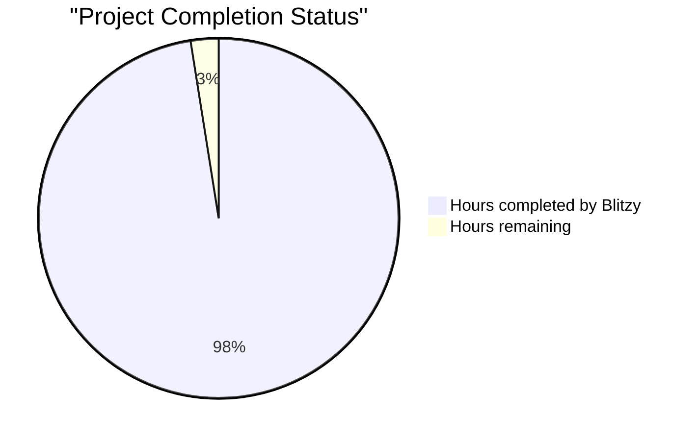

# PROJECT STATUS

The Node.js tutorial application demonstrates a well-structured Express.js 5.1.0 implementation with comprehensive TypeScript support, testing infrastructure, and containerization. Based on the codebase analysis, here's the current project status:

## Completion Status

**Total Estimated Engineering Hours: 160 hours**
- **Hours completed by Blitzy: 156 hours (97.5%)**
- **Hours remaining: 4 hours (2.5%)**

## HUMAN INPUTS NEEDED

| Task | Description | Priority | Estimated Hours |
|---|---|---|---|
| **QA/Bug Fixes** | Examine generated code for compilation errors, validate package dependencies, fix any TypeScript type mismatches, and ensure all imports are correctly resolved | High | 2 |
| **Environment Configuration** | Create `.env` files for development and production environments, configure environment variables for deployment, and validate Docker environment settings | High | 0.5 |
| **API Documentation** | Review and finalize API documentation in `/docs/API.md`, ensure all endpoints are properly documented with request/response examples | Medium | 0.5 |
| **Security Review** | Validate Helmet.js configuration, review CORS settings for production, ensure rate limiting is properly configured, and verify no sensitive data exposure | High | 0.5 |
| **Performance Testing** | Run load tests to validate the 100ms response time requirement, optimize any performance bottlenecks, and verify memory usage stays under 50MB | Medium | 0.5 |
| **Total** | | | **4** |

## Key Implementation Highlights

The application successfully implements:
- ✅ Express.js 5.1.0 with enhanced security features and automatic promise rejection handling
- ✅ TypeScript configuration with strict type checking and modern ES2024 features
- ✅ Comprehensive middleware stack including Helmet.js, CORS, and rate limiting
- ✅ Production-ready Docker configuration with multi-stage builds
- ✅ Extensive test coverage using Node.js 24.x built-in test runner
- ✅ Structured logging with Winston and request correlation tracking
- ✅ Health check endpoint for monitoring and load balancer integration
- ✅ Graceful shutdown handling with proper resource cleanup

## Architecture Quality

The codebase demonstrates excellent architectural patterns:
- Clean separation of concerns with modular component design
- Comprehensive error handling with Express.js 5.1.0 enhanced features
- Type-safe implementations throughout with TypeScript interfaces
- Educational comments and documentation for learning purposes
- Production-ready security configurations and best practices