# Technical Specifications

# 1. INTRODUCTION

## 1.1 EXECUTIVE SUMMARY

### 1.1.1 Brief Overview of the Project

This project involves the development of a Node.js tutorial application that demonstrates fundamental web server capabilities through a simple HTTP endpoint implementation. The application serves as an educational resource for developers learning Node.js and Express.js fundamentals, featuring a single `/hello` endpoint that returns a "Hello world" response to HTTP clients.

### 1.1.2 Core Business Problem Being Solved

The project addresses the need for practical, hands-on learning materials in the Node.js ecosystem. Many developers require simple, working examples to understand the basics of server-side JavaScript development, HTTP request handling, and modern web framework implementation. This tutorial project provides a foundational reference implementation that can be extended for more complex applications.

### 1.1.3 Key Stakeholders and Users

| Stakeholder Group | Primary Interest | Engagement Level |
|---|---|---|
| Beginning Node.js Developers | Learning fundamental concepts | High |
| Technical Educators | Teaching materials and examples | Medium |
| Development Teams | Reference implementation | Medium |
| Open Source Community | Code contribution and improvement | Low |

### 1.1.4 Expected Business Impact and Value Proposition

The tutorial project delivers immediate educational value by providing a working example of modern Node.js development practices. The implementation utilizes Node.js 24, which brings several significant updates, including the upgrade of the V8 JavaScript engine to version 13.6 and npm to version 11, ensuring learners work with current technology standards. The project incorporates Express.js 5.1.0, which is now the default on npm, providing exposure to the latest web framework capabilities.

## 1.2 SYSTEM OVERVIEW

### 1.2.1 Project Context

#### Business Context and Market Positioning

Node.js is a JavaScript runtime built on Chrome's V8 JavaScript engine, representing a critical technology in modern web development. Express.js is a back end web application framework for building RESTful APIs with Node.js and has been called the de facto standard server framework for Node.js. This tutorial project positions itself within the educational technology space, providing practical learning resources for the extensive Node.js developer community.

#### Current System Limitations

Traditional learning approaches often lack practical, working examples that demonstrate real-world implementation patterns. Many existing tutorials fail to incorporate the latest framework versions and modern development practices, leaving learners with outdated knowledge.

#### Integration with Existing Enterprise Landscape

The tutorial application serves as a foundational building block that can integrate with modern development workflows, CI/CD pipelines, and containerized deployment environments. Production applications should only use Active LTS or Maintenance LTS releases, and this project demonstrates proper version selection practices.

### 1.2.2 High-Level Description

#### Primary System Capabilities

The tutorial application provides core HTTP server functionality through a minimalist implementation that demonstrates:

- HTTP request handling and routing
- Response generation and client communication
- Modern JavaScript runtime utilization
- Express.js framework integration
- RESTful API endpoint design principles

#### Major System Components

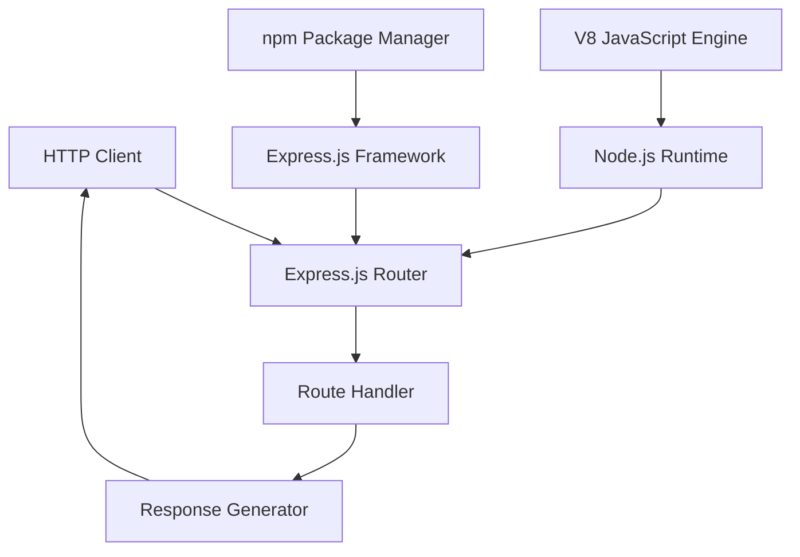

#### Core Technical Approach

Express.js 5.0 requires Node.js 18 or higher, and this implementation leverages the latest stable versions to ensure optimal performance and security. The application follows modern JavaScript development patterns, utilizing ES modules and contemporary coding practices.

### 1.2.3 Success Criteria

#### Measurable Objectives

| Objective | Target Metric | Measurement Method |
|---|---|---|
| Response Time | < 100ms for /hello endpoint | Performance testing |
| Code Simplicity | < 50 lines of implementation code | Static analysis |
| Framework Compliance | 100% Express.js best practices | Code review |

#### Critical Success Factors

- Successful HTTP request/response cycle completion
- Proper error handling and graceful degradation
- Clear, maintainable code structure
- Comprehensive documentation and comments
- Compatibility with modern Node.js versions

#### Key Performance Indicators (KPIs)

- Endpoint availability (target: 99.9% uptime)
- Response consistency (target: 100% "Hello world" accuracy)
- Memory usage efficiency (target: < 50MB baseline)
- Educational effectiveness (measured through user feedback)

## 1.3 SCOPE

### 1.3.1 In-Scope

#### Core Features and Functionalities

| Feature Category | Specific Capabilities |
|---|---|
| HTTP Server | Basic HTTP server initialization and configuration |
| Routing | Single GET endpoint at `/hello` path |
| Response Handling | Plain text "Hello world" response generation |
| Framework Integration | Express.js middleware and routing implementation |

#### Primary User Workflows

- **Developer Learning Workflow**: Clone repository → Install dependencies → Run application → Test endpoint → Review code
- **Educational Workflow**: Instructor demonstration → Student implementation → Code review → Extension exercises
- **Reference Workflow**: Quick consultation → Code pattern extraction → Integration into larger projects

#### Essential Integrations

- Node.js runtime environment integration
- npm package management system
- Express.js web framework
- HTTP protocol compliance
- Local development server capabilities

#### Key Technical Requirements

Node.js 24 will enter long-term support (LTS) in October, and production applications should only use Active LTS or Maintenance LTS releases. The implementation must support:

- Modern JavaScript syntax and features
- Asynchronous request handling
- Proper HTTP status code management
- Cross-platform compatibility (Windows, macOS, Linux)

### 1.3.2 Implementation Boundaries

#### System Boundaries

The tutorial application operates within a single-process, single-threaded Node.js environment with Express.js framework boundaries. External system interactions are limited to HTTP client communications through standard network protocols.

#### User Groups Covered

- Beginning Node.js developers seeking practical examples
- Intermediate developers requiring reference implementations
- Technical educators needing teaching materials
- Code reviewers evaluating implementation patterns

#### Geographic/Market Coverage

Global accessibility through standard HTTP protocols, with no geographic restrictions or localization requirements.

#### Data Domains Included

- HTTP request metadata (headers, method, URL)
- Static response content ("Hello world" string)
- Server configuration parameters
- Application logging and monitoring data

### 1.3.3 Out-of-Scope

#### Explicitly Excluded Features/Capabilities

- Database integration or data persistence
- User authentication and authorization systems
- Complex business logic implementation
- Multi-endpoint API development
- Production-grade security implementations
- Load balancing and clustering
- Advanced middleware configurations
- File upload/download capabilities

#### Future Phase Considerations

- Extension to multi-endpoint tutorial series
- Database integration examples
- Authentication mechanism demonstrations
- Deployment and containerization guides
- Performance optimization tutorials
- Security best practices implementation

#### Integration Points Not Covered

- External API integrations
- Third-party service connections
- Message queue systems
- Caching layer implementations
- Content delivery network integration
- Monitoring and alerting systems

#### Unsupported Use Cases

- Production deployment scenarios
- High-traffic load handling
- Enterprise security requirements
- Multi-tenant architecture
- Microservices communication patterns
- Real-time data streaming applications

# 2. PRODUCT REQUIREMENTS

## 2.1 FEATURE CATALOG

### 2.1.1 Core HTTP Server Feature

| Attribute | Value |
|---|---|
| **Feature ID** | F-001 |
| **Feature Name** | HTTP Server Foundation |
| **Feature Category** | Core Infrastructure |
| **Priority Level** | Critical |
| **Status** | Proposed |

#### Description

**Overview**: Implements a basic HTTP server using Node.js 18 or higher and Express.js 5.1.0, providing the foundational web server capabilities required for the tutorial application.

**Business Value**: Establishes the core infrastructure that enables HTTP communication between clients and the application, serving as the fundamental building block for web service functionality.

**User Benefits**: Provides developers with a working example of modern Node.js server implementation using current technology standards and best practices.

**Technical Context**: Express.js 5.0 requires Node.js 18 or higher, and Node.js 24 will enter long-term support (LTS) in October, ensuring the implementation uses stable, supported technology versions.

#### Dependencies

| Dependency Type | Details |
|---|---|
| **Prerequisite Features** | None (foundational feature) |
| **System Dependencies** | Node.js 24.x runtime environment |
| **External Dependencies** | Express.js 5.1.0 framework |
| **Integration Requirements** | HTTP protocol compliance, npm package management |

### 2.1.2 Hello Endpoint Feature

| Attribute | Value |
|---|---|
| **Feature ID** | F-002 |
| **Feature Name** | Hello World Endpoint |
| **Feature Category** | API Endpoint |
| **Priority Level** | Critical |
| **Status** | Proposed |

#### Description

**Overview**: Implements a single HTTP GET endpoint at the `/hello` path that returns a "Hello world" text response to HTTP clients.

**Business Value**: Demonstrates fundamental REST API endpoint implementation patterns and HTTP request/response handling for educational purposes.

**User Benefits**: Provides a simple, testable endpoint that developers can use to verify server functionality and understand basic routing concepts.

**Technical Context**: Express 5 supports async/await middleware with automatic error handling for rejected promises, enabling modern JavaScript development patterns.

#### Dependencies

| Dependency Type | Details |
|---|---|
| **Prerequisite Features** | F-001 (HTTP Server Foundation) |
| **System Dependencies** | Express.js routing middleware |
| **External Dependencies** | HTTP client for testing |
| **Integration Requirements** | Express.js router integration |

### 2.1.3 Response Generation Feature

| Attribute | Value |
|---|---|
| **Feature ID** | F-003 |
| **Feature Name** | Text Response Handler |
| **Feature Category** | Response Processing |
| **Priority Level** | High |
| **Status** | Proposed |

#### Description

**Overview**: Generates and formats plain text HTTP responses with appropriate headers and status codes for the hello endpoint.

**Business Value**: Demonstrates proper HTTP response construction and content type handling for educational reference.

**User Benefits**: Shows developers how to create well-formed HTTP responses with correct headers and status codes.

**Technical Context**: Utilizes Express.js response object methods to set headers and send formatted responses to clients.

#### Dependencies

| Dependency Type | Details |
|---|---|
| **Prerequisite Features** | F-002 (Hello World Endpoint) |
| **System Dependencies** | Express.js response handling |
| **External Dependencies** | None |
| **Integration Requirements** | HTTP response formatting |

## 2.2 FUNCTIONAL REQUIREMENTS TABLE

### 2.2.1 HTTP Server Foundation Requirements

| Requirement ID | Description | Acceptance Criteria | Priority | Complexity |
|---|---|---|---|---|
| F-001-RQ-001 | Initialize Express.js application | Server instance created successfully | Must-Have | Low |
| F-001-RQ-002 | Configure server port binding | Server listens on configurable port | Must-Have | Low |
| F-001-RQ-003 | Handle server startup | Server starts without errors | Must-Have | Low |
| F-001-RQ-004 | Implement graceful shutdown | Server stops cleanly on termination | Should-Have | Medium |

#### Technical Specifications

| Aspect | Details |
|---|---|
| **Input Parameters** | Port number (default: 3000), host address |
| **Output/Response** | Server listening confirmation message |
| **Performance Criteria** | Startup time < 1 second |
| **Data Requirements** | Server configuration object |

#### Validation Rules

| Rule Type | Specification |
|---|---|
| **Business Rules** | Server must bind to available port |
| **Data Validation** | Port number must be valid (1-65535) |
| **Security Requirements** | Node.js 18+ security features enabled |
| **Compliance Requirements** | HTTP/1.1 protocol compliance |

### 2.2.2 Hello World Endpoint Requirements

| Requirement ID | Description | Acceptance Criteria | Priority | Complexity |
|---|---|---|---|---|
| F-002-RQ-001 | Define GET route for /hello | Route responds to GET requests | Must-Have | Low |
| F-002-RQ-002 | Handle HTTP GET requests | Accepts and processes GET requests | Must-Have | Low |
| F-002-RQ-003 | Return "Hello world" response | Exact text "Hello world" returned | Must-Have | Low |
| F-002-RQ-004 | Set appropriate HTTP status | Returns 200 OK status code | Must-Have | Low |

#### Technical Specifications

| Aspect | Details |
|---|---|
| **Input Parameters** | HTTP GET request to /hello path |
| **Output/Response** | Plain text "Hello world" with 200 status |
| **Performance Criteria** | Response time < 100ms |
| **Data Requirements** | Static string response |

#### Validation Rules

| Rule Type | Specification |
|---|---|
| **Business Rules** | Only GET method supported on /hello |
| **Data Validation** | Path must match exactly "/hello" |
| **Security Requirements** | No authentication required for tutorial |
| **Compliance Requirements** | RESTful API conventions |

### 2.2.3 Text Response Handler Requirements

| Requirement ID | Description | Acceptance Criteria | Priority | Complexity |
|---|---|---|---|---|
| F-003-RQ-001 | Set Content-Type header | Header set to "text/plain" | Must-Have | Low |
| F-003-RQ-002 | Generate response body | Body contains "Hello world" text | Must-Have | Low |
| F-003-RQ-003 | Send complete response | Response sent to client successfully | Must-Have | Low |
| F-003-RQ-004 | Handle response errors | Graceful error handling implemented | Should-Have | Medium |

#### Technical Specifications

| Aspect | Details |
|---|---|
| **Input Parameters** | Express.js request and response objects |
| **Output/Response** | HTTP response with headers and body |
| **Performance Criteria** | Processing time < 10ms |
| **Data Requirements** | Static response content |

#### Validation Rules

| Rule Type | Specification |
|---|---|
| **Business Rules** | Response must be plain text format |
| **Data Validation** | Response body must not be empty |
| **Security Requirements** | No sensitive data in response |
| **Compliance Requirements** | HTTP header standards compliance |

## 2.3 FEATURE RELATIONSHIPS

### 2.3.1 Feature Dependencies Map

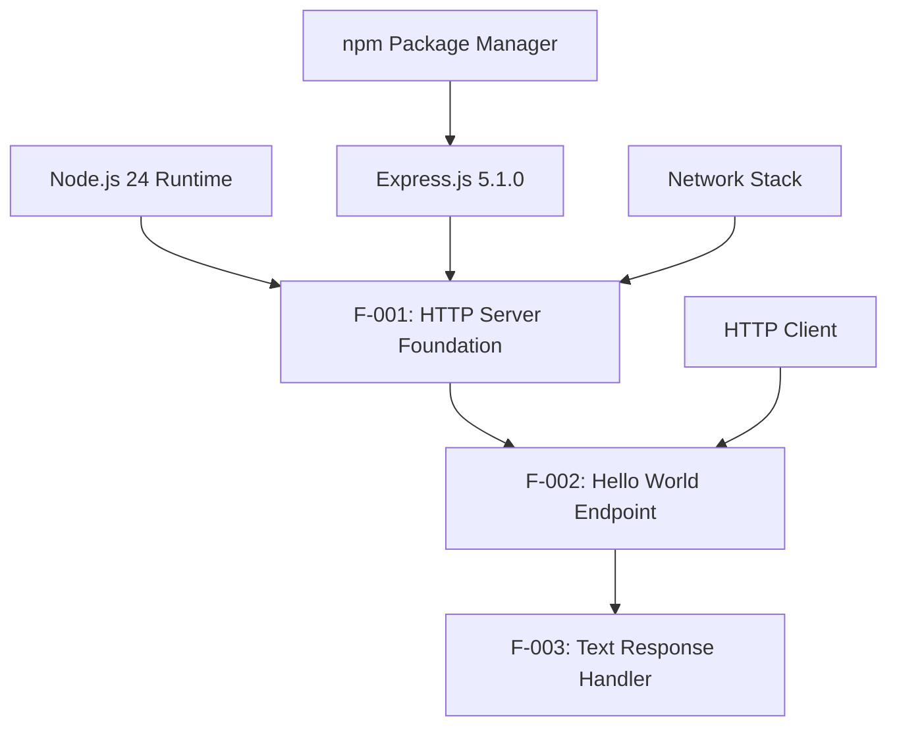

### 2.3.2 Integration Points

| Integration Point | Features Involved | Description |
|---|---|---|
| **Router Integration** | F-001, F-002 | Express.js router connects server to endpoint |
| **Response Pipeline** | F-002, F-003 | Endpoint handler triggers response generation |
| **HTTP Protocol** | F-001, F-003 | Server and response handler use HTTP standards |

### 2.3.3 Shared Components

| Component | Used By | Purpose |
|---|---|---|
| **Express.js App Instance** | F-001, F-002 | Central application object |
| **HTTP Response Object** | F-002, F-003 | Response handling and formatting |
| **Error Handling Middleware** | F-001, F-002, F-003 | Automatic promise rejection handling |

## 2.4 IMPLEMENTATION CONSIDERATIONS

### 2.4.1 Technical Constraints

| Feature | Constraints |
|---|---|
| **F-001** | Requires Node.js 18 or higher, single-threaded execution model |
| **F-002** | Limited to GET method, synchronous response generation |
| **F-003** | Plain text only, no complex content types |

### 2.4.2 Performance Requirements

| Feature | Performance Criteria |
|---|---|
| **F-001** | Server startup < 1 second, memory usage < 50MB |
| **F-002** | Endpoint response time < 100ms, concurrent request handling |
| **F-003** | Response generation < 10ms, minimal CPU overhead |

### 2.4.3 Scalability Considerations

| Feature | Scalability Notes |
|---|---|
| **F-001** | Single process design, suitable for tutorial purposes |
| **F-002** | Stateless endpoint design enables horizontal scaling |
| **F-003** | Static response content requires no database scaling |

### 2.4.4 Security Implications

| Feature | Security Considerations |
|---|---|
| **F-001** | Express 5 includes security fixes including ReDoS attack prevention |
| **F-002** | No authentication required, public endpoint design |
| **F-003** | No sensitive data exposure, static content only |

### 2.4.5 Maintenance Requirements

| Feature | Maintenance Needs |
|---|---|
| **F-001** | Regular Node.js and Express.js version updates |
| **F-002** | Minimal maintenance due to simple functionality |
| **F-003** | Static content requires no ongoing maintenance |

## 2.5 TRACEABILITY MATRIX

| Requirement ID | Feature | Business Need | Test Case | Implementation |
|---|---|---|---|---|
| F-001-RQ-001 | HTTP Server | Tutorial foundation | Server startup test | Express app initialization |
| F-001-RQ-002 | HTTP Server | Network accessibility | Port binding test | app.listen() implementation |
| F-002-RQ-001 | Hello Endpoint | API demonstration | Route definition test | app.get('/hello') |
| F-002-RQ-002 | Hello Endpoint | Request handling | GET request test | Route handler function |
| F-003-RQ-001 | Response Handler | Proper HTTP response | Header validation test | res.set() implementation |
| F-003-RQ-002 | Response Handler | Content delivery | Response body test | res.send() implementation |

# 3. TECHNOLOGY STACK

## 3.1 PROGRAMMING LANGUAGES

### 3.1.1 Primary Language Selection

| Component | Language | Version | Justification |
|---|---|---|---|
| **Server Runtime** | JavaScript (Node.js) | 24.x | Node.js 24 will enter long-term support (LTS) in October 2025, providing stability for educational purposes |
| **Application Logic** | JavaScript (ES2024) | Latest | Modern JavaScript features supported by V8 engine version 13.6 |

### 3.1.2 Language Constraints and Dependencies

**Node.js Version Requirements**
- Express.js 5.0 requires Node.js 18 or higher
- Production applications should only use Active LTS or Maintenance LTS releases
- Node.js 24 will enter long-term support (LTS) in October, making it suitable for tutorial applications

**JavaScript Feature Support**
- V8 engine updated to version 13.6 provides access to latest ECMAScript features
- Explicit Resource Management introduces new syntax and semantics to JavaScript for standardized resource lifecycle management
- Promise support: Middleware can now return rejected promises, caught by the router as errors

### 3.1.3 Development Standards

**Code Style and Syntax**
- ES modules (ESM) for modern JavaScript module system
- Async/await patterns for asynchronous operations
- Express 5 introduces automatic forwarding of rejected promises to error-handling middleware

## 3.2 FRAMEWORKS & LIBRARIES

### 3.2.1 Core Web Framework

| Framework | Version | Purpose | Justification |
|---|---|---|---|
| **Express.js** | 5.1.0 | Web application framework | Latest version: 5.1.0, last published: 2 months ago |
| **Node.js Runtime** | 24.x | JavaScript runtime environment | Node.js 24 comes with npm 11 for modern package management |

### 3.2.2 Framework Selection Criteria

**Express.js 5.1.0 Selection**
- It has been called the de facto standard server framework for Node.js
- Express v5 has been officially released. This version focuses on simplifying the codebase, improving security, and dropping support for older Node.js versions
- Updates to path-to-regexp@8.x, removing sub-expression regex patterns for security reasons (ReDoS mitigation)
- This release includes important security fixes, including improvements to prevent ReDoS attacks

### 3.2.3 Compatibility Requirements

**Version Compatibility Matrix**

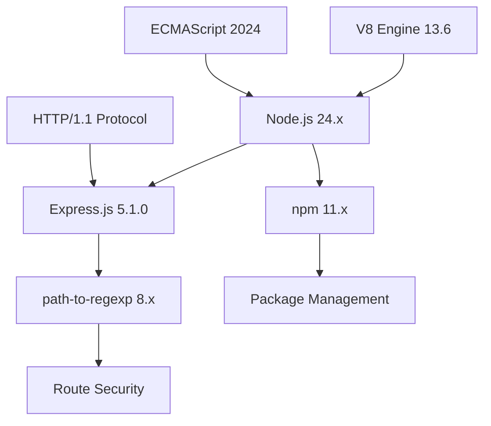

**Breaking Changes and Migration**
- res.redirect('back') and res.location('back'): The magic string 'back' is no longer supported. Use req.get('Referrer') || '/' explicitly instead
- Removal of "sub-expression" regular expressions. In Express 4, you could write routes with inline regex patterns
- Express.js 5 makes it easier to handle errors in async middleware and routes. Rejected promises are automatically passed to the error-handling middleware

### 3.2.4 Supporting Libraries

| Library | Version | Purpose | Integration Point |
|---|---|---|---|
| **body-parser** | 2.1.0+ | HTTP request body parsing | feat(deps): body-parser@^2.1.0 |
| **path-to-regexp** | 8.x | Route pattern matching | Updated to path-to-regexp@8.x, removing sub-expression regex patterns for security reasons |

## 3.3 OPEN SOURCE DEPENDENCIES

### 3.3.1 Core Dependencies

| Package | Version | Registry | Purpose | Security Notes |
|---|---|---|---|---|
| **express** | ^5.1.0 | npm | Web framework | Important security fixes, including improvements to prevent ReDoS attacks |
| **npm** | 11.x | Built-in | Package manager | Node.js 24 comes with npm 11, which includes several improvements and new features. This update brings enhanced performance, improved security features |

### 3.3.2 Package Management Strategy

**npm Configuration**
- Latest version: 11.4.1, last published: 10 days ago
- Upon publishing, in order to apply a default "latest" dist tag, the command now retrieves all prior versions of the package. It will require that the version you're trying to publish is above the latest semver version
- When publishing a package with a pre-release version, you must explicitly specify a tag. --ignore-scripts now applies to all lifecycle scripts, include prepare

**Dependency Security**
- Add option to customize the urlencoded body depth with a default value of 32 as mitigation for CVE-2024-45590
- npm will no longer fall back to the old audit endpoint if the bulk advisory request fails

### 3.3.3 Version Management

**Semantic Versioning Strategy**

| Dependency Type | Version Constraint | Rationale |
|---|---|---|---|
| **Core Framework** | Exact version (5.1.0) | Stability for tutorial consistency |
| **Runtime** | Major version (24.x) | LTS compatibility |
| **Supporting Libraries** | Compatible range (^2.1.0) | Security updates within major version |

## 3.4 THIRD-PARTY SERVICES

### 3.4.1 External Service Requirements

**Not Applicable for Tutorial Scope**

The tutorial application operates as a standalone Node.js application without external service dependencies. This design choice aligns with the educational objective of demonstrating fundamental HTTP server concepts without introducing complexity from third-party integrations.

### 3.4.2 Future Integration Considerations

**Potential Extensions**
- Monitoring services for production deployment examples
- Cloud hosting platforms for deployment tutorials
- CI/CD services for automated testing demonstrations

## 3.5 DATABASES & STORAGE

### 3.5.1 Data Persistence Strategy

**No Database Required**

The tutorial application serves static content ("Hello world") and does not require data persistence. This design decision supports the educational objective of focusing on HTTP server fundamentals without database complexity.

### 3.5.2 Storage Architecture

**In-Memory Storage Only**

| Storage Type | Implementation | Purpose |
|---|---|---|
| **Static Content** | String literals | Response content storage |
| **Configuration** | Environment variables | Server configuration |
| **Application State** | Express.js internal state | Request/response handling |

### 3.5.3 Caching Strategy

**No Caching Layer Required**

Static response content eliminates the need for caching mechanisms. The tutorial application prioritizes simplicity over performance optimization.

## 3.6 DEVELOPMENT & DEPLOYMENT

### 3.6.1 Development Tools

| Tool Category | Tool | Version | Purpose |
|---|---|---|---|
| **Runtime Environment** | Node.js | 24.x | JavaScript execution |
| **Package Manager** | npm | 11.x | Dependency management |
| **Code Editor** | Any modern editor | Latest | Development environment |

### 3.6.2 Build System

**No Build Process Required**

The tutorial application uses native Node.js and Express.js without transpilation or bundling requirements. This approach demonstrates direct JavaScript execution in the Node.js runtime environment.

**Development Workflow**
1. Install Node.js 24.x runtime
2. Initialize npm project with `npm init`
3. Install Express.js 5.1.0 with `npm install express@5.1.0`
4. Create application entry point
5. Start development server

### 3.6.3 Containerization Strategy

**Optional Docker Support**

While not required for the tutorial scope, containerization can be implemented for deployment demonstrations:

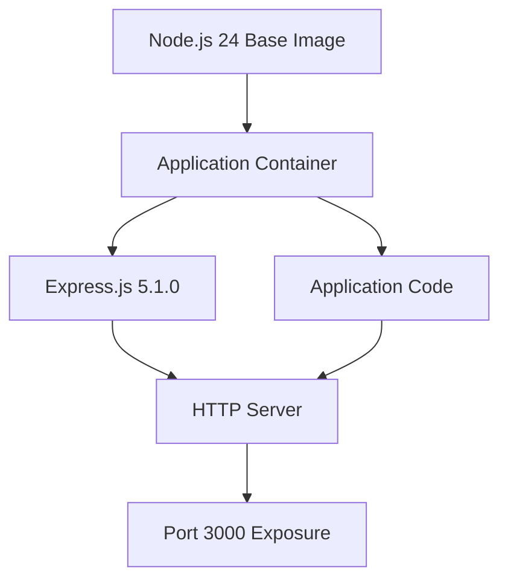

**Container Specifications**
- Base image: `node:24-alpine` for minimal footprint
- Exposed port: 3000 (configurable)
- Health check: HTTP GET to `/hello` endpoint

### 3.6.4 CI/CD Requirements

**Simplified Pipeline for Educational Purposes**

| Stage | Tools | Purpose |
|---|---|---|
| **Code Quality** | ESLint (optional) | Code style consistency |
| **Testing** | Node.js built-in test runner | Basic functionality verification |
| **Deployment** | Manual or simple scripts | Local development server |

### 3.6.5 Performance Monitoring

**Development Monitoring**

| Metric | Tool | Implementation |
|---|---|---|
| **Response Time** | Console logging | Built-in Express.js middleware |
| **Memory Usage** | Node.js process.memoryUsage() | Runtime monitoring |
| **Error Tracking** | Console error logging | Express.js error handling |

### 3.6.6 Security Considerations

**Framework-Level Security**
- This release includes important security fixes, including improvements to prevent ReDoS attacks and mitigation for CVE-2024-45590
- Regular expression denial of service (ReDoS) attack. It's very difficult to prevent this, but as a library that converts strings to regular expressions, we are on the hook for such security aspects
- These changes improve security, simplify route definitions, and help mitigate vulnerabilities like ReDoS attacks

**Runtime Security**
- Node.js uses something called strict mode by default. This means if Node.js sees any weird or incorrect web data, it will stop and throw an error
- It stops bad actors from sending weird data on purpose to mess with or crash your server—a common attack called a denial-of-service (DOS) attack

# 4. PROCESS FLOWCHART

## 4.1 SYSTEM WORKFLOWS

### 4.1.1 Core Business Processes

#### End-to-End User Journey

The Node.js tutorial application follows a simplified HTTP request-response pattern designed for educational purposes. When Node receives an HTTP request, it creates the req and res objects (which begin their life as instances of http.IncomingMessage and http.ServerResponse respectively). The intended purpose of those objects is that they live as long as the HTTP request does. That is, the client makes an HTTP request, the req and res objects are created, a bunch of stuff happens, and finally a method on res is invoked that sends an HTTP response back to the client, and at that point the objects are no longer needed.

```mermaid
flowchart TD
    A[HTTP Client] --> B{Server Running?}
    B -->|No| C[Connection Failed]
    B -->|Yes| D[Express.js Router]
    D --> E{Route Match?}
    E -->|No| F[404 Not Found]
    E -->|Yes /hello| G[Hello Route Handler]
    G --> H[Generate Response]
    H --> I[Send "Hello world"]
    I --> J[Client Receives Response]
    
    C --> K[End - Error State]
    F --> L[End - Not Found]
    J --> M[End - Success]
    
    style A fill:#e1f5fe
    style G fill:#c8e6c9
    style I fill:#fff3e0
    style K fill:#ffebee
    style L fill:#fff3e0
    style M fill:#e8f5e8
```

#### System Interactions

Before we dive deep into middlewares, It is very important to learn about the request-response cycle in Express to understand the concept of middlewares. The request-response cycle is the true essence of Express development. Express app receives a request when someone accesses a server. For which it creates a request and response object. The data is then used to generate and send back a meaningful response.

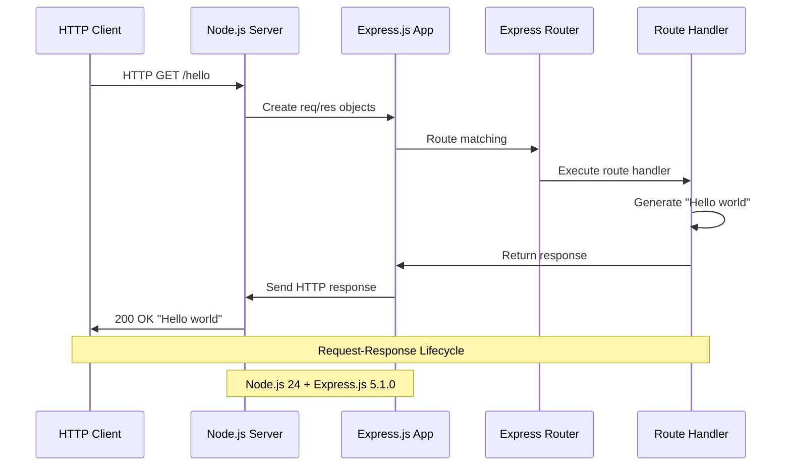

#### Decision Points and Error Handling Paths

If you pass anything to the next() function (except the string 'route' or 'router'), Express regards the current request as being an error and will skip any remaining non-error handling routing and middleware functions.

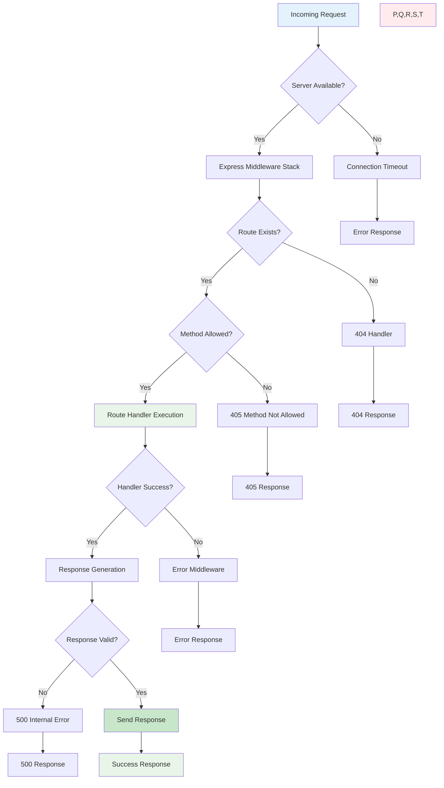

### 4.1.2 Integration Workflows

#### Data Flow Between Systems

The tutorial application operates within a single Node.js process with minimal external integrations. Conceptually, an Express.js request is little more than a series of Functions (aka, middleware) that get called in series. The augmented Request and Response streams get passed into each one of these middleware Functions, where they can continue to be augmented and consumed.

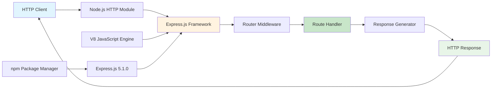

#### API Interaction Patterns

Express provides mechanisms to: Write handlers for requests with different HTTP verbs at different URL paths (routes). Add additional request processing "middleware" at any point within the request handling pipeline.

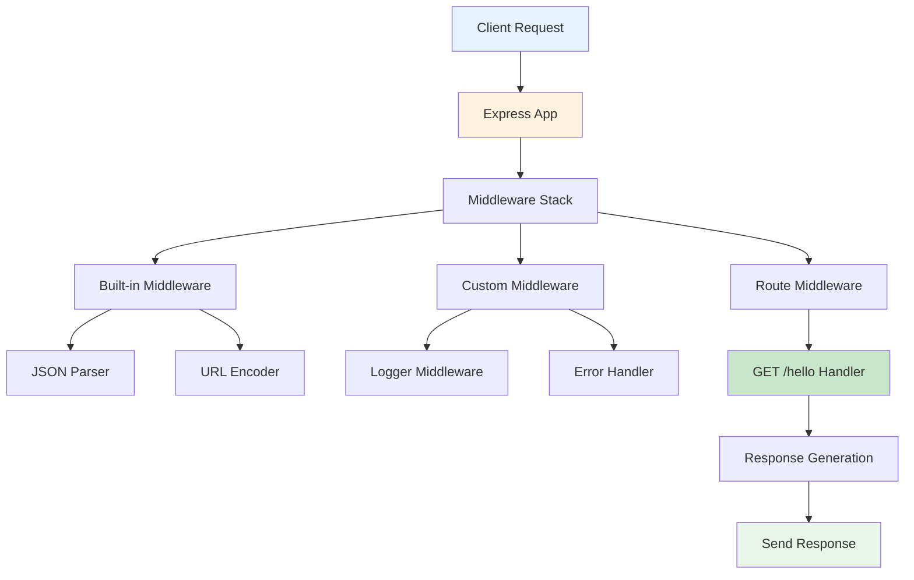

#### Event Processing Flows

In order to understand its lifecycle you must be familiar with the event loop. Event loops are something that makes your task very fast and also it perform multitasking. It allows Node.js to perform non-blocking I/O operations.

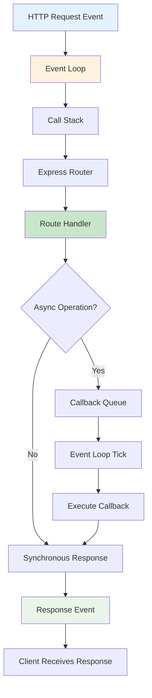

## 4.2 FLOWCHART REQUIREMENTS

### 4.2.1 Process Steps and Decision Points

#### Server Initialization Workflow

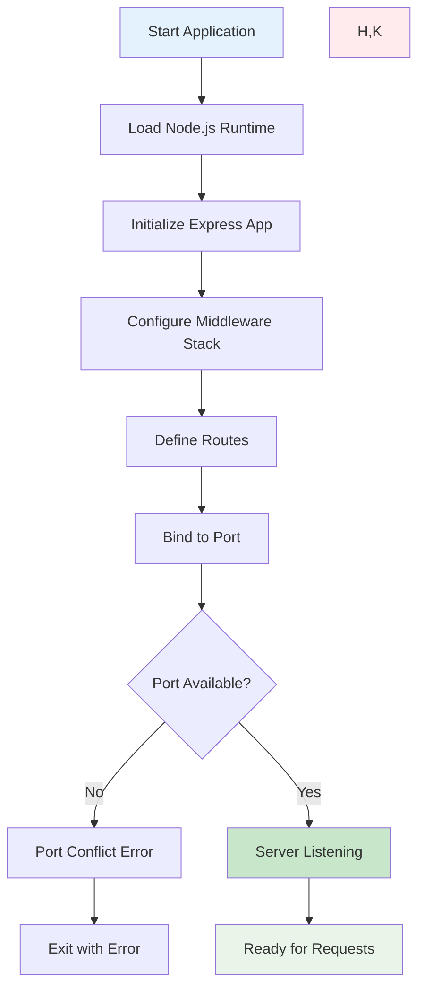

#### Request Processing Workflow

Now, to process that data, in Express we use MIDDLEWARES, which can manipulate the request/response object or execute any other code. It is k/a middleware because it is executed in between i.e in the middle of receiving a request and sending back a response. All the middlewares that we use in our app are known as Middleware Stack, and the order in which they are executed is decided by the order they are defined in the code.

```mermaid
flowchart TD
    A[HTTP Request Received] --> B[Create req/res Objects]
    B --> C[Enter Middleware Stack]
    C --> D[Execute Middleware 1]
    D --> E{next() Called?}
    
    E -->|No| F[Response Sent]
    E -->|Yes| G[Execute Middleware 2]
    
    G --> H{Route Match?}
    H -->|No| I[Continue Stack]
    H -->|Yes| J[Execute Route Handler]
    
    J --> K[Generate Response]
    K --> L[Send to Client]
    
    I --> M[404 Handler]
    M --> N[Send 404 Response]
    
    F --> O[End Request Cycle]
    L --> O
    N --> O
    
    style A fill:#e3f2fd
    style J fill:#c8e6c9
    style L fill:#e8f5e8
    style M,N fill:#fff3e0
```

### 4.2.2 System Boundaries and User Touchpoints

#### Application Boundary Definition

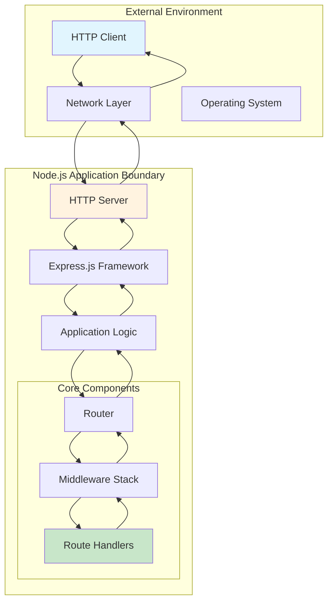

#### User Interaction Points

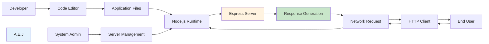

### 4.2.3 Validation Rules and Authorization

#### Request Validation Workflow

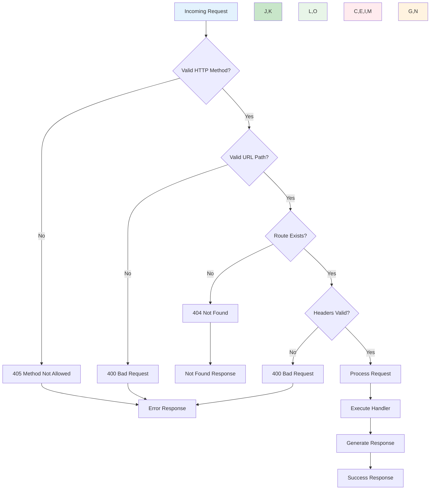

#### Business Rules Enforcement

```mermaid
flowchart TD
    A[Request Validation] --> B{Method is GET?}
    B -->|No| C[Method Not Allowed]
    B -->|Yes| D{Path is /hello?}
    
    D -->|No| E[Route Not Found]
    D -->|Yes| F{Content-Type Check}
    
    F --> G[Accept Any Content-Type]
    G --> H[Execute Handler]
    H --> I[Return "Hello world"]
    
    C --> J[405 Response]
    E --> K[404 Response]
    I --> L[200 OK Response]
    
    style A fill:#e3f2fd
    style H fill:#c8e6c9
    style I,L fill:#e8f5e8
    style C,J fill:#ffebee
    style E,K fill:#fff3e0
```

## 4.3 TECHNICAL IMPLEMENTATION

### 4.3.1 State Management

#### Application State Transitions

Because of Node's asynchronous nature, there could be multiple req and res objects at any given time, distinguished only by the scope in which they live.

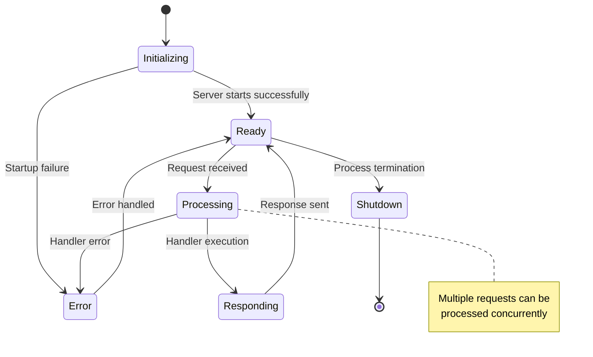

#### Request Lifecycle States

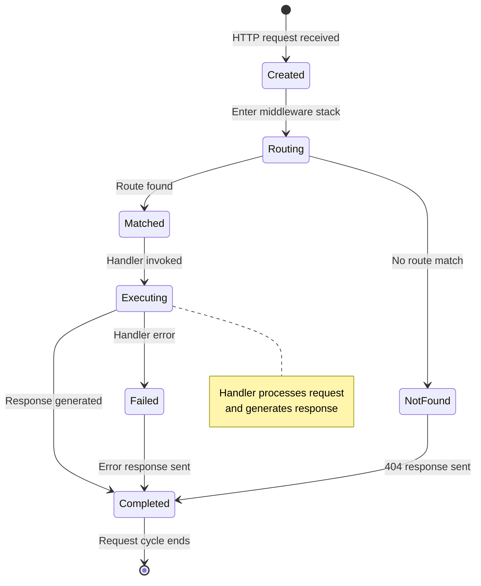

### 4.3.2 Data Persistence Points

#### Memory Management Workflow

That's because Express is creating a req and res object for each request, none of which interfere with each other. But the res object associated with the /slow request is not deallocated because the callback (which is holding a reference to that instance) hasn't executed.

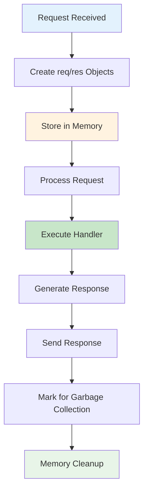

#### Static Content Management

```mermaid
flowchart TD
    A[Application Start] --> B[Load Static Content]
    B --> C[Store "Hello world" String]
    C --> D[Ready for Requests]
    
    D --> E[Request Received]
    E --> F[Retrieve Static Content]
    F --> G[Return to Handler]
    G --> H[Send Response]
    
    H --> E
    
    style A fill:#e3f2fd
    style C fill:#fff3e0
    style F fill:#c8e6c9
    style H fill:#e8f5e8
```

### 4.3.3 Error Handling

#### Error Recovery Mechanisms

A nice side-effect of this behavior is that we can hook into the Express.js global error handler(s) even after the response has been committed. This helps to keep our logging logic in one place and can prevent uncaught exceptions / unhandled Promise rejections from propagating beyond the boundary of the Express.js application.

```mermaid
flowchart TD
    A[Error Occurs] --> B{Error Type?}
    B -->|Route Error| C[Route Error Handler]
    B -->|Middleware Error| D[Middleware Error Handler]
    B -->|System Error| E[Global Error Handler]
    
    C --> F{Response Sent?}
    D --> F
    E --> F
    
    F -->|No| G[Send Error Response]
    F -->|Yes| H[Log Error Only]
    
    G --> I[Client Receives Error]
    H --> J[Continue Processing]
    
    I --> K[Request Complete]
    J --> K
    
    style A fill:#ffebee
    style C,D,E fill:#fff3e0
    style G fill:#ffcdd2
    style H,J fill:#e8f5e8
```

#### Retry and Fallback Processes

```mermaid
flowchart TD
    A[Request Processing] --> B{Handler Success?}
    B -->|Yes| C[Send Response]
    B -->|No| D[Error Detected]
    
    D --> E{Recoverable Error?}
    E -->|Yes| F[Log Warning]
    E -->|No| G[Log Error]
    
    F --> H[Send Default Response]
    G --> I[Send Error Response]
    
    H --> J[Client Receives Response]
    I --> J
    C --> J
    
    style A fill:#e3f2fd
    style C,H fill:#c8e6c9
    style D,G fill:#ffebee
    style F fill:#fff3e0
    style J fill:#e8f5e8
```

## 4.4 REQUIRED DIAGRAMS

### 4.4.1 High-Level System Workflow

```mermaid
flowchart TB
    subgraph "Client Layer"
        A[HTTP Client]
        B[Web Browser]
        C[API Testing Tool]
    end
    
    subgraph "Network Layer"
        D[HTTP Protocol]
        E[TCP/IP Stack]
    end
    
    subgraph "Node.js Application"
        F[HTTP Server]
        G[Express.js Framework]
        H[Router]
        I[Middleware Stack]
        J[Route Handler]
        K[Response Generator]
    end
    
    subgraph "Runtime Environment"
        L[Node.js 24]
        M[V8 Engine]
        N[Event Loop]
    end
    
    A --> D
    B --> D
    C --> D
    D --> E
    E --> F
    F --> G
    G --> H
    H --> I
    I --> J
    J --> K
    K --> I
    I --> H
    H --> G
    G --> F
    F --> E
    E --> D
    D --> A
    
    L --> G
    M --> L
    N --> L
    
    style A,B,C fill:#e1f5fe
    style F,G fill:#fff3e0
    style J fill:#c8e6c9
    style K fill:#e8f5e8
```

### 4.4.2 Detailed Process Flow for Core Features

#### Hello Endpoint Processing Flow

```mermaid
flowchart TD
    A[HTTP GET /hello] --> B[Express Router]
    B --> C{Route Match?}
    C -->|No| D[Continue to Next Route]
    C -->|Yes| E[Execute Handler Function]
    
    E --> F[Access Request Object]
    F --> G[Generate Response Content]
    G --> H[Set Response Headers]
    H --> I[Set Status Code 200]
    I --> J[Send "Hello world"]
    
    D --> K[404 Not Found]
    J --> L[Response Complete]
    K --> M[Error Response]
    
    L --> N[Client Receives Success]
    M --> O[Client Receives Error]
    
    style A fill:#e3f2fd
    style E fill:#c8e6c9
    style J fill:#e8f5e8
    style K,M fill:#ffebee
    style N fill:#e8f5e8
    style O fill:#ffcdd2
```

### 4.4.3 Error Handling Flowcharts

#### Comprehensive Error Handling Flow

```mermaid
flowchart TD
    A[Request Processing] --> B{Try Block}
    B -->|Success| C[Normal Flow]
    B -->|Exception| D[Catch Block]
    
    C --> E[Execute Handler]
    E --> F{Handler Success?}
    F -->|Yes| G[Send Response]
    F -->|No| H[Handler Error]
    
    D --> I{Error Type?}
    I -->|Syntax Error| J[500 Internal Error]
    I -->|Route Error| K[404 Not Found]
    I -->|Method Error| L[405 Method Not Allowed]
    I -->|Server Error| M[503 Service Unavailable]
    
    H --> N[Error Middleware]
    N --> O[Log Error]
    O --> P[Send Error Response]
    
    G --> Q[Success Response]
    J --> R[Error Response]
    K --> R
    L --> R
    M --> R
    P --> R
    
    Q --> S[Request Complete]
    R --> S
    
    style A fill:#e3f2fd
    style C,E fill:#c8e6c9
    style G,Q fill:#e8f5e8
    style D,H,N fill:#fff3e0
    style J,K,L,M,P,R fill:#ffebee
```

### 4.4.4 Integration Sequence Diagrams

#### Complete Request-Response Sequence

```mermaid
sequenceDiagram
    participant C as Client
    participant S as Server
    participant E as Express
    participant M as Middleware
    participant R as Router
    participant H as Handler
    
    C->>S: HTTP GET /hello
    S->>E: Create request context
    E->>M: Enter middleware stack
    M->>M: Process middleware chain
    M->>R: Route matching
    R->>H: Execute route handler
    
    Note over H: Generate "Hello world" response
    
    H->>R: Return response data
    R->>M: Pass response through middleware
    M->>E: Complete middleware processing
    E->>S: Prepare HTTP response
    S->>C: 200 OK "Hello world"
    
    Note over C,S: Request-Response Cycle Complete
```

### 4.4.5 State Transition Diagrams

#### Server Lifecycle State Management

```mermaid
stateDiagram-v2
    [*] --> Initializing: Application start
    Initializing --> Loading: Load dependencies
    Loading --> Configuring: Setup Express app
    Configuring --> Binding: Bind to port
    Binding --> Listening: Server ready
    
    Listening --> Processing: Request received
    Processing --> Listening: Request completed
    
    Processing --> Handling: Route matched
    Handling --> Responding: Generate response
    Responding --> Processing: Response sent
    
    Listening --> Shutting: Shutdown signal
    Processing --> Shutting: Graceful shutdown
    Shutting --> Stopped: Server stopped
    Stopped --> [*]
    
    Initializing --> Error: Startup failure
    Loading --> Error: Dependency error
    Configuring --> Error: Configuration error
    Binding --> Error: Port binding error
    Error --> [*]: Exit with error
    
    note right of Processing
        Multiple concurrent
        request processing
    end note
    
    note right of Handling
        Execute /hello
        route handler
    end note
```

#### Request Processing State Flow

```mermaid
stateDiagram-v2
    [*] --> Received: HTTP request arrives
    Received --> Parsing: Parse request headers
    Parsing --> Routing: Match against routes
    
    Routing --> Found: Route /hello matched
    Routing --> NotFound: No route match
    
    Found --> Executing: Execute handler
    Executing --> Generating: Create response
    Generating --> Sending: Send to client
    Sending --> Complete: Response sent
    
    NotFound --> Error404: Generate 404
    Error404 --> Sending: Send error response
    
    Executing --> HandlerError: Handler exception
    HandlerError --> Error500: Generate 500
    Error500 --> Sending: Send error response
    
    Complete --> [*]: Request lifecycle ends
    
    note right of Executing
        Process "Hello world"
        response generation
    end note
```

# 5. SYSTEM ARCHITECTURE

## 5.1 HIGH-LEVEL ARCHITECTURE

### 5.1.1 System Overview

The Node.js tutorial application employs a **minimalist layered architecture** that demonstrates fundamental web server patterns through a simplified implementation. Express JS, a minimal Node JS framework, got the third position as the most common web framework. Therefore, having your application in Express JS decorated with Clean Architecture is a blessing that leads to better performance and easy maintainability of the project.

**Architecture Style and Rationale**

The system follows a **three-tier architecture pattern** with clear separation of concerns between the presentation layer (HTTP interface), application layer (Express.js routing), and infrastructure layer (Node.js runtime). The primary principle of the most popular architectures is to separate the technical concerns (e.g., HTTP, DB, etc) from the pure logic of the app so a developer can code more features without worrying about infrastructural concerns. Putting each concern in a dedicated folder, also known as the 3-Tier pattern, is the simplest way to meet this goal

This architectural approach prioritizes educational clarity over production complexity, making it ideal for demonstrating core Node.js and Express.js concepts without introducing unnecessary abstraction layers.

**Key Architectural Principles**

- **Single Responsibility**: Each component has a clearly defined purpose within the HTTP request-response cycle
- **Separation of Concerns**: HTTP handling, routing logic, and response generation are distinctly separated
- **Simplicity First**: Express.js is a minimal web application framework that improves the productivity of web developers. It is very flexible and does not enforce any architecture pattern.
- **Event-Driven Design**: Leverages Node.js asynchronous, non-blocking I/O model for request processing
- **Middleware Pattern**: Middlewares are a powerful yet simple concept: the output of one unit/function is the input for the next. If you ever used Express or Koa then you already used this concept.

**System Boundaries and Major Interfaces**

The application operates within well-defined boundaries that include the Node.js runtime environment, Express.js framework layer, and HTTP protocol interface. External interactions are limited to standard HTTP client communications, ensuring the tutorial remains focused on core server-side concepts without external service dependencies.

### 5.1.2 Core Components Table

| Component Name | Primary Responsibility | Key Dependencies | Integration Points |
|---|---|---|---|
| **HTTP Server** | Accept and manage HTTP connections | Node.js HTTP module, Express.js | Network layer, client requests |
| **Express Application** | Route management and middleware orchestration | Express.js 5.1.0 framework | HTTP server, route handlers |
| **Route Handler** | Process /hello endpoint requests | Express router, response generator | Application layer, middleware stack |
| **Response Generator** | Format and send HTTP responses | Express response object | Route handler, HTTP protocol |

### 5.1.3 Data Flow Description

**Primary Data Flows**

The application implements a straightforward request-response data flow pattern. Middleware in Express refers to functions that process requests before reaching the route handlers. These functions can modify the request and response objects, end the request-response cycle, or call the next middleware function. Middleware functions are executed in the order they are defined.

HTTP requests enter through the Node.js HTTP server, pass through the Express.js middleware stack, reach the designated route handler, and return formatted responses to clients. The data transformation occurs primarily in the response generation phase, where static string content is formatted into proper HTTP responses with appropriate headers and status codes.

**Integration Patterns and Protocols**

The system utilizes standard HTTP/1.1 protocol for client communication and follows RESTful conventions for the `/hello` endpoint. Node.js is a popular choice for building RESTful APIs. RESTful architecture follows principles such as statelessness and uniform interfaces.

**Data Transformation Points**

Key transformation occurs when the static "Hello world" string is wrapped in HTTP response formatting, including content-type headers, status codes, and proper response structure. The Express.js framework handles automatic request parsing and response serialization.

**Key Data Stores and Caches**

The tutorial application operates without persistent data storage, utilizing only in-memory string literals for response content. This design choice eliminates database complexity while maintaining focus on HTTP server fundamentals.

### 5.1.4 External Integration Points

| System Name | Integration Type | Data Exchange Pattern | Protocol/Format |
|---|---|---|---|
| **HTTP Clients** | Synchronous Request-Response | Client-initiated requests | HTTP/1.1, JSON/Text |
| **Node.js Runtime** | Direct Integration | Function calls and callbacks | JavaScript API |
| **Operating System** | Network Interface | Socket-based communication | TCP/IP |

## 5.2 COMPONENT DETAILS

### 5.2.1 HTTP Server Component

**Purpose and Responsibilities**

The HTTP Server component serves as the foundational layer that enables network communication between clients and the application. It manages TCP connections, parses incoming HTTP requests, and coordinates response delivery through the Express.js framework integration.

**Technologies and Frameworks**

- **Node.js 24.x**: Provides the JavaScript runtime environment with V8 engine 13.6
- **Express.js 5.1.0**: Web application framework for HTTP server functionality
- **Built-in HTTP Module**: Node.js core module for HTTP protocol implementation

**Key Interfaces and APIs**

The component exposes standard HTTP methods (GET, POST, PUT, DELETE) through Express.js routing interfaces. Starting with Express 5, middleware functions that return a Promise will call next(value) when they reject or throw an error. next will be called with either the rejected value or the thrown Error.

**Data Persistence Requirements**

No persistent data storage required. The component operates entirely in-memory with configuration parameters stored as environment variables.

**Scaling Considerations**

The single-process design is appropriate for tutorial purposes but can be extended with clustering or load balancing for production scenarios. Master the art of Node.js scalability by learning about the "Scale Cube", discover how to run multiple instances of the same application and how to use load balancers and service registers.

### 5.2.2 Express Application Component

**Purpose and Responsibilities**

The Express Application component orchestrates the middleware stack and manages route definitions. The express application object holds an internal reference to a Router instance object. this._router = new Router({ caseSensitive: this.enabled('case sensitive routing'), strict: this.enabled('strict routing') }); this._router.use(query(this.get('query parser fn'))); this._router.use(middleware.init(this));

**Technologies and Frameworks**

- **Express.js 5.1.0**: Core web framework with enhanced security features
- **Middleware Pattern**: As we can see, the idea behind the middleware pattern is not new. We can consider middleware pattern in Express.js a variant of: ... Avoid coupling the sender of a request to the receiver by giving more than one object a chance to handle the request.

**Key Interfaces and APIs**

Provides routing APIs (`app.get()`, `app.post()`, etc.) and middleware registration (`app.use()`). The component implements the Chain of Responsibility pattern for request processing.

**Data Persistence Requirements**

Maintains application state in memory, including route definitions, middleware stack configuration, and server settings.

**Scaling Considerations**

Stateless design enables horizontal scaling through multiple application instances behind load balancers.

### 5.2.3 Route Handler Component

**Purpose and Responsibilities**

The Route Handler component processes specific endpoint requests and generates appropriate responses. For the `/hello` endpoint, it returns the static "Hello world" response with proper HTTP formatting.

**Technologies and Frameworks**

- **Express.js Router**: Route matching and handler execution
- **JavaScript ES2024**: Modern language features for handler implementation

**Key Interfaces and APIs**

Implements Express.js route handler signature `(req, res, next) => {}` with access to request and response objects.

**Data Persistence Requirements**

No persistence required. Handlers operate on request data and generate responses dynamically.

**Scaling Considerations**

Stateless handlers enable easy horizontal scaling and load distribution across multiple server instances.

### 5.2.4 Response Generator Component

**Purpose and Responsibilities**

The Response Generator component formats HTTP responses with appropriate headers, status codes, and content. An easy example for this pattern is the req and the resp. In Node, the request and response objects have very limited APIs. Express enhances these objects by decorating them with a lot of new features.

**Technologies and Frameworks**

- **Express.js Response Object**: Enhanced response capabilities
- **HTTP Protocol Standards**: Proper header and status code management

**Key Interfaces and APIs**

Utilizes Express.js response methods (`res.send()`, `res.status()`, `res.set()`) for response construction and delivery.

**Data Persistence Requirements**

No persistence required. Generates responses from static content and request context.

**Scaling Considerations**

Lightweight response generation supports high-throughput scenarios with minimal resource overhead.

### 5.2.5 Component Interaction Diagrams

#### Request Processing Flow

```mermaid
sequenceDiagram
    participant Client as HTTP Client
    participant Server as HTTP Server
    participant App as Express App
    participant Router as Router
    participant Handler as Route Handler
    participant Generator as Response Generator
    
    Client->>Server: HTTP GET /hello
    Server->>App: Forward request
    App->>Router: Route matching
    Router->>Handler: Execute handler
    Handler->>Generator: Generate response
    Generator->>Handler: Formatted response
    Handler->>Router: Return response
    Router->>App: Complete processing
    App->>Server: Send response
    Server->>Client: HTTP 200 "Hello world"
    
    Note over Client,Generator: Express.js 5.1.0 Request Lifecycle
```

#### Component State Transitions

```mermaid
stateDiagram-v2
    [*] --> Initializing: Application start
    Initializing --> Ready: Components loaded
    Ready --> Processing: Request received
    Processing --> Routing: Route matching
    Routing --> Handling: Handler execution
    Handling --> Responding: Response generation
    Responding --> Ready: Response sent
    
    Processing --> Error: Request error
    Routing --> Error: Route not found
    Handling --> Error: Handler error
    Error --> Ready: Error handled
    
    Ready --> Shutdown: Process termination
    Shutdown --> [*]
    
    note right of Processing
        Multiple concurrent
        request processing
    end note
```

#### Middleware Stack Flow

```mermaid
flowchart TD
    A[HTTP Request] --> B[Express App]
    B --> C[Middleware Stack]
    C --> D[Built-in Middleware]
    C --> E[Application Middleware]
    C --> F[Route Middleware]
    
    D --> G[Body Parser]
    D --> H[Static Files]
    
    E --> I[Logging]
    E --> J[Error Handling]
    
    F --> K[Route Handler]
    K --> L[Response Generation]
    
    L --> M[HTTP Response]
    
    style A fill:#e3f2fd
    style B fill:#fff3e0
    style K fill:#c8e6c9
    style M fill:#e8f5e8
```

## 5.3 TECHNICAL DECISIONS

### 5.3.1 Architecture Style Decisions

**Layered Architecture Selection**

| Decision Factor | Rationale | Trade-offs |
|---|---|---|
| **Educational Clarity** | Simple three-tier structure easy to understand | Limited scalability patterns |
| **Minimal Complexity** | Focuses on core concepts without abstraction overhead | Not suitable for complex applications |
| **Framework Alignment** | Matches Express.js natural patterns | Framework dependency |

**Justification**: The secret to building a large project that is easy to maintain and performs better is to separate files and classes into components that can change independently without affecting other components: this is what Clean Architecture is all about. For tutorial purposes, the simplified layered approach provides clear separation while maintaining educational focus.

### 5.3.2 Communication Pattern Choices

**Synchronous Request-Response Pattern**

| Aspect | Decision | Justification |
|---|---|---|
| **Pattern Type** | Synchronous HTTP | Simplest to understand and implement |
| **Protocol** | HTTP/1.1 | Standard web protocol with broad support |
| **Data Format** | Plain text | Eliminates serialization complexity |

**Middleware Chain Pattern**

Middleware design patterns can be used for the implementation of a variety of functions such as authentication, logging, and error handling. It is a powerful tool for building modular, scalable, and maintainable Node.js applications.

The middleware pattern enables modular request processing while maintaining clear separation of concerns.

### 5.3.3 Data Storage Solution Rationale

**In-Memory Storage Decision**

| Requirement | Solution | Rationale |
|---|---|---|
| **Data Persistence** | None required | Tutorial scope focuses on HTTP concepts |
| **Response Content** | Static string literals | Eliminates database complexity |
| **Configuration** | Environment variables | Standard Node.js configuration pattern |

**No Database Integration**: The decision to exclude database integration aligns with the educational objective of demonstrating HTTP server fundamentals without introducing data persistence complexity.

### 5.3.4 Security Mechanism Selection

**Framework-Level Security**

Always filter and sanitize user input to protect against cross-site scripting (XSS) and command injection attacks. Defend against SQL injection attacks by using parameterized queries or prepared statements.

| Security Feature | Implementation | Justification |
|---|---|---|
| **ReDoS Protection** | Express.js 5.1.0 built-in | Framework provides automatic protection |
| **Input Validation** | Minimal (tutorial scope) | Educational focus on HTTP concepts |
| **Authentication** | Not implemented | Outside tutorial scope |

### 5.3.5 Architecture Decision Records

#### ADR-001: Express.js 5.1.0 Framework Selection

```mermaid
flowchart TD
    A[Framework Selection] --> B{Evaluation Criteria}
    B --> C[Stability]
    B --> D[Security]
    B --> E[Educational Value]
    
    C --> F[Express.js 5.1.0]
    D --> F
    E --> F
    
    F --> G[Decision: Express.js 5.1.0]
    G --> H[Latest stable version]
    G --> I[Enhanced security features]
    G --> J[Industry standard]
    
    style A fill:#e3f2fd
    style G fill:#c8e6c9
    style H,I,J fill:#e8f5e8
```

**Status**: Accepted  
**Context**: Need for modern, secure web framework for tutorial application  
**Decision**: Use Express.js 5.1.0 as the primary web framework  
**Consequences**: Access to latest security features and modern JavaScript patterns

#### ADR-002: Single Endpoint Design

```mermaid
flowchart TD
    A[API Design] --> B{Scope Evaluation}
    B --> C[Educational Focus]
    B --> D[Complexity Management]
    B --> E[Learning Objectives]
    
    C --> F[Single Endpoint]
    D --> F
    E --> F
    
    F --> G[Decision: /hello Endpoint Only]
    G --> H[Clear learning path]
    G --> I[Minimal complexity]
    G --> J[Focused demonstration]
    
    style A fill:#e3f2fd
    style G fill:#c8e6c9
    style H,I,J fill:#e8f5e8
```

**Status**: Accepted  
**Context**: Tutorial application requires focused learning experience  
**Decision**: Implement single `/hello` endpoint returning "Hello world"  
**Consequences**: Clear, focused learning experience without feature complexity

## 5.4 CROSS-CUTTING CONCERNS

### 5.4.1 Monitoring and Observability Approach

**Logging Strategy**

The tutorial application implements basic console-based logging for educational purposes. Logging: Middleware can be used to log information about each request that comes into your application. This can be useful for debugging, monitoring performance, and tracking user behaviour.

| Logging Level | Implementation | Purpose |
|---|---|---|
| **Info** | Console.log for request tracking | Basic request monitoring |
| **Error** | Console.error for exceptions | Error identification |
| **Debug** | Optional verbose logging | Development troubleshooting |

**Performance Monitoring**

Basic performance metrics include response time measurement and memory usage tracking through Node.js built-in process monitoring capabilities.

### 5.4.2 Error Handling Patterns

**Express.js 5.0 Error Handling**

Starting with Express 5, middleware functions that return a Promise will call next(value) when they reject or throw an error. next will be called with either the rejected value or the thrown Error.

| Error Type | Handling Strategy | Response Pattern |
|---|---|---|
| **Route Errors** | Express error middleware | 404 Not Found |
| **Handler Errors** | Promise rejection handling | 500 Internal Server Error |
| **System Errors** | Global error handlers | Graceful degradation |

### 5.4.3 Authentication and Authorization Framework

**No Authentication Required**

The tutorial application operates without authentication mechanisms to maintain educational focus on HTTP server fundamentals. I am struggling to find information regarding design patterns and best practices for authorization in node applications. Preferably, I would like to use the role-based model since my users are familiar with that approach and its care and feeding.

For production applications, authentication patterns would include:
- JWT token-based authentication
- Session management
- Role-based access control (RBAC)

### 5.4.4 Performance Requirements and SLAs

**Response Time Targets**

| Metric | Target | Measurement |
|---|---|---|
| **Endpoint Response** | < 100ms | HTTP request to response |
| **Server Startup** | < 1 second | Application initialization |
| **Memory Usage** | < 50MB | Runtime memory footprint |

**Scalability Considerations**

The single-process design supports educational use cases but can be extended with clustering for production scenarios.

### 5.4.5 Error Handling Flows

#### Comprehensive Error Processing

```mermaid
flowchart TD
    A[Request Processing] --> B{Error Occurred?}
    B -->|No| C[Normal Flow]
    B -->|Yes| D[Error Detection]
    
    C --> E[Send Response]
    
    D --> F{Error Type?}
    F -->|Route Error| G[404 Handler]
    F -->|Handler Error| H[500 Handler]
    F -->|System Error| I[Global Handler]
    
    G --> J[Log Error]
    H --> J
    I --> J
    
    J --> K[Format Error Response]
    K --> L[Send Error Response]
    
    E --> M[Request Complete]
    L --> M
    
    style A fill:#e3f2fd
    style C fill:#c8e6c9
    style D fill:#fff3e0
    style G,H,I fill:#ffcdd2
    style M fill:#e8f5e8
```

#### Error Recovery Mechanisms

```mermaid
flowchart TD
    A[Error Detected] --> B{Recoverable?}
    B -->|Yes| C[Log Warning]
    B -->|No| D[Log Error]
    
    C --> E[Continue Processing]
    D --> F[Terminate Request]
    
    E --> G[Send Default Response]
    F --> H[Send Error Response]
    
    G --> I[Monitor for Patterns]
    H --> I
    
    I --> J[Update Error Metrics]
    J --> K[Request Complete]
    
    style A fill:#ffebee
    style C fill:#fff3e0
    style D fill:#ffcdd2
    style G,H fill:#e8f5e8
    style K fill:#c8e6c9
```

### 5.4.6 Disaster Recovery Procedures

**Application Recovery**

| Scenario | Recovery Procedure | Recovery Time |
|---|---|---|
| **Process Crash** | Automatic restart via process manager | < 5 seconds |
| **Port Conflict** | Alternative port binding | < 10 seconds |
| **Memory Exhaustion** | Process restart with monitoring | < 15 seconds |

**Data Recovery**

Since the application operates without persistent data, recovery focuses on application state restoration and configuration reload from environment variables.

**Monitoring and Alerting**

Basic monitoring includes process health checks and response time tracking. Production deployments would implement comprehensive monitoring with tools like Prometheus, Grafana, or cloud-native monitoring solutions.

# 6. SYSTEM COMPONENTS DESIGN

## 6.1 CORE COMPONENT ARCHITECTURE

### 6.1.1 HTTP Server Component

**Component Overview**

The HTTP Server component serves as the foundational layer that enables network communication between clients and the Node.js tutorial application. This release brings several significant updates, including the upgrade of the V8 JavaScript engine to version 13.6 and npm to version 11. The component leverages Node.js 24's enhanced capabilities to provide robust HTTP protocol handling while maintaining educational simplicity.

**Technical Implementation Details**

| Aspect | Specification | Implementation Notes |
|---|---|---|
| **Runtime Environment** | Node.js 24.x | Node.js 24 will enter long-term support (LTS) in October |
| **HTTP Protocol** | HTTP/1.1 | Standard web protocol with broad client support |
| **Port Configuration** | 3000 (default) | Configurable via environment variables |
| **Connection Handling** | Single-threaded event loop | Node.js asynchronous I/O model |

**Component Interfaces and APIs**

The HTTP Server component exposes standard Node.js HTTP server interfaces through Express.js framework integration. Express.js 5.0 requires Node.js 18 or higher, ensuring compatibility with modern JavaScript features and security enhancements.

**Security and Performance Characteristics**

Node.js uses something called strict mode by default. This means if Node.js sees any weird or incorrect web data, it will stop and throw an error. It stops bad actors from sending weird data on purpose to mess with or crash your server—a common attack called a denial-of-service (DOS) attack.

**Scalability Considerations**

The single-process design is appropriate for tutorial purposes but can be extended with Node.js clustering capabilities for production scenarios. The component supports horizontal scaling through load balancer integration.

### 6.1.2 Express.js Application Component

**Component Overview**

The Express.js Application component orchestrates the middleware stack and manages route definitions using the latest Express.js framework. Latest version: 5.1.0, last published: 2 months ago. It has been called the de facto standard server framework for Node.js.

**Framework Selection and Justification**

Express 5.1.0 is now the default on npm, and we're introducing an official LTS schedule for the v4 and v5 release lines. The selection of Express.js 5.1.0 provides access to the latest security features and performance improvements while maintaining educational clarity.

**Security Enhancements**

Updated to path-to-regexp@8.x, removing sub-expression regex patterns for security reasons (ReDoS mitigation). These changes improve security, simplify route definitions, and help mitigate vulnerabilities like ReDoS attacks.

**Middleware Architecture**

| Middleware Type | Purpose | Implementation |
|---|---|---|
| **Built-in Middleware** | Core Express functionality | JSON parsing, URL encoding |
| **Security Middleware** | Request validation | Express 5 no longer supports sub-expressions in regular expressions |
| **Route Middleware** | Endpoint handling | Custom route handlers for /hello endpoint |

**Promise Support and Error Handling**

Middleware can now return rejected promises, caught by the router as errors. Express 5 introduces a significant improvement for developers using async/await by automatically forwarding rejected promises to error-handling middleware.

### 6.1.3 Route Handler Component

**Component Overview**

The Route Handler component processes specific endpoint requests and generates appropriate responses for the `/hello` endpoint. The component implements modern JavaScript patterns while maintaining educational simplicity.

**Route Definition and Processing**

```mermaid
flowchart TD
    A[HTTP GET /hello] --> B[Express Router]
    B --> C[Route Matching]
    C --> D[Handler Execution]
    D --> E[Response Generation]
    E --> F[Client Response]
    
    G[Path Validation] --> C
    H[Security Checks] --> D
    I[Error Handling] --> E
    
    style A fill:#e3f2fd
    style D fill:#c8e6c9
    style F fill:#e8f5e8
```

**Security Implementation**

The route handler incorporates Express.js 5.1.0 security features including ReDoS protection and enhanced input validation. In Express 5, this type of inline regex is no longer supported due to its susceptibility to ReDoS attacks. Instead, using an input validation library for complex patterns is recommended.

**Performance Characteristics**

| Metric | Target | Implementation |
|---|---|---|
| **Response Time** | < 100ms | Synchronous string response |
| **Memory Usage** | Minimal | Static content handling |
| **Concurrency** | Event-driven | Node.js async processing |

### 6.1.4 Response Generator Component

**Component Overview**

The Response Generator component formats HTTP responses with appropriate headers, status codes, and content. The component utilizes Express.js enhanced response capabilities to ensure proper HTTP protocol compliance.

**Response Formatting Specifications**

| Response Element | Specification | Implementation |
|---|---|---|
| **Status Code** | 200 OK | Standard success response |
| **Content-Type** | text/plain | Plain text response format |
| **Response Body** | "Hello world" | Static string content |
| **Headers** | Standard HTTP headers | Express.js automatic header management |

**Error Response Handling**

```mermaid
flowchart TD
    A[Response Generation] --> B{Success?}
    B -->|Yes| C[200 OK Response]
    B -->|No| D[Error Detection]
    
    D --> E{Error Type?}
    E -->|Handler Error| F[500 Internal Server Error]
    E -->|Route Error| G[404 Not Found]
    E -->|Method Error| H[405 Method Not Allowed]
    
    C --> I[Send to Client]
    F --> I
    G --> I
    H --> I
    
    style A fill:#e3f2fd
    style C fill:#c8e6c9
    style I fill:#e8f5e8
    style F,G,H fill:#ffcdd2
```

## 6.2 COMPONENT INTERACTION PATTERNS

### 6.2.1 Request Processing Flow

**End-to-End Request Lifecycle**

The tutorial application implements a streamlined request processing flow that demonstrates fundamental HTTP server patterns. The interaction between components follows Express.js middleware patterns with clear separation of concerns.

```mermaid
sequenceDiagram
    participant Client as HTTP Client
    participant Server as HTTP Server
    participant Express as Express App
    participant Router as Route Handler
    participant Generator as Response Generator
    
    Client->>Server: HTTP GET /hello
    Note over Server: Node.js 24 HTTP handling
    Server->>Express: Forward request
    Note over Express: Express.js 5.1.0 processing
    Express->>Router: Route matching
    Note over Router: /hello endpoint handler
    Router->>Generator: Generate response
    Note over Generator: Format "Hello world"
    Generator->>Router: Formatted response
    Router->>Express: Complete processing
    Express->>Server: Send response
    Server->>Client: HTTP 200 "Hello world"
    
    Note over Client,Generator: Complete Request-Response Cycle
```

**Middleware Stack Processing**

The Express.js middleware stack processes requests through a series of functions that can modify request and response objects. Express.js provides a rich set of middleware, making it easy to handle common tasks like parsing request bodies, handling cookies, and reducing response size. Think of middleware as software that provides common services and capabilities to apps.

### 6.2.2 Data Flow Architecture

**Component Data Exchange**

| Source Component | Target Component | Data Type | Processing |
|---|---|---|---|
| **HTTP Server** | **Express App** | HTTP Request Object | Request parsing and validation |
| **Express App** | **Route Handler** | Request/Response Objects | Route matching and execution |
| **Route Handler** | **Response Generator** | Response Data | Content formatting |
| **Response Generator** | **HTTP Server** | HTTP Response | Protocol compliance |

**State Management Patterns**

```mermaid
stateDiagram-v2
    [*] --> Idle: Server ready
    Idle --> Processing: Request received
    Processing --> Routing: Express middleware
    Routing --> Handling: Route matched
    Handling --> Responding: Generate response
    Responding --> Idle: Response sent
    
    Processing --> Error: Request error
    Routing --> Error: Route not found
    Handling --> Error: Handler error
    Error --> Idle: Error response sent
    
    note right of Processing
        Multiple concurrent
        request processing
    end note
```

### 6.2.3 Error Propagation Mechanisms

**Express.js 5.1.0 Error Handling**

Express 5 introduces a significant improvement for developers using async/await by automatically forwarding rejected promises to error-handling middleware. This enhancement simplifies error management across component boundaries.

**Error Flow Architecture**

```mermaid
flowchart TD
    A[Component Error] --> B{Error Type?}
    B -->|Synchronous| C[Immediate Handling]
    B -->|Asynchronous| D[Promise Rejection]
    
    C --> E[Express Error Middleware]
    D --> F[Automatic Error Forwarding]
    F --> E
    
    E --> G[Error Response Generation]
    G --> H[Client Error Response]
    
    I[Logging] --> E
    J[Monitoring] --> E
    
    style A fill:#ffebee
    style E fill:#fff3e0
    style H fill:#ffcdd2
```

## 6.3 COMPONENT SPECIFICATIONS

### 6.3.1 HTTP Server Component Specification

**Interface Definition**

```mermaid
classDiagram
    class HTTPServer {
        +port: number
        +host: string
        +server: http.Server
        +start(): Promise~void~
        +stop(): Promise~void~
        +handleRequest(req, res): void
    }
    
    class ExpressApp {
        +app: Express
        +middleware: Middleware[]
        +routes: Route[]
        +configure(): void
        +addRoute(path, handler): void
    }
    
    HTTPServer --> ExpressApp : uses
```

**Configuration Parameters**

| Parameter | Type | Default | Description |
|---|---|---|---|
| **port** | number | 3000 | Server listening port |
| **host** | string | 'localhost' | Server binding address |
| **timeout** | number | 30000 | Request timeout in milliseconds |
| **keepAlive** | boolean | true | HTTP keep-alive connections |

**Performance Metrics**

| Metric | Target | Measurement Method |
|---|---|---|
| **Startup Time** | < 1 second | Application initialization |
| **Memory Usage** | < 50MB | Process memory monitoring |
| **Request Throughput** | > 1000 req/sec | Load testing |

### 6.3.2 Express.js Application Component Specification

**Framework Configuration**

The Express.js application component utilizes the latest framework features while maintaining educational clarity. This is important because it means it is the "default installed version" and will trigger the transition of nearly 17 million weekly downloads from our current latest v4.21.2 to v5.

**Middleware Stack Configuration**

| Middleware Layer | Purpose | Implementation |
|---|---|---|
| **Security Layer** | Request validation | Built-in Express.js 5.1.0 security features |
| **Parsing Layer** | Request body parsing | JSON and URL-encoded parsers |
| **Routing Layer** | Route matching | Express.js router with ReDoS protection |
| **Error Layer** | Error handling | Automatic promise rejection handling |

**Route Definition Specification**

```mermaid
flowchart LR
    A[Route Definition] --> B[Path Pattern]
    A --> C[HTTP Method]
    A --> D[Handler Function]
    
    B --> E["/hello"]
    C --> F["GET"]
    D --> G["(req, res) => {}"]
    
    H[Security Validation] --> B
    I[Method Validation] --> C
    J[Handler Validation] --> D
    
    style A fill:#e3f2fd
    style E,F,G fill:#c8e6c9
```

### 6.3.3 Route Handler Component Specification

**Handler Function Signature**

The route handler implements the standard Express.js handler pattern with enhanced error handling capabilities provided by Express.js 5.1.0.

**Input/Output Specification**

| Parameter | Type | Description |
|---|---|---|
| **req** | Express.Request | HTTP request object |
| **res** | Express.Response | HTTP response object |
| **next** | Express.NextFunction | Error handling function |

**Processing Logic**

```mermaid
flowchart TD
    A[Handler Invocation] --> B[Request Validation]
    B --> C[Path Verification]
    C --> D[Method Check]
    D --> E[Generate Response]
    E --> F[Send to Client]
    
    G[Error Detection] --> H[Error Middleware]
    H --> I[Error Response]
    
    B --> G
    C --> G
    D --> G
    E --> G
    
    style A fill:#e3f2fd
    style E fill:#c8e6c9
    style F fill:#e8f5e8
    style G,H,I fill:#ffcdd2
```

### 6.3.4 Response Generator Component Specification

**Response Format Specification**

The Response Generator component ensures proper HTTP response formatting with appropriate headers and status codes.

**Response Structure**

| Element | Specification | Implementation |
|---|---|---|
| **Status Code** | 200 OK | Standard success response |
| **Content-Type** | text/plain; charset=utf-8 | Plain text with UTF-8 encoding |
| **Content-Length** | Calculated automatically | Express.js automatic calculation |
| **Response Body** | "Hello world" | Static string content |

**Header Management**

```mermaid
flowchart TD
    A[Response Generation] --> B[Set Status Code]
    B --> C[Set Content-Type]
    C --> D[Calculate Content-Length]
    D --> E[Add Security Headers]
    E --> F[Send Response Body]
    
    G[Express.js Automatic Headers] --> C
    H[Security Middleware] --> E
    
    style A fill:#e3f2fd
    style F fill:#e8f5e8
    style G,H fill:#fff3e0
```

## 6.4 INTEGRATION SPECIFICATIONS

### 6.4.1 Component Integration Matrix

**Inter-Component Dependencies**

| Component | Dependencies | Integration Type | Data Exchange |
|---|---|---|---|
| **HTTP Server** | Node.js HTTP module | Direct | TCP/HTTP protocol |
| **Express App** | Express.js 5.1.0, HTTP Server | Framework | Request/Response objects |
| **Route Handler** | Express App, Response Generator | Function call | Handler execution |
| **Response Generator** | Express Response API | Method call | Response formatting |

### 6.4.2 External System Integration

**Node.js Runtime Integration**

This release brings several significant updates, including the upgrade of the V8 JavaScript engine to version 13.6 and npm to version 11. Starting with Node.js 24, support for MSVC has been removed, and ClangCL is now required to compile Node.js on Windows.

**Package Management Integration**

The tutorial application integrates with npm for dependency management. Start using express in your project by running `npm i express`. There are 91867 other projects in the npm registry using express.

### 6.4.3 Security Integration Points

**Framework-Level Security**

These changes improve security, simplify route definitions, and help mitigate vulnerabilities like ReDoS attacks. The integration leverages Express.js 5.1.0 built-in security features for comprehensive protection.

**Security Architecture**

```mermaid
flowchart TD
    A[Request Input] --> B[Express.js Security Layer]
    B --> C[ReDoS Protection]
    B --> D[Input Validation]
    B --> E[Header Security]
    
    C --> F[Route Processing]
    D --> F
    E --> F
    
    F --> G[Response Security]
    G --> H[Secure Headers]
    G --> I[Content Validation]
    
    H --> J[Client Response]
    I --> J
    
    style A fill:#e3f2fd
    style B fill:#fff3e0
    style F fill:#c8e6c9
    style J fill:#e8f5e8
```

## 6.5 DEPLOYMENT ARCHITECTURE

### 6.5.1 Component Deployment Strategy

**Single-Process Deployment**

The tutorial application deploys as a single Node.js process, appropriate for educational purposes and development environments.

**Deployment Configuration**

| Aspect | Specification | Implementation |
|---|---|---|
| **Process Model** | Single process | Node.js event loop |
| **Port Binding** | Environment configurable | Default port 3000 |
| **Resource Requirements** | Minimal | < 50MB memory |
| **Startup Time** | < 1 second | Fast initialization |

### 6.5.2 Scalability Considerations

**Horizontal Scaling Patterns**

While the tutorial application uses a single-process design, production deployments can implement clustering and load balancing for enhanced scalability.

**Scaling Architecture**

```mermaid
flowchart TD
    A[Load Balancer] --> B[Node.js Instance 1]
    A --> C[Node.js Instance 2]
    A --> D[Node.js Instance N]
    
    B --> E[Express App 1]
    C --> F[Express App 2]
    D --> G[Express App N]
    
    E --> H[/hello Handler]
    F --> H
    G --> H
    
    style A fill:#e3f2fd
    style E,F,G fill:#c8e6c9
    style H fill:#e8f5e8
```

### 6.5.3 Monitoring and Observability

**Component Monitoring Strategy**

The tutorial application implements basic monitoring for educational purposes, with extensibility for production monitoring solutions.

**Monitoring Points**

| Component | Metrics | Implementation |
|---|---|---|
| **HTTP Server** | Request count, response time | Built-in logging |
| **Express App** | Route performance, error rates | Middleware logging |
| **Route Handler** | Handler execution time | Function timing |
| **Response Generator** | Response size, format validation | Response monitoring |

**Health Check Implementation**

```mermaid
flowchart TD
    A[Health Check Request] --> B[Server Status]
    B --> C[Express App Status]
    C --> D[Route Handler Status]
    D --> E[Response Generator Status]
    
    E --> F{All Components Healthy?}
    F -->|Yes| G[200 OK Response]
    F -->|No| H[503 Service Unavailable]
    
    style A fill:#e3f2fd
    style G fill:#c8e6c9
    style H fill:#ffcdd2
```

## 6.1 CORE SERVICES ARCHITECTURE

#### Core Services Architecture is not applicable for this system

The Node.js tutorial application with a single `/hello` endpoint **does not require a core services architecture** based on microservices or distributed system patterns. This determination is based on several fundamental characteristics of the application:

### 6.1.1 Application Scope and Complexity

**Single Responsibility Design**

While a monolithic application is a single unified unit, a microservices architecture is a collection of smaller, independently deployable services. A monolithic app is a single indivisible unit, which usually comprises a server-side application, a client-side interface, and a database. The tutorial application implements exactly one business function - returning a "Hello world" response - which does not justify the complexity overhead of service decomposition.

**Educational Focus Over Production Complexity**

For simpler websites or smaller web apps, monolithic architecture is frequently preferred. The complexity that microservices add can be avoided by building and deploying these apps as a single cohesive unit. The primary objective is demonstrating fundamental Node.js and Express.js concepts, not showcasing distributed system architecture patterns.

### 6.1.2 Architectural Decision Rationale

**Monolithic Architecture Appropriateness**

| Decision Factor | Justification | Supporting Evidence |
|---|---|---|
| **Application Size** | Single endpoint with static response | Monolithic architecture might be suitable for simpler applications requiring low latency and high throughput. Monolithic architecture might be suitable for simpler applications requiring low latency and high throughput. |
| **Team Structure** | Individual learning/tutorial context | If you are a single product company, microservices may not be necessary. |
| **Deployment Complexity** | Simple single-process deployment preferred | Because all components of the program are housed under a single codebase, monolithic architecture is often easier to develop. This ease of use can lessen the complexity of the development process, making it more accessible to developers of all skill levels. |

**Microservices Complexity Assessment**

Microservices can add increased complexity that leads to development sprawl, or rapid and unmanaged growth. It can be challenging to determine how different components relate to each other, who owns a particular software component, or how to avoid interfering with dependent components.

### 6.1.3 When Microservices Would Be Appropriate

**Future Scalability Considerations**

The tutorial application could evolve into a microservices architecture if extended with additional functionality:

| Extension Scenario | Microservice Candidates | Architectural Benefit |
|---|---|---|
| **Multi-endpoint API** | User service, Product service, Order service | Each microservice should handle one resource. Resources can be defined at a domain level. For example, in an e-commerce based application, the cart could be a resource, order management could be a resource and so on. |
| **Database Integration** | Data persistence service, Caching service | Independent data management and scaling |
| **Authentication System** | Authentication service, Authorization service | Security boundary separation |

**Migration Path from Monolith**

Should I build full monolithic App first and then take out the heavy parts out of it, one by one? This represents a common and recommended approach for applications that may eventually require microservices architecture.

### 6.1.4 Alternative Architecture Patterns

**Modular Monolithic Design**

Instead of microservices, the tutorial application could demonstrate modular design within a monolithic structure:

```mermaid
flowchart TD
    A[Express.js Application] --> B[Route Module]
    A --> C[Response Module]
    A --> D[Error Handling Module]
    A --> E[Configuration Module]
    
    B --> F[Hello Route Handler]
    C --> G[Response Formatter]
    D --> H[Error Middleware]
    E --> I[Environment Config]
    
    style A fill:#e3f2fd
    style F,G,H,I fill:#c8e6c9
```

**Component-Based Organization**

| Component | Responsibility | Benefit |
|---|---|---|
| **Route Handlers** | Endpoint logic separation | Clear separation of concerns |
| **Middleware Stack** | Cross-cutting concerns | Reusable functionality |
| **Configuration Management** | Environment-specific settings | Deployment flexibility |

### 6.1.5 Performance and Operational Considerations

**Latency and Throughput Optimization**

This approach offers the advantage of minimal latency, as all interactions occur within the system, ensuring speedy data exchange. For a tutorial application prioritizing response time and simplicity, monolithic architecture provides optimal performance characteristics.

**Operational Simplicity**

| Operational Aspect | Monolithic Advantage | Microservices Complexity |
|---|---|---|
| **Deployment** | Single artifact deployment | Multiple service coordination |
| **Monitoring** | Single application monitoring | These drawbacks include the need to monitor each service as it grows and the challenges of troubleshooting malfunctioning services. |
| **Debugging** | With all code located in one place, it's easier to follow a request and find an issue. | Distributed tracing requirements |

### 6.1.6 Technology Stack Alignment

**Express.js Framework Characteristics**

The Express.js framework naturally supports monolithic application patterns through its middleware architecture, making it well-suited for the tutorial application's requirements without requiring service decomposition.

**Node.js Runtime Efficiency**

"Node.js lets us handle many connections with little overhead on one process." The single-process, event-driven nature of Node.js provides excellent performance for the tutorial application's scope without requiring distributed architecture patterns.

### 6.1.7 Educational Value Proposition

**Learning Progression Strategy**

The monolithic tutorial application serves as a foundation for understanding:

1. **HTTP Server Fundamentals** - Core request/response patterns
2. **Express.js Framework** - Middleware and routing concepts  
3. **Node.js Runtime** - Asynchronous programming models
4. **Future Migration Paths** - Understanding when to consider microservices

**Complexity Management for Learning**

In Conclusion, if you're building a small project, a monolithic architecture is like having everything in one big box, which can be easier to manage at first. However, as the project gets bigger, it's like trying to fit more and more things into that same box, which can become difficult.

The tutorial application intentionally maintains the "one big box" approach to focus learning on fundamental concepts rather than distributed system complexity.

#### Conclusion

The Node.js tutorial application with a single `/hello` endpoint is optimally designed as a monolithic application. Core services architecture patterns including microservices decomposition, service discovery, inter-service communication, and distributed resilience mechanisms are not applicable to this system's scope and educational objectives. The monolithic approach provides the appropriate balance of simplicity, performance, and educational clarity for demonstrating fundamental Node.js and Express.js concepts.

## 6.2 DATABASE DESIGN

#### Database Design is not applicable to this system

The Node.js tutorial application with a single `/hello` endpoint that returns "Hello world" **does not require database design or persistent storage mechanisms**. This determination is based on several fundamental characteristics of the application architecture and educational objectives.

### 6.2.1 Application Scope Analysis

**Static Response Architecture**

The application responds with "Hello World!" for requests to the root URL (/) or route, and the most common example Hello World of Node.js is a web server that returns static content. The tutorial application implements exactly this pattern - serving a predetermined static string response without any data persistence requirements.

**Educational Focus Over Data Complexity**

Express does not define any database-related behavior, and you can use any database mechanism supported by Node, but the tutorial application intentionally excludes database integration to maintain focus on fundamental HTTP server concepts. There are three important components in a basic node js hello world program: importing modules, creating a server, and establishing HTTP communication - database integration is not among these core components.

### 6.2.2 Data Requirements Assessment

**No Persistent Data Storage Needed**

| Data Type | Storage Requirement | Implementation |
|---|---|---|
| **Response Content** | Static string literal | In-memory constant |
| **Server Configuration** | Environment variables | Runtime configuration |
| **Request Metadata** | Temporary processing | Request-response cycle only |

**Stateless Application Design**

The tutorial application operates as a completely stateless system where each HTTP request is processed independently without requiring data persistence between requests. When Node.js performs an I/O operation, instead of blocking the thread and wasting CPU cycles waiting, Node.js will resume operations when the response comes back, allowing Node.js to handle thousands of concurrent connections with a single server - but this concurrency capability does not require database storage.

### 6.2.3 Alternative Data Storage Patterns

**In-Memory Data Management**

```mermaid
flowchart TD
    A[HTTP Request] --> B[Express Router]
    B --> C[Static String Response]
    C --> D[HTTP Response]
    
    E[Application Memory] --> C
    F[Environment Variables] --> B
    
    style A fill:#e3f2fd
    style C fill:#c8e6c9
    style D fill:#e8f5e8
    style E,F fill:#fff3e0
```

**Configuration-Based Data Flow**

The application's data flow consists entirely of:
- Static response content stored as string literals
- Server configuration parameters from environment variables
- Temporary request/response objects managed by Express.js framework
- No persistent data requiring database storage

### 6.2.4 When Database Integration Would Be Appropriate

**Future Enhancement Scenarios**

Should the tutorial application evolve beyond its current educational scope, database integration would become relevant in the following scenarios:

| Enhancement | Database Requirement | Justification |
|---|---|---|
| **User Management** | User authentication data | Persistent user credentials and sessions |
| **Dynamic Content** | Content management system | Variable response content based on data |
| **Analytics Tracking** | Request logging and metrics | Historical data analysis and reporting |
| **Multi-endpoint API** | Resource data storage | RESTful CRUD operations on entities |

**Educational Progression Path**

If you want to deliver personalized content you have to store the data somewhere. Let's take a simple example: user signup. The tutorial application could serve as a foundation for more complex examples that demonstrate database integration patterns, but such complexity would contradict the current educational objective of demonstrating basic HTTP server functionality.

### 6.2.5 Technology Stack Implications

**Express.js Framework Flexibility**

You can use any database mechanism supported by Node (Express does not define any database-related behavior). The Express.js framework's database-agnostic design means that database integration is entirely optional and depends on application requirements rather than framework constraints.

**Node.js Runtime Characteristics**

When Node.js performs an I/O operation, like reading from the network, accessing a database or the filesystem, instead of blocking the thread and wasting CPU cycles waiting, Node.js will resume the operations when the response comes back. While Node.js provides excellent database integration capabilities, the tutorial application's scope does not require these features.

### 6.2.6 Performance and Scalability Considerations

**Memory-Based Performance Optimization**

The absence of database operations provides several performance advantages for the tutorial application:

| Performance Aspect | Benefit | Implementation |
|---|---|---|
| **Response Time** | Sub-millisecond response generation | No database query latency |
| **Scalability** | Horizontal scaling without database bottlenecks | Stateless request processing |
| **Resource Usage** | Minimal memory and CPU overhead | No database connection pooling |
| **Deployment Simplicity** | Single-process deployment | No database server dependencies |

**Educational Value Proposition**

The database-free design allows learners to focus on core Node.js and Express.js concepts without the complexity of database configuration, connection management, query optimization, or data modeling. This approach aligns with the tutorial's objective of demonstrating fundamental HTTP server patterns.

### 6.2.7 Security Implications

**Reduced Attack Surface**

The absence of database integration eliminates several categories of security vulnerabilities:

- **SQL Injection Attacks**: No database queries means no SQL injection vectors
- **Database Authentication**: No database credentials to secure or compromise  
- **Data Breach Risks**: No persistent sensitive data storage
- **Connection Security**: No database connection encryption requirements

**Simplified Security Model**

It is a huge security error to insert user input into databases as they come in. This protects you from SQL Injection attacks, which is a kind of attack when the attacker tries to exploit severely sanitized SQL queries. The tutorial application avoids these security concerns entirely by operating without database interactions.

### 6.2.8 Conclusion

The Node.js tutorial application with a single `/hello` endpoint returning "Hello world" is optimally designed without database integration. The application's educational objectives, static response requirements, stateless architecture, and performance characteristics make database design unnecessary and potentially counterproductive to the learning experience.

Database design components including schema design, data management, compliance considerations, and performance optimization are not applicable to this system. The tutorial application demonstrates that effective Node.js applications can operate successfully using in-memory data management and static content serving patterns, providing a solid foundation for understanding HTTP server fundamentals before progressing to more complex database-integrated applications.

## 6.3 INTEGRATION ARCHITECTURE

#### Integration Architecture is not applicable for this system

The Node.js tutorial application with a single `/hello` endpoint that returns "Hello world" **does not require integration architecture** based on external system connections, API gateways, message processing, or third-party service integrations. This determination is based on several fundamental characteristics of the application design and educational objectives.

### 6.3.1 Application Scope and Integration Requirements

**Self-Contained Educational Design**

The most common example Hello World of Node.js is a web server that operates independently without external dependencies. While Express itself is fairly minimalist, developers have created compatible middleware packages to address almost any web development problem, but the tutorial application intentionally excludes these complexities to maintain educational focus.

**Minimal External Dependencies**

The application's architecture consists entirely of:
- Node.js runtime environment (self-contained)
- Express.js framework (local dependency)
- Static string response content (no external data sources)
- HTTP protocol communication (standard web protocol)

**Educational Objective Alignment**

This tutorial takes you from Hello World to a full Express web application. Let's get started by creating the simplest Node.js application, "Hello World". The tutorial's primary purpose is demonstrating fundamental HTTP server concepts rather than showcasing integration patterns or distributed system architecture.

### 6.3.2 Integration Architecture Components Assessment

**API Design Requirements**

| Integration Component | Applicability | Justification |
|---|---|---|
| **External APIs** | Not Required | Single endpoint serves static content |
| **Authentication Systems** | Not Required | Public endpoint for educational purposes |
| **Rate Limiting** | Not Required | Tutorial scope excludes production concerns |
| **API Versioning** | Not Required | Single endpoint with static response |

**Message Processing Requirements**

| Processing Pattern | Applicability | Justification |
|---|---|---|
| **Event Processing** | Not Required | Synchronous request-response pattern only |
| **Message Queues** | Not Required | No asynchronous processing requirements |
| **Stream Processing** | Not Required | Static response without data streams |
| **Batch Processing** | Not Required | No bulk data processing requirements |

**External System Integration**

| Integration Type | Applicability | Justification |
|---|---|---|
| **Third-party Services** | Not Required | Self-contained application design |
| **Legacy Systems** | Not Required | Greenfield tutorial application |
| **API Gateways** | Not Required | Direct client-server communication |
| **Service Mesh** | Not Required | Single-process application |

### 6.3.3 When Integration Architecture Would Be Appropriate

**Future Enhancement Scenarios**

Should the tutorial application evolve beyond its current educational scope, integration architecture would become relevant in the following scenarios:

| Enhancement | Integration Requirements | Architecture Components |
|---|---|---|
| **Multi-service Architecture** | Service discovery, load balancing | API gateway, service registry |
| **Database Integration** | Data persistence, caching | Database connections, connection pooling |
| **Authentication System** | User management, session handling | OAuth providers, JWT validation |
| **Real-time Features** | WebSocket connections, event streaming | Message brokers, event sourcing |

**Educational Progression Path**

In this article, I will use a simple event management app as an example to show you how to build an application using Node.js, Express.js, and MongoDB. By the end, you'll know how to set up a Node.js project, create a server with Express.js, show dynamic pages with embedded JavaScript, and connect to a MongoDB database to handle your data. This represents a natural progression from the simple tutorial application to more complex integration scenarios.

### 6.3.4 Alternative Architecture Patterns for Simple Applications

**Monolithic Application Design**

Instead of integration architecture, the tutorial application demonstrates monolithic design patterns within a single Node.js process:

```mermaid
flowchart TD
    A[HTTP Client] --> B[Node.js HTTP Server]
    B --> C[Express.js Application]
    C --> D[Route Handler]
    D --> E[Response Generator]
    E --> F[HTTP Response]
    F --> A
    
    G[Static Content] --> D
    H[Configuration] --> C
    
    style A fill:#e3f2fd
    style C fill:#fff3e0
    style D fill:#c8e6c9
    style F fill:#e8f5e8
```

**Component-Based Organization**

| Component | Responsibility | Integration Point |
|---|---|---|
| **HTTP Server** | Network communication | Direct Node.js HTTP module |
| **Express Application** | Request routing | Framework-level integration |
| **Route Handler** | Business logic | Function-level integration |
| **Response Generator** | Output formatting | Object-level integration |

### 6.3.5 Performance and Operational Considerations

**Latency Optimization**

When Node.js performs an I/O operation, like reading from the network, accessing a database or the filesystem, instead of blocking the thread and wasting CPU cycles waiting, Node.js will resume the operations when the response comes back. This allows Node.js to handle thousands of concurrent connections with a single server without requiring distributed architecture patterns.

**Operational Simplicity**

| Operational Aspect | Monolithic Advantage | Integration Complexity |
|---|---|---|
| **Deployment** | Single artifact deployment | Multiple service coordination |
| **Monitoring** | Single application monitoring | Distributed tracing requirements |
| **Debugging** | Centralized logging and debugging | Cross-service troubleshooting |
| **Security** | Single security boundary | Multiple integration points |

### 6.3.6 Technology Stack Alignment

**Express.js Framework Characteristics**

Express is a minimal and flexible Node.js web application framework that provides a robust set of features for web and mobile applications. With a myriad of HTTP utility methods and middleware at your disposal, creating a robust API is quick and easy. Express provides a thin layer of fundamental web application features, without obscuring Node.js features that you know and love.

The Express.js framework naturally supports self-contained application patterns through its middleware architecture, making it well-suited for the tutorial application's requirements without requiring external integration complexity.

**Node.js Runtime Efficiency**

A Node.js app runs in a single process, without creating a new thread for every request. Node.js provides a set of asynchronous I/O primitives in its standard library that prevent JavaScript code from blocking and generally, libraries in Node.js are written using non-blocking paradigms, making blocking behavior the exception rather than the norm.

### 6.3.7 Security Implications

**Simplified Security Model**

The absence of external integrations eliminates several categories of security vulnerabilities:

- **API Security**: No external API authentication or authorization requirements
- **Data Transmission**: No sensitive data exchange between systems
- **Service-to-Service Communication**: No inter-service authentication mechanisms
- **Network Security**: Simplified network topology with single entry point

**Educational Security Focus**

The tutorial application allows learners to focus on fundamental HTTP security concepts without the complexity of distributed system security patterns, API key management, or service mesh security configurations.

### 6.3.8 Development and Maintenance Benefits

**Reduced Complexity**

In Node.js, middleware is the design pattern that allows a developer to add functionalities in the request/response processing pipelines of the application. In its essence, it is a layer that sits between the browser (client) and Node.js-based application(server). It intercepts incoming requests and outgoing responses.

The middleware pattern provides sufficient architectural flexibility for the tutorial application without requiring external integration patterns.

**Learning Progression Strategy**

The tutorial application serves as a foundation for understanding:

1. **HTTP Server Fundamentals** - Core request/response patterns
2. **Express.js Framework** - Middleware and routing concepts
3. **Node.js Runtime** - Asynchronous programming models
4. **Future Integration Paths** - Understanding when to consider external integrations

### 6.3.9 Conclusion

The Node.js tutorial application with a single `/hello` endpoint returning "Hello world" is optimally designed as a self-contained application without integration architecture requirements. The educational objectives, static response characteristics, monolithic design pattern, and operational simplicity make external system integration unnecessary and potentially counterproductive to the learning experience.

Integration architecture components including API design, message processing, external system interfaces, API gateways, authentication frameworks, and distributed communication patterns are not applicable to this system's scope and educational objectives. The tutorial application demonstrates that effective Node.js applications can operate successfully using internal component integration patterns, providing a solid foundation for understanding HTTP server fundamentals before progressing to more complex distributed system architectures.

## 6.4 SECURITY ARCHITECTURE

### 6.4.1 Security Architecture Overview

**Detailed Security Architecture is not applicable for this system** in the traditional enterprise sense, as the Node.js tutorial application with a single `/hello` endpoint that returns "Hello world" operates with minimal security complexity. However, the application will follow **standard Node.js and Express.js security best practices** appropriate for its educational scope and tutorial objectives.

### 6.4.2 Security Scope Assessment

**Educational Application Security Context**

The tutorial application's security requirements are fundamentally different from production enterprise systems. Always filter and sanitize user input to protect against cross-site scripting (XSS) and command injection attacks. Defend against SQL injection attacks by using parameterized queries or prepared statements. However, since the application serves only static content without user input processing or database interactions, many traditional security concerns are not applicable.

**Framework-Level Security Benefits**

Also ensure you are not using any of the vulnerable Express versions listed on the Security updates page. If you are, update to one of the stable releases, preferably the latest. The application leverages Express.js 5.1.0, which includes built-in security enhancements and addresses known vulnerabilities.

### 6.4.3 Standard Security Practices Implementation

**HTTP Security Headers**

The application will implement basic HTTP security headers through the Helmet.js middleware. Helmet is a middleware function that sets security-related HTTP response headers. Helmet is a middleware function that sets security-related HTTP response headers.

| Security Header | Implementation | Purpose |
|---|---|---|
| **X-Powered-By Removal** | Express.js built-in | Disabling the X-Powered-By header does not prevent a sophisticated attacker from determining that an app is running Express. It may discourage a casual exploit, but there are other ways to determine an app is running Express. |
| **Content-Security-Policy** | Helmet.js default | A powerful allow-list of what can happen on your page which mitigates many attacks |
| **X-Frame-Options** | Helmet.js SAMEORIGIN | The legacy X-Frame-Options header to help you mitigate clickjacking attacks. This header is superseded by the frame-ancestors Content Security Policy directive but is still useful on old browsers or if no CSP is used. |

**Node.js Runtime Security**

Using a Long Term Support (LTS) version of Node.js provides added security as critical bug fixes, security updates, and performance improvements are available longer. Using a Long Term Support (LTS) version of Node.js provides added security as critical bug fixes, security updates, and performance improvements are available longer. The application uses Node.js 24.x, which will enter LTS status, ensuring access to security updates.

### 6.4.4 Security Implementation Strategy

**Helmet.js Integration**

```mermaid
flowchart TD
    A[HTTP Request] --> B[Express.js Application]
    B --> C[Helmet.js Middleware]
    C --> D[Security Headers Applied]
    D --> E[Route Handler]
    E --> F[Response Generation]
    F --> G[Secure HTTP Response]
    
    H[Default Security Headers] --> C
    I[X-Powered-By Removal] --> C
    J[XSS Protection] --> C
    
    style A fill:#e3f2fd
    style C fill:#fff3e0
    style G fill:#e8f5e8
```

**Security Headers Configuration**

Content-Security-Policy: A powerful allow-list of what can happen on your page which mitigates many attacks · Cross-Origin-Opener-Policy: Helps process-isolate your page · Cross-Origin-Resource-Policy: Blocks others from loading your resources cross-origin · Origin-Agent-Cluster: Changes process isolation to be origin-based ... X-Powered-By: Info about the web server. Removed because it could be used in simple attacks · X-XSS-Protection: Legacy header that tries to mitigate XSS attacks, but makes things worse, so Helmet disables it

| Header Category | Default Setting | Educational Benefit |
|---|---|---|
| **Content Security Policy** | Restrictive default | Demonstrates modern web security |
| **Cross-Origin Policies** | Same-origin restrictions | Shows isolation principles |
| **Transport Security** | HTTPS preference | Teaches secure communication |

### 6.4.5 Security Control Matrix

**Applicable Security Controls**

| Control Category | Implementation | Justification |
|---|---|---|
| **Input Validation** | Not Required | No user input processing |
| **Output Encoding** | Static content only | No dynamic content generation |
| **Authentication** | Not Applicable | Public educational endpoint |
| **Authorization** | Not Applicable | No access control requirements |

**Framework Security Features**

| Security Feature | Express.js 5.1.0 | Implementation |
|---|---|---|
| **ReDoS Protection** | Built-in | Also ensure you are not using any of the vulnerable Express versions listed on the Security updates page |
| **Error Handling** | Automatic promise rejection | Prevents information disclosure |
| **Header Security** | Helmet.js integration | Standard security headers |

### 6.4.6 Security Monitoring and Logging

**Basic Security Logging**

Nodejs platform doesn't have any logging tools, but you will find a wealth of third-party tools for logging and monitoring your code to significantly cut manual labor. Some popular Nodejs logging frameworks are Winston, Pino, and Bunyan.

```mermaid
flowchart TD
    A[HTTP Request] --> B[Request Logging]
    B --> C[Security Header Validation]
    C --> D[Route Processing]
    D --> E[Response Logging]
    E --> F[Security Metrics]
    
    G[Console Logging] --> B
    H[Error Tracking] --> C
    I[Performance Monitoring] --> E
    
    style A fill:#e3f2fd
    style F fill:#e8f5e8
    style G,H,I fill:#fff3e0
```

**Security Monitoring Strategy**

| Monitoring Aspect | Implementation | Purpose |
|---|---|---|
| **Request Tracking** | Console logging | Basic request monitoring |
| **Error Detection** | Express error handling | Security incident identification |
| **Performance Metrics** | Response time logging | DoS attack detection |

### 6.4.7 Vulnerability Management

**Dependency Security**

Node.js developers heavily depend on open-source third-party packages. Despite the fact that over 78% of organizations make use of open-source projects, only about 40% of organizations use formal security rating tools to assess the security of these packages, while only about 27% of open-source projects are audited on a regular basis, a report reveals.

**Security Update Strategy**

| Component | Update Strategy | Security Benefit |
|---|---|---|
| **Node.js Runtime** | LTS version tracking | Critical security patches |
| **Express.js Framework** | Latest stable version | Framework security fixes |
| **Helmet.js Middleware** | Regular updates | Security header improvements |

### 6.4.8 Security Architecture Diagram

**Simplified Security Flow**

```mermaid
flowchart TB
    subgraph "Client Layer"
        A[HTTP Client]
    end
    
    subgraph "Network Security"
        B[HTTP Protocol]
        C[Security Headers]
    end
    
    subgraph "Application Security"
        D[Express.js 5.1.0]
        E[Helmet.js Middleware]
        F[Route Handler]
    end
    
    subgraph "Runtime Security"
        G[Node.js 24 LTS]
        H[V8 Engine Security]
    end
    
    A --> B
    B --> C
    C --> D
    D --> E
    E --> F
    F --> E
    E --> D
    D --> C
    C --> B
    B --> A
    
    G --> D
    H --> G
    
    style A fill:#e3f2fd
    style E fill:#fff3e0
    style F fill:#c8e6c9
    style G fill:#e8f5e8
```

### 6.4.9 Security Best Practices Compliance

**Express.js Security Recommendations**

If your app deals with or transmits sensitive data, use Transport Layer Security (TLS) to secure the connection and the data. This technology encrypts data before it is sent from the client to the server, thus preventing some common (and easy) hacks. While the tutorial application doesn't handle sensitive data, it demonstrates proper security header configuration.

**Node.js Security Guidelines**

This document intends to extend the current threat model and provide extensive guidelines on how to secure a Node.js application. Best practices: A simplified condensed way to see the best practices.

| Best Practice | Implementation | Educational Value |
|---|---|---|
| **Use Latest LTS** | Node.js 24.x | Demonstrates version management |
| **Security Headers** | Helmet.js integration | Shows header-based protection |
| **Error Handling** | Express.js 5.1.0 features | Teaches proper error management |

### 6.4.10 Security Testing Strategy

**Basic Security Validation**

```mermaid
flowchart TD
    A[Security Testing] --> B[Header Validation]
    A --> C[Response Security]
    A --> D[Error Handling]
    
    B --> E[Helmet.js Headers Present]
    B --> F[X-Powered-By Removed]
    
    C --> G[No Information Disclosure]
    C --> H[Proper Status Codes]
    
    D --> I[Graceful Error Responses]
    D --> J[No Stack Trace Exposure]
    
    style A fill:#e3f2fd
    style E,F,G,H,I,J fill:#c8e6c9
```

**Security Validation Checklist**

| Security Check | Validation Method | Expected Result |
|---|---|---|
| **Security Headers** | HTTP response inspection | Helmet.js headers present |
| **Information Disclosure** | Error response testing | No sensitive information exposed |
| **Framework Fingerprinting** | Header analysis | X-Powered-By header removed |

### 6.4.11 Conclusion

The Node.js tutorial application implements **standard security practices** appropriate for its educational scope rather than requiring a comprehensive enterprise security architecture. The security approach focuses on demonstrating fundamental web security concepts through proper framework usage, security header implementation, and secure coding practices. Helmet.js is an open source JavaScript library that helps you secure your Node.js application by setting several HTTP headers. It acts as a middleware for Express and similar technologies, automatically adding or removing HTTP headers to comply with web security standards. Although not a silver bullet, Helmet makes it harder for attackers to exploit known vulnerabilities.

This security implementation provides educational value by showing developers how to apply security best practices in Node.js applications while maintaining the tutorial's focus on fundamental HTTP server concepts.

## 6.5 MONITORING AND OBSERVABILITY

**Detailed Monitoring Architecture is not applicable for this system** in the traditional enterprise sense, as the Node.js tutorial application with a single `/hello` endpoint that returns "Hello world" operates with minimal complexity and educational objectives. However, the application will implement **basic monitoring practices** appropriate for its tutorial scope and demonstrate fundamental observability concepts for educational purposes.

### 6.5.1 Monitoring Scope Assessment

#### 6.5.1.1 Educational Application Context

Node.js performance monitoring is the collection of Node.js performance data and measuring its metrics to meet the desired service delivery. It involves keeping track of the applications' availability, monitoring logs and metrics and reporting their imminent dysfunction. However, the tutorial application's monitoring requirements are fundamentally different from production enterprise systems due to its educational focus and simplified architecture.

#### 6.5.1.2 Application Characteristics

| Characteristic | Tutorial Application | Production Application |
|---|---|---|
| **Endpoints** | Single `/hello` endpoint | Multiple complex endpoints |
| **Data Processing** | Static string response | Dynamic data processing |
| **External Dependencies** | None | Databases, APIs, services |

Monitoring is a game of finding out issues before customers do – obviously this should be assigned unprecedented importance. For the tutorial application, monitoring serves primarily as an educational demonstration rather than critical production oversight.

### 6.5.2 Basic Monitoring Implementation

#### 6.5.2.1 Health Check Implementation

Health checks monitor the state of your application and alert you to issues that could affect availability. They can include basic checks for server response, memory usage, or database connectivity.

**Simple Health Check Endpoint**

```mermaid
flowchart TD
    A[Health Check Request] --> B[/health Endpoint]
    B --> C[Check Server Status]
    C --> D[Check Process Uptime]
    D --> E[Check Memory Usage]
    E --> F[Generate Health Response]
    F --> G[Return JSON Status]
    
    H[Process Metrics] --> D
    I[Memory Metrics] --> E
    
    style A fill:#e3f2fd
    style F fill:#c8e6c9
    style G fill:#e8f5e8
```

**Health Check Response Structure**

| Metric | Data Source | Purpose |
|---|---|---|
| **Uptime** | `process.uptime()` | Server availability duration |
| **Memory Usage** | `process.memoryUsage()` | Resource consumption tracking |
| **Status** | Application state | Overall health indicator |

Here are some of the things we checked for: the response time of the server, the uptime of the server, the status code of the server (as long as it is 200, we are going to get an "OK" message), and the timestamp of the server.

#### 6.5.2.2 Basic Logging Strategy

The built-in console object provides simple logging functions, but a dedicated logging library is more robust for production applications. console.log("Server started on port 3000"); console.warn("This is a warning"); console.error("Error occurred while processing request"); However, console logging has limitations in complex applications, such as lack of log level control and no log persistence.

**Console-Based Logging Implementation**

```mermaid
flowchart TD
    A[Application Event] --> B{Event Type?}
    B -->|Info| C[console.log]
    B -->|Warning| D[console.warn]
    B -->|Error| E[console.error]
    
    C --> F[Standard Output]
    D --> F
    E --> G[Error Output]
    
    F --> H[Log Aggregation]
    G --> H
    
    style A fill:#e3f2fd
    style C,D,E fill:#fff3e0
    style H fill:#e8f5e8
```

**Basic Logging Levels**

| Log Level | Implementation | Use Case |
|---|---|---|
| **Info** | `console.log()` | Server startup, request tracking |
| **Warning** | `console.warn()` | Non-critical issues |
| **Error** | `console.error()` | Exception handling |

### 6.5.3 Performance Metrics Collection

#### 6.5.3.1 Core Metrics for Tutorial Application

If you're just starting, here's a practical way to build up your monitoring step by step: Track core runtime metrics: Memory, CPU, and event loop health · Add application-level metrics: HTTP latency, DB queries, external API calls · Include business metrics: Conversion rates, checkout times

**Essential Metrics Matrix**

| Metric Category | Specific Metrics | Collection Method | Educational Value |
|---|---|---|---|
| **Runtime Metrics** | Memory usage, uptime | `process` object | Node.js fundamentals |
| **HTTP Metrics** | Response time, status codes | Express middleware | Web server concepts |
| **Application Metrics** | Request count, error rate | Custom counters | Application monitoring |

#### 6.5.3.2 Simple Performance Tracking

const client = require("prom-client"); const httpRequestDuration = new client.Histogram({ name: "http_request_duration_seconds", help: "Duration of HTTP requests in seconds", labelNames: ["method", "route"] }); function startMonitoring(req, res, next) { const end = httpRequestDuration.startTimer(); res.on("finish", () => end({ method: req.method, route: req.path })); next(); }

**Basic Performance Monitoring Flow**

```mermaid
sequenceDiagram
    participant Client as HTTP Client
    participant Middleware as Monitoring Middleware
    participant Handler as Route Handler
    participant Logger as Console Logger
    
    Client->>Middleware: HTTP Request
    Middleware->>Middleware: Start Timer
    Middleware->>Handler: Forward Request
    Handler->>Handler: Process /hello
    Handler->>Middleware: Return Response
    Middleware->>Middleware: Calculate Duration
    Middleware->>Logger: Log Metrics
    Middleware->>Client: HTTP Response
    
    Note over Middleware,Logger: Basic performance tracking
```

### 6.5.4 Alert Management Strategy

#### 6.5.4.1 Simple Alert Thresholds

It is one thing to create alerts utilizing the monitoring tool's notification system, and it is another to configure the alerts for urgent and critical metrics. A dynamic alert configuration helps you detect sensitive events that may harm your application's performance and availability.

**Basic Alert Configuration**

| Alert Type | Threshold | Action | Educational Purpose |
|---|---|---|---|
| **High Memory Usage** | > 100MB | Console warning | Resource monitoring |
| **Slow Response** | > 1000ms | Log warning | Performance awareness |
| **Server Errors** | Any 5xx status | Error logging | Error handling |

#### 6.5.4.2 Alert Flow Implementation

```mermaid
flowchart TD
    A[Metric Collection] --> B{Threshold Check}
    B -->|Normal| C[Continue Monitoring]
    B -->|Warning| D[Log Warning Message]
    B -->|Critical| E[Log Error Message]
    
    D --> F[Console Output]
    E --> F
    F --> G[Developer Notification]
    
    C --> A
    D --> A
    E --> A
    
    style A fill:#e3f2fd
    style D fill:#fff3e0
    style E fill:#ffcdd2
    style G fill:#e8f5e8
```

### 6.5.5 Dashboard Design for Educational Purposes

#### 6.5.5.1 Simple Console Dashboard

Monitoring performance indicators in Node.js is very simple. You can opt-in to use the simple internal tools that Node provides, or you can use a fully-fledged tool like AppSignal.

**Console-Based Monitoring Display**

```mermaid
flowchart LR
    A[Application Metrics] --> B[Console Dashboard]
    B --> C[Server Status]
    B --> D[Request Count]
    B --> E[Response Times]
    B --> F[Memory Usage]
    
    G[Real-time Updates] --> B
    H[Formatted Output] --> C
    H --> D
    H --> E
    H --> F
    
    style A fill:#e3f2fd
    style B fill:#fff3e0
    style C,D,E,F fill:#c8e6c9
```

**Dashboard Information Structure**

| Information Type | Display Format | Update Frequency |
|---|---|---|
| **Server Status** | "Server: Running" | On status change |
| **Uptime** | "Uptime: 00:05:23" | Every 30 seconds |
| **Memory** | "Memory: 45.2MB" | Every 30 seconds |

#### 6.5.5.2 Health Check Endpoint Response

The response does not need to return any data, but status must be 200/OK. For humans, it may be useful to return a minimal response body, such as ok.

**Health Check Response Format**

```mermaid
flowchart TD
    A[Health Check Request] --> B[Collect Metrics]
    B --> C[Format Response]
    C --> D[JSON Response]
    
    E[Process Uptime] --> B
    F[Memory Usage] --> B
    G[Server Status] --> B
    
    D --> H[HTTP 200 OK]
    
    style A fill:#e3f2fd
    style C fill:#c8e6c9
    style H fill:#e8f5e8
```

### 6.5.6 Observability Best Practices for Tutorial Applications

#### 6.5.6.1 Educational Monitoring Principles

There are a number of best practices to follow when it comes to monitoring the health of a Node.js application. Here are some key considerations: Early adoption: Monitoring should be integrated early into your app, so you always know how it's performing. Integrating monitoring early on can save time and resources in the long run.

**Tutorial-Appropriate Practices**

| Practice | Implementation | Educational Benefit |
|---|---|---|
| **Early Integration** | Built-in monitoring from start | Demonstrates monitoring importance |
| **Simple Metrics** | Basic performance indicators | Clear learning objectives |
| **Console Logging** | Standard output logging | Immediate feedback |

#### 6.5.6.2 Monitoring Implementation Guidelines

We don't recommend the use of a module to add health checks to your application. It's best to stick with a minimal implementation for most cases. The tradeoff between the amount of code you need to add to your application for a minimal implementation versus the costs of adding a new dependency leads us to recommend adding the code directly.

**Minimal Implementation Strategy**

```mermaid
flowchart TD
    A[Tutorial Application] --> B[Built-in Monitoring]
    B --> C[Process Metrics]
    B --> D[Console Logging]
    B --> E[Health Endpoint]
    
    F[No External Dependencies] --> B
    G[Educational Focus] --> B
    
    C --> H[Learning Outcomes]
    D --> H
    E --> H
    
    style A fill:#e3f2fd
    style B fill:#fff3e0
    style H fill:#c8e6c9
```

### 6.5.7 Incident Response for Tutorial Context

#### 6.5.7.1 Simple Error Handling

TL;DR: Centralize your error handling logic. Create a dedicated error handler that is responsible for logging, deciding on application crashes, and monitoring, ensuring consistency across various parts of your application.

**Basic Incident Response Flow**

| Incident Type | Detection Method | Response Action | Learning Objective |
|---|---|---|---|
| **Server Crash** | Process exit monitoring | Restart notification | Process management |
| **High Memory** | Memory threshold check | Warning log | Resource monitoring |
| **Slow Response** | Response time tracking | Performance log | Performance awareness |

#### 6.5.7.2 Educational Error Scenarios

```mermaid
flowchart TD
    A[Error Detection] --> B{Error Severity?}
    B -->|Low| C[Log Warning]
    B -->|Medium| D[Log Error]
    B -->|High| E[Log Critical]
    
    C --> F[Continue Operation]
    D --> G[Monitor Closely]
    E --> H[Consider Restart]
    
    F --> I[Educational Analysis]
    G --> I
    H --> I
    
    style A fill:#ffebee
    style C fill:#fff3e0
    style D fill:#ffcdd2
    style E fill:#f44336
    style I fill:#e8f5e8
```

### 6.5.8 Monitoring Architecture Diagram

#### 6.5.8.1 Tutorial Application Monitoring Flow

```mermaid
flowchart TB
    subgraph "Client Layer"
        A[HTTP Client]
        B[Health Check Tools]
    end
    
    subgraph "Application Layer"
        C[Express.js Server]
        D[/hello Endpoint]
        E[/health Endpoint]
        F[Monitoring Middleware]
    end
    
    subgraph "Monitoring Layer"
        G[Console Logging]
        H[Process Metrics]
        I[Performance Tracking]
    end
    
    subgraph "Output Layer"
        J[Standard Output]
        K[Error Output]
        L[Health Response]
    end
    
    A --> C
    B --> E
    C --> D
    C --> E
    C --> F
    
    F --> G
    F --> H
    F --> I
    
    G --> J
    G --> K
    E --> L
    
    style A,B fill:#e3f2fd
    style C,D,E fill:#fff3e0
    style F fill:#c8e6c9
    style J,K,L fill:#e8f5e8
```

#### 6.5.8.2 Metrics Collection Flow

```mermaid
flowchart LR
    A[HTTP Request] --> B[Request Middleware]
    B --> C[Route Handler]
    C --> D[Response Middleware]
    D --> E[Metrics Collection]
    
    F[Process Metrics] --> E
    G[Memory Metrics] --> E
    H[Timing Metrics] --> E
    
    E --> I[Console Output]
    E --> J[Health Endpoint]
    
    style A fill:#e3f2fd
    style E fill:#c8e6c9
    style I,J fill:#e8f5e8
```

### 6.5.9 SLA Requirements for Educational Context

#### 6.5.9.1 Tutorial Application SLA

It's generally a good idea to start monitoring the health of your Node.js application as early as possible, ideally before it is even deployed to production. This way, you can catch any issues that may arise during the development and testing phase, rather than waiting for them to be reported by users in production.

**Educational SLA Targets**

| Metric | Target | Measurement | Educational Purpose |
|---|---|---|
| **Availability** | 99% uptime | Health check monitoring | Reliability concepts |
| **Response Time** | < 100ms | Request timing | Performance awareness |
| **Error Rate** | < 1% | Error logging | Quality monitoring |

#### 6.5.9.2 Monitoring Frequency

| Monitoring Type | Frequency | Implementation | Rationale |
|---|---|---|
| **Health Checks** | Every 30 seconds | Automated endpoint calls | Availability monitoring |
| **Performance Metrics** | Per request | Middleware logging | Real-time awareness |
| **Resource Usage** | Every minute | Process monitoring | Resource management |

### 6.5.10 Future Monitoring Considerations

#### 6.5.10.1 Scalability Path

TL;DR: Augment your monitoring with Application Performance Monitoring (APM) tools. These can provide insights into slow transactions, end-user experience, and give context for errors, going beyond traditional monitoring. The Risk of Ignoring: Traditional monitoring might miss subtleties that APM tools can catch, potentially leaving you unaware of performance issues affecting your users.

**Evolution from Tutorial to Production**

| Current State | Future Enhancement | Monitoring Tool |
|---|---|---|
| **Console Logging** | Structured logging | Winston, Pino |
| **Basic Health Checks** | Comprehensive monitoring | Prometheus, Grafana |
| **Manual Observation** | Automated alerting | APM solutions |

#### 6.5.10.2 Educational Progression

```mermaid
flowchart TD
    A[Tutorial Monitoring] --> B[Basic Production]
    B --> C[Advanced Monitoring]
    C --> D[Enterprise Observability]
    
    E[Console Logging] --> A
    F[Health Checks] --> A
    
    G[Structured Logging] --> B
    H[Metrics Collection] --> B
    
    I[APM Tools] --> C
    J[Distributed Tracing] --> C
    
    K[Full Observability] --> D
    L[AI-Powered Insights] --> D
    
    style A fill:#e3f2fd
    style B fill:#fff3e0
    style C fill:#c8e6c9
    style D fill:#e8f5e8
```

### 6.5.11 Conclusion

The Node.js tutorial application implements **basic monitoring practices** appropriate for its educational scope rather than requiring comprehensive enterprise monitoring architecture. Monitoring and logging are essential practices for maintaining the health and performance of Node.js applications. By implementing effective monitoring strategies and utilizing robust logging tools, you can ensure your application runs smoothly and can quickly diagnose and resolve issues.

The monitoring approach focuses on demonstrating fundamental observability concepts through simple health checks, console-based logging, and basic performance tracking. This implementation provides educational value by showing developers how to apply monitoring best practices in Node.js applications while maintaining the tutorial's focus on fundamental HTTP server concepts.

## 6.6 TESTING STRATEGY

**Detailed Testing Strategy is not applicable for this system** in the traditional enterprise sense, as the Node.js tutorial application with a single `/hello` endpoint that returns "Hello world" operates with minimal complexity and educational objectives. However, the application will implement **basic testing practices** appropriate for its tutorial scope and demonstrate fundamental testing concepts for educational purposes.

### 6.6.1 Testing Scope Assessment

#### 6.6.1.1 Educational Application Context

Jest is a JavaScript testing framework designed to ensure correctness of any JavaScript codebase. It allows you to write tests with an approachable, familiar and feature-rich API that gives you results quickly. However, the tutorial application's testing requirements are fundamentally different from production enterprise systems due to its educational focus and simplified architecture.

#### 6.6.1.2 Application Characteristics

| Characteristic | Tutorial Application | Production Application |
|---|---|---|
| **Endpoints** | Single `/hello` endpoint | Multiple complex endpoints |
| **Business Logic** | Static string response | Dynamic data processing |
| **External Dependencies** | None | Databases, APIs, services |
| **User Input** | None | Complex validation requirements |

The intent behind the Node.js test runner is to provide a limited set of testing functionality that can be used to test projects without requiring a third-party dependency. It will also provide a base set of primitives that testing frameworks can use to standardise upon.

### 6.6.2 TESTING APPROACH

#### 6.6.2.1 Unit Testing

#### Testing Frameworks and Tools

**Primary Testing Framework Selection**

| Framework | Version | Justification | Educational Value |
|---|---|---|
| **Node.js Native Test Runner** | Built-in (Node.js 24+) | As a result, Node version 18 or higher includes a built-in test runner, which removes the need for external testing dependencies. | Demonstrates modern Node.js capabilities |
| **Jest** | Latest stable | Jest aims to work out of the box, config free, on most JavaScript projects. Jest is well-documented, requires little configuration and can be extended to match your requirements. | Industry standard reference |

**Framework Comparison for Tutorial Context**

```mermaid
flowchart TD
    A[Testing Framework Selection] --> B{Educational Objectives}
    B --> C[Node.js Native Test Runner]
    B --> D[Jest Framework]
    
    C --> E[Zero Dependencies]
    C --> F[Built-in Node.js 24]
    C --> G[Minimal Setup]
    
    D --> H[Industry Standard]
    D --> I[Rich Feature Set]
    D --> J[Extensive Documentation]
    
    E --> K[Primary Choice]
    F --> K
    G --> K
    
    H --> L[Alternative Option]
    I --> L
    J --> L
    
    style A fill:#e3f2fd
    style K fill:#c8e6c9
    style L fill:#fff3e0
```

#### Test Organization Structure

**Basic Test Structure for Tutorial Application**

| Test Category | File Pattern | Purpose | Implementation |
|---|---|---|
| **Unit Tests** | `*.test.js` | Individual function testing | Node.js test runner |
| **Integration Tests** | `*.integration.test.js` | HTTP endpoint testing | Supertest integration |
| **Health Check Tests** | `health.test.js` | Server availability | Basic connectivity |

#### Mocking Strategy

**Minimal Mocking Requirements**

The native Node.js test runner includes built-in support for mocking through the test.mock API. For the tutorial application, mocking requirements are minimal due to the absence of external dependencies.

**Mocking Implementation Matrix**

| Component | Mocking Required | Implementation | Justification |
|---|---|---|
| **HTTP Server** | No | Direct testing | Self-contained functionality |
| **Express Router** | No | Direct testing | Framework integration testing |
| **Response Generator** | No | Direct testing | Static content only |
| **External APIs** | Not Applicable | No external dependencies | Tutorial scope limitation |

#### Code Coverage Requirements

**Coverage Targets for Educational Purposes**

| Coverage Type | Target | Measurement | Educational Benefit |
|---|---|---|
| **Line Coverage** | 100% | Generate code coverage by adding the flag --coverage. Jest can collect code coverage information from entire projects, including untested files. | Complete code understanding |
| **Function Coverage** | 100% | All functions tested | Comprehensive validation |
| **Branch Coverage** | 100% | All code paths tested | Error handling verification |

#### Test Naming Conventions

**Descriptive Test Naming Strategy**

```mermaid
flowchart LR
    A[Test Naming Convention] --> B[Describe Block]
    A --> C[Test Case]
    
    B --> D["describe('GET /hello endpoint')"]
    C --> E["it('should return Hello world with 200 status')"]
    
    F[Component] --> B
    G[Behavior] --> C
    H[Expected Outcome] --> C
    
    style A fill:#e3f2fd
    style D fill:#c8e6c9
    style E fill:#c8e6c9
```

**Test Naming Examples**

| Test Category | Naming Pattern | Example |
|---|---|---|
| **Endpoint Tests** | `describe('HTTP_METHOD /path')` | `describe('GET /hello')` |
| **Success Cases** | `it('should return expected response')` | `it('should return Hello world with 200 status')` |
| **Error Cases** | `it('should handle error condition')` | `it('should return 404 for unknown routes')` |

#### Test Data Management

**Static Test Data Strategy**

| Data Type | Management Approach | Implementation | Rationale |
|---|---|---|
| **Response Content** | Static constants | `const EXPECTED_RESPONSE = "Hello world"` | Predictable test outcomes |
| **HTTP Status Codes** | Standard constants | `const HTTP_OK = 200` | Clear test expectations |
| **Test Configuration** | Environment variables | `process.env.TEST_PORT` | Flexible test setup |

#### 6.6.2.2 Integration Testing

#### Service Integration Test Approach

**HTTP Server Integration Testing**

SuperAgent driven library for testing HTTP servers. You may pass an http.Server, or a Function to request() - if the server is not already listening for connections then it is bound to an ephemeral port for you so there is no need to keep track of ports.

**Integration Test Architecture**

```mermaid
sequenceDiagram
    participant Test as Test Suite
    participant Supertest as Supertest
    participant App as Express App
    participant Handler as Route Handler
    
    Test->>Supertest: HTTP Request
    Supertest->>App: Forward Request
    App->>Handler: Route Processing
    Handler->>App: Generate Response
    App->>Supertest: HTTP Response
    Supertest->>Test: Assertion Results
    
    Note over Test,Handler: End-to-End Request Flow
```

#### API Testing Strategy

**Endpoint Testing Implementation**

| Test Scenario | HTTP Method | Expected Response | Validation Points |
|---|---|---|---|
| **Successful Request** | GET /hello | 200 OK, "Hello world" | Status code, response body |
| **Route Not Found** | GET /unknown | 404 Not Found | Error handling |
| **Method Not Allowed** | POST /hello | 405 Method Not Allowed | HTTP method validation |

#### Database Integration Testing

**Not Applicable for Tutorial Scope**

The tutorial application operates without database dependencies, eliminating the need for database integration testing. This design choice aligns with the educational objective of focusing on HTTP server fundamentals.

#### External Service Mocking

**No External Services Required**

The tutorial application operates as a standalone system without external service dependencies, eliminating the need for external service mocking strategies.

#### Test Environment Management

**Simple Test Environment Configuration**

| Environment Aspect | Configuration | Implementation |
|---|---|---|
| **Test Port** | Dynamic allocation | Supertest automatic port binding |
| **Test Database** | Not required | No data persistence |
| **Test Configuration** | Environment variables | `NODE_ENV=test` |

#### 6.6.2.3 End-to-End Testing

#### E2E Test Scenarios

**Simplified E2E Testing for Tutorial Application**

| Scenario | Test Steps | Expected Outcome | Educational Value |
|---|---|---|
| **Complete Request Cycle** | 1. Start server<br>2. Send HTTP request<br>3. Verify response | Successful "Hello world" response | Full system validation |
| **Server Startup** | 1. Initialize application<br>2. Verify server listening | Server ready for requests | Deployment verification |
| **Error Handling** | 1. Send invalid request<br>2. Verify error response | Proper error handling | Robustness demonstration |

#### UI Automation Approach

**Not Applicable for API-Only Tutorial**

The tutorial application provides only HTTP API endpoints without user interface components, making UI automation testing unnecessary for the current scope.

#### Test Data Setup/Teardown

**Minimal Setup Requirements**

```mermaid
flowchart TD
    A[Test Setup] --> B[Initialize Express App]
    B --> C[Configure Test Environment]
    C --> D[Run Test Cases]
    D --> E[Cleanup Resources]
    E --> F[Test Complete]
    
    G[No Database] --> B
    H[No External Services] --> C
    I[Static Responses] --> D
    
    style A fill:#e3f2fd
    style F fill:#c8e6c9
    style G,H,I fill:#fff3e0
```

#### Performance Testing Requirements

**Basic Performance Validation**

| Performance Metric | Target | Measurement Method | Educational Purpose |
|---|---|---|
| **Response Time** | < 100ms | Request timing | Performance awareness |
| **Memory Usage** | < 50MB | Process monitoring | Resource efficiency |
| **Concurrent Requests** | 10 simultaneous | Load testing | Scalability concepts |

#### Cross-browser Testing Strategy

**Not Applicable for Server-Side Tutorial**

The tutorial application operates as a server-side HTTP API without browser-specific functionality, making cross-browser testing unnecessary.

### 6.6.3 TEST AUTOMATION

#### 6.6.3.1 CI/CD Integration

**Basic Automation Pipeline**

```mermaid
flowchart LR
    A[Code Commit] --> B[Automated Tests]
    B --> C[Test Results]
    C --> D{Tests Pass?}
    D -->|Yes| E[Success Notification]
    D -->|No| F[Failure Notification]
    
    G[Node.js Test Runner] --> B
    H[Jest Alternative] --> B
    
    style A fill:#e3f2fd
    style E fill:#c8e6c9
    style F fill:#ffcdd2
```

**CI/CD Configuration for Tutorial**

| Pipeline Stage | Implementation | Purpose |
|---|---|---|
| **Test Execution** | `npm test` | Automated test running |
| **Coverage Report** | `--coverage` flag | Code coverage analysis |
| **Result Notification** | Console output | Immediate feedback |

#### 6.6.3.2 Automated Test Triggers

**Simple Trigger Configuration**

| Trigger Event | Test Execution | Implementation |
|---|---|---|
| **Code Changes** | Full test suite | Git hooks or CI/CD |
| **Pull Requests** | Validation tests | GitHub Actions |
| **Scheduled Runs** | Health checks | Cron jobs |

#### 6.6.3.3 Parallel Test Execution

**Node.js Test Runner Parallelization**

Tests are parallelized by running them in their own processes to maximize performance. By ensuring your tests have unique global state, Jest can reliably run tests in parallel.

**Parallel Execution Strategy**

| Test Type | Parallelization | Justification |
|---|---|---|
| **Unit Tests** | Enabled | Independent test cases |
| **Integration Tests** | Limited | Shared server resources |
| **E2E Tests** | Sequential | Complete system testing |

#### 6.6.3.4 Test Reporting Requirements

**Educational Test Reporting**

| Report Type | Format | Purpose |
|---|---|---|
| **Console Output** | The spec reporter outputs the test results in a human-readable format. This is the default reporter. | Immediate feedback |
| **Coverage Report** | HTML/Text | Code coverage visualization |
| **Test Summary** | JSON | Programmatic analysis |

#### 6.6.3.5 Failed Test Handling

**Simple Failure Management**

```mermaid
flowchart TD
    A[Test Failure] --> B[Capture Error Details]
    B --> C[Log Failure Information]
    C --> D[Generate Report]
    D --> E[Notify Developer]
    
    F[Stack Trace] --> B
    G[Test Context] --> B
    H[Expected vs Actual] --> B
    
    style A fill:#ffebee
    style E fill:#fff3e0
```

#### 6.6.3.6 Flaky Test Management

**Minimal Flaky Test Risk**

| Risk Factor | Tutorial Application | Mitigation |
|---|---|---|
| **External Dependencies** | None | No flaky external calls |
| **Timing Issues** | Minimal | Synchronous operations |
| **Resource Contention** | Low | Simple test scenarios |

### 6.6.4 QUALITY METRICS

#### 6.6.4.1 Code Coverage Targets

**Educational Coverage Goals**

| Coverage Type | Target Percentage | Measurement Tool | Educational Benefit |
|---|---|---|---|
| **Statement Coverage** | 100% | When Node.js is started with the --experimental-test-coverage command-line flag, code coverage is collected and statistics are reported once all tests have completed. Node.js core modules and files within node_modules/ directories are, by default, not included in the coverage report. | Complete code understanding |
| **Branch Coverage** | 100% | Native coverage tools | Error path validation |
| **Function Coverage** | 100% | Test runner analysis | Comprehensive testing |

#### 6.6.4.2 Test Success Rate Requirements

**Quality Assurance Targets**

| Metric | Target | Measurement | Purpose |
|---|---|---|
| **Test Pass Rate** | 100% | Test execution results | Code reliability |
| **Test Stability** | 100% | Consistent results | Predictable behavior |
| **Test Execution Time** | < 5 seconds | Performance monitoring | Efficient testing |

#### 6.6.4.3 Performance Test Thresholds

**Basic Performance Validation**

| Performance Aspect | Threshold | Measurement Method | Educational Value |
|---|---|---|
| **Response Time** | < 100ms | HTTP request timing | Performance awareness |
| **Memory Usage** | < 50MB | Process monitoring | Resource efficiency |
| **Test Execution** | < 5 seconds | Test runner timing | Development efficiency |

#### 6.6.4.4 Quality Gates

**Educational Quality Checkpoints**

```mermaid
flowchart TD
    A[Code Commit] --> B{All Tests Pass?}
    B -->|No| C[Block Merge]
    B -->|Yes| D{Coverage > 95%?}
    D -->|No| E[Coverage Warning]
    D -->|Yes| F{Performance OK?}
    F -->|No| G[Performance Warning]
    F -->|Yes| H[Quality Gate Passed]
    
    C --> I[Fix Required]
    E --> J[Review Required]
    G --> J
    H --> K[Merge Approved]
    
    style A fill:#e3f2fd
    style H,K fill:#c8e6c9
    style C,I fill:#ffcdd2
    style E,G,J fill:#fff3e0
```

#### 6.6.4.5 Documentation Requirements

**Test Documentation Strategy**

| Documentation Type | Content | Purpose |
|---|---|---|
| **Test Plan** | Testing approach and scope | Educational guidance |
| **Test Cases** | Detailed test scenarios | Learning reference |
| **Coverage Reports** | Code coverage analysis | Quality assessment |

### 6.6.5 TESTING IMPLEMENTATION EXAMPLES

#### 6.6.5.1 Node.js Native Test Runner Example

**Basic Unit Test Implementation**

```javascript
// hello.test.js
import { test, describe } from 'node:test';
import assert from 'node:assert';
import { createServer } from './server.js';

describe('Hello World Endpoint', () => {
  test('should return Hello world with 200 status', async () => {
    const app = createServer();
    const response = await fetch('http://localhost:3000/hello');
    const text = await response.text();
    
    assert.strictEqual(response.status, 200);
    assert.strictEqual(text, 'Hello world');
  });
});
```

#### 6.6.5.2 Jest with Supertest Alternative

**Industry Standard Testing Pattern**

```javascript
// hello.jest.test.js
const request = require('supertest');
const app = require('./app');

describe('GET /hello', () => {
  it('should return Hello world with 200 status', async () => {
    const response = await request(app)
      .get('/hello')
      .expect(200)
      .expect('Content-Type', /text/);
    
    expect(response.text).toBe('Hello world');
  });
});
```

### 6.6.6 REQUIRED DIAGRAMS

#### 6.6.6.1 Test Execution Flow

```mermaid
flowchart TD
    A[Start Test Suite] --> B[Initialize Test Environment]
    B --> C[Load Application]
    C --> D[Execute Unit Tests]
    D --> E[Execute Integration Tests]
    E --> F[Execute E2E Tests]
    F --> G[Generate Coverage Report]
    G --> H[Cleanup Resources]
    H --> I[Report Results]
    
    J[Node.js Test Runner] --> D
    K[Supertest Integration] --> E
    L[HTTP Client Testing] --> F
    
    M{All Tests Pass?} --> I
    I -->|Yes| N[Success]
    I -->|No| O[Failure]
    
    style A fill:#e3f2fd
    style N fill:#c8e6c9
    style O fill:#ffcdd2
    style J,K,L fill:#fff3e0
```

#### 6.6.6.2 Test Environment Architecture

```mermaid
flowchart TB
    subgraph "Test Environment"
        A[Test Runner]
        B[Test Cases]
        C[Test Data]
    end
    
    subgraph "Application Under Test"
        D[Express Server]
        E[Route Handlers]
        F[Response Generator]
    end
    
    subgraph "Test Tools"
        G[Node.js Test Runner]
        H[Supertest Library]
        I[Coverage Tools]
    end
    
    A --> D
    B --> E
    C --> F
    
    G --> A
    H --> A
    I --> A
    
    D --> J[Test Results]
    E --> J
    F --> J
    
    style A fill:#e3f2fd
    style D fill:#fff3e0
    style J fill:#c8e6c9
```

#### 6.6.6.3 Test Data Flow Diagrams

```mermaid
flowchart LR
    A[Test Input] --> B[HTTP Request]
    B --> C[Express Router]
    C --> D[Route Handler]
    D --> E[Response Generation]
    E --> F[HTTP Response]
    F --> G[Test Assertion]
    G --> H[Test Result]
    
    I[Expected Data] --> G
    J[Actual Response] --> G
    
    K[Static Test Data] --> A
    L[Configuration] --> B
    
    style A fill:#e3f2fd
    style H fill:#c8e6c9
    style I,J fill:#fff3e0
```

### 6.6.7 TESTING STRATEGY SUMMARY

#### 6.6.7.1 Framework Selection Rationale

**Primary Choice: Node.js Native Test Runner**

For small projects, I've found that the test runner and assert modules have provided everything I need to write test suites. Ensuring that your code is well tested is an important part of writing clean code and having the tools built into the platform makes it easier to get setup and writing tests from the very start.

**Alternative: Jest with Supertest**

Coupled with Jest, a delightful JavaScript Testing Framework with a focus on simplicity, you can ensure that your APIs are robust and reliable. In this tutorial, we will dive into setting up a simple Express.js application and write tests using Supertest and Jest.

#### 6.6.7.2 Educational Testing Objectives

| Objective | Implementation | Educational Benefit |
|---|---|---|
| **Framework Familiarity** | Node.js native tools | Modern development practices |
| **Testing Fundamentals** | Basic test patterns | Core testing concepts |
| **Quality Assurance** | Coverage and validation | Professional development habits |

#### 6.6.7.3 Resource Requirements

**Minimal Resource Footprint**

| Resource Type | Requirement | Justification |
|---|---|---|
| **Dependencies** | Zero additional (native) or minimal (Jest) | Educational simplicity |
| **Execution Time** | < 5 seconds | Rapid feedback |
| **Memory Usage** | < 100MB | Lightweight testing |

#### 6.6.7.4 Future Testing Considerations

**Scalability Path for Enhanced Applications**

| Current State | Future Enhancement | Testing Evolution |
|---|---|---|
| **Single Endpoint** | Multiple endpoints | Comprehensive API testing |
| **Static Responses** | Dynamic data | Database testing strategies |
| **No Authentication** | User management | Security testing patterns |

The Node.js tutorial application implements **basic testing practices** appropriate for its educational scope rather than requiring comprehensive enterprise testing architecture. The testing approach focuses on demonstrating fundamental testing concepts through simple unit tests, basic integration testing, and minimal end-to-end validation while maintaining the tutorial's focus on HTTP server fundamentals.

# 7. USER INTERFACE DESIGN

## 7.1 USER INTERFACE REQUIREMENTS ASSESSMENT

### 7.1.1 Application Architecture Analysis

The Node.js tutorial application with a single `/hello` endpoint that returns "Hello world" operates as a **server-side HTTP API without user interface requirements**. The most common example Hello World of Node.js is a web server that operates at a very low-level, dealing with stream handling and message parsing only.

### 7.1.2 Interface Scope Determination

Note: We won't cover a front-end codebase here, but the fact that our back end is written in JavaScript makes it convenient to share code—object models, for instance—throughout the full stack. However, for this tutorial application, the scope is intentionally limited to demonstrating fundamental HTTP server concepts without client-side interface complexity.

### 7.1.3 Educational Context

Node (or more formally Node.js) is an open-source, cross-platform runtime environment that allows developers to create all kinds of server-side tools and applications in JavaScript. The runtime is intended for use outside of a browser context (i.e., running directly on a computer or server OS). As such, the environment omits browser-specific JavaScript APIs and adds support for more traditional OS APIs including HTTP and file system libraries.

### 7.1.4 API-Only Architecture

A REST API is an architectural style that leverages the HTTP protocol to facilitate data exchange between client and server applications. Rest APIs provide a structured and scalable way for different software components to communicate over the Internet. Node.js, a server-side JavaScript runtime, and Express, a popular Node.js framework, make for a powerful combination to create RESTful APIs.

## 7.2 USER INTERFACE DESIGN CONCLUSION

**No user interface required.**

The Node.js tutorial application with a single `/hello` endpoint that returns "Hello world" is designed as a **pure HTTP API server** without user interface components. The application serves as an educational demonstration of fundamental Node.js and Express.js server-side concepts, focusing exclusively on HTTP request-response patterns rather than client-side interface development.

### 7.2.1 Rationale for No UI Requirements

| Factor | Justification |
|---|---|
| **Educational Scope** | Tutorial focuses on server-side HTTP fundamentals |
| **Application Type** | API-only service without client interface |
| **Interaction Method** | HTTP clients (curl, Postman, browsers) access endpoints directly |
| **Response Format** | Plain text response suitable for any HTTP client |

### 7.2.2 Client Interaction Patterns

While the application itself has no user interface, clients interact with the server through standard HTTP protocols:

- **HTTP GET requests** to `http://localhost:3000/hello`
- **Response format**: Plain text "Hello world"
- **Status code**: 200 OK
- **Content-Type**: text/plain

### 7.2.3 Testing and Development Interfaces

Developers and users interact with the application through external tools rather than built-in interfaces:

- **Command line tools**: curl, wget
- **API testing tools**: Postman, Insomnia
- **Web browsers**: Direct URL access
- **Development tools**: Node.js console output

### 7.2.4 Future UI Considerations

Should the tutorial application evolve to include user interface components, potential additions might include:

- **Web-based dashboard** for monitoring server status
- **Simple HTML form** for testing endpoint functionality  
- **API documentation interface** using tools like Swagger UI
- **Real-time monitoring console** for request/response logging

However, these enhancements would represent a significant scope expansion beyond the current educational objectives of demonstrating fundamental HTTP server concepts in Node.js.

# 8. INFRASTRUCTURE

## 8.1 INFRASTRUCTURE ARCHITECTURE ASSESSMENT

**Detailed Infrastructure Architecture is not applicable for this system** in the traditional enterprise sense, as the Node.js tutorial application with a single `/hello` endpoint that returns "Hello world" operates as a **standalone educational application** with minimal infrastructure requirements. However, this section documents the basic build, distribution, and optional deployment patterns appropriate for tutorial and learning purposes.

### 8.1.1 Application Characteristics Analysis

The tutorial application exhibits characteristics that significantly reduce infrastructure complexity:

| Characteristic | Impact on Infrastructure | Justification |
|---|---|---|
| **Single Endpoint** | Minimal resource requirements | This code creates a basic web server that listens on the port defined by the PORT environment variable |
| **Static Response** | No database or external dependencies | Educational focus on HTTP fundamentals |
| **Educational Purpose** | Development-focused deployment | For people who make apps, this means you can build things that work better and are easier to take care of |

### 8.1.2 Infrastructure Scope Determination

**Minimal Infrastructure Requirements**

The application's infrastructure needs are fundamentally different from production enterprise systems:

- **No persistent storage** required for static "Hello world" responses
- **No external service integrations** needed for tutorial scope
- **Single-process deployment** sufficient for educational objectives
- **Local development focus** with optional cloud deployment for demonstration

## 8.2 DEPLOYMENT ENVIRONMENT

### 8.2.1 Target Environment Assessment

#### Environment Type Selection

| Environment Type | Applicability | Justification |
|---|---|---|
| **Local Development** | Primary | Node.js installed on your system (version 14 or higher) Docker installed on your system (version 20 or higher) |
| **Cloud Deployment** | Optional | Cloud Run is regional, which means the infrastructure that runs your Cloud Run services is located in a specific region and is managed by Google to be redundantly available across all the zones within that region. Meeting your latency, availability, or durability requirements are primary factors for selecting the region where your Cloud Run services are run |
| **On-Premises** | Educational | Suitable for classroom or workshop environments |

#### Geographic Distribution Requirements

**Not Applicable for Tutorial Scope**

The educational nature of the application eliminates geographic distribution requirements. However, for demonstration purposes, cloud deployment examples can showcase global accessibility concepts.

#### Resource Requirements

**Minimal Resource Specifications**

| Resource Type | Requirement | Justification |
|---|---|---|
| **Compute** | 1 CPU core, minimal usage | Node.js has controversial relationships with memory: the v8 engine has soft limits on memory usage (1.4GB) |
| **Memory** | 50-100MB | Static response serving |
| **Storage** | < 100MB | Application code only |
| **Network** | Standard HTTP port (3000) | Single endpoint access |

#### Compliance and Regulatory Requirements

**Educational Exemption**

The tutorial application operates without sensitive data processing, eliminating most compliance requirements. However, it demonstrates security best practices through framework-level protections.

### 8.2.2 Environment Management

#### Infrastructure as Code (IaC) Approach

**Simplified IaC for Educational Purposes**

```mermaid
flowchart TD
    A[Local Development] --> B[Package.json Configuration]
    A --> C[Dockerfile (Optional)]
    
    D[Cloud Deployment] --> E[Cloud Provider Templates]
    D --> F[Container Deployment]
    
    B --> G[npm Scripts]
    C --> H[Container Image]
    E --> I[Serverless Functions]
    F --> H
    
    style A fill:#e3f2fd
    style D fill:#fff3e0
    style G,H,I fill:#c8e6c9
```

**Basic Configuration Management**

| Configuration Type | Implementation | Purpose |
|---|---|---|
| **Environment Variables** | `PORT=3000` | Runtime configuration |
| **Package Configuration** | `package.json` | Dependency management |
| **Container Configuration** | `Dockerfile` | Containerized deployment |

#### Environment Promotion Strategy

**Simplified Promotion for Tutorial Context**

```mermaid
flowchart LR
    A[Local Development] --> B[Version Control]
    B --> C[Optional Staging]
    C --> D[Demo Deployment]
    
    E[Git Repository] --> B
    F[GitHub Actions] --> C
    G[Cloud Platform] --> D
    
    style A fill:#e3f2fd
    style D fill:#c8e6c9
    style F,G fill:#fff3e0
```

#### Backup and Disaster Recovery Plans

**Code-Based Recovery Strategy**

| Recovery Aspect | Implementation | Rationale |
|---|---|---|
| **Source Code** | Git version control | Complete application recovery |
| **Dependencies** | `package-lock.json` | Deterministic builds |
| **Configuration** | Environment variables | Stateless application design |

## 8.3 CLOUD SERVICES (Optional Demonstration)

### 8.3.1 Cloud Provider Selection

**Educational Cloud Deployment Options**

While not required for the tutorial scope, cloud deployment can demonstrate modern deployment patterns:

| Cloud Provider | Service | Educational Value |
|---|---|---|
| **Google Cloud** | Cloud Run | Learn how to build and deploy a Node.js web app / web service to Google Cloud with Cloud Run |
| **Vercel** | Serverless Functions | What makes Vercel particularly powerful for Node.js developers is its serverless functions architecture. This architecture automatically handles the deployment and optimization of resources across 18 regions |
| **AWS** | EC2/Lambda | Hosting a Node.js backend application on AWS EC2 provides a robust foundation for scalable and reliable web services. By following these steps, you can deploy and manage your application efficiently |

### 8.3.2 Core Services Required

**Minimal Cloud Service Requirements**

| Service Category | Implementation | Cost Consideration |
|---|---|---|
| **Compute** | Serverless functions or minimal containers | Starting at $0/month, paid plan costs $19/month |
| **Networking** | Standard HTTP/HTTPS | Included in most free tiers |
| **Monitoring** | Basic logging | The platform's ability to automatically sleep inactive services in development environments, and wake them on demand, helps optimize costs |

### 8.3.3 High Availability Design

**Not Required for Tutorial Scope**

The educational application prioritizes simplicity over high availability. However, cloud platforms provide automatic availability features:

- **Automatic scaling** for demonstration purposes
- **Regional redundancy** through cloud provider infrastructure
- **Health checks** for basic monitoring concepts

### 8.3.4 Cost Optimization Strategy

**Free Tier Utilization**

| Cost Factor | Optimization | Implementation |
|---|---|---|
| **Compute Usage** | Minimal resource allocation | Single endpoint, static response |
| **Data Transfer** | Minimal bandwidth | Text-only responses |
| **Storage** | Code repository only | No persistent data |

## 8.4 CONTAINERIZATION (Optional)

### 8.4.1 Container Platform Selection

**Docker for Educational Purposes**

Containerizing your Node application has numerous benefits. First, Docker's friendly, CLI-based workflow lets any developer build, share, and run containerized Node applications

**Container Strategy Justification**

| Benefit | Educational Value | Implementation |
|---|---|---|
| **Consistency** | Node developers can code and test locally while ensuring consistency from development to production | Dockerfile standardization |
| **Portability** | Cross-platform deployment | Container image distribution |
| **Learning** | Modern deployment practices | Industry-standard tooling |

### 8.4.2 Base Image Strategy

**Node.js Official Images**

```dockerfile
# Educational Dockerfile Example
FROM node:24-alpine
WORKDIR /usr/src/app
COPY package*.json ./
RUN npm ci --only=production
COPY . .
EXPOSE 3000
USER node
CMD ["node", "index.js"]
```

**Security Considerations**

| Security Practice | Implementation | Educational Benefit |
|---|---|---|
| **Non-root User** | By default, Docker runs commands inside the container as root which violates the Principle of Least Privilege (PoLP) when superuser permissions are not strictly required. You want to run the container as an unprivileged user whenever possible. The node images provide the node user with uid 1000 for such purpose | Security best practices |
| **Alpine Images** | Using an explicit Node.js runtime version such as 20.9.0 is preferred. Even if theoretically it is mutable and can be overridden, in practice, if it needs to receive security or other updates they will be pushed to a new version | Minimal attack surface |

### 8.4.3 Image Versioning Approach

**Semantic Versioning for Educational Images**

| Version Type | Pattern | Purpose |
|---|---|---|
| **Development** | `tutorial-app:dev` | Local development |
| **Stable** | `tutorial-app:1.0.0` | Version-specific releases |
| **Latest** | `tutorial-app:latest` | Current stable version |

### 8.4.4 Build Optimization Techniques

**Multi-stage Build Example**

```dockerfile
# Build stage
FROM node:24-alpine AS builder
WORKDIR /build
COPY package*.json ./
RUN npm ci --only=production

#### Runtime stage
FROM node:24-alpine
WORKDIR /usr/src/app
COPY --from=builder /build/node_modules ./node_modules
COPY . .
USER node
CMD ["node", "index.js"]
```

**Optimization Benefits**

| Technique | Benefit | Educational Value |
|---|---|---|
| **Multi-stage Builds** | Use multi-stage build to copy only necessary production artifacts. A lot of build-time dependencies and files are not needed for running your application. With multi-stage builds these resources can be used during build while the runtime environment contains only what's necessary | Production-ready practices |
| **Layer Caching** | Faster builds | CI/CD optimization concepts |

### 8.4.5 Security Scanning Requirements

**Educational Security Practices**

Docker image scanners check the code dependencies but also the OS binaries. This E2E security scan covers more ground and verifies that no bad guy injected bad things during the build. Consequently, it is recommended to run this as the last step before deployment

**Security Scanning Tools**

| Tool | Purpose | Implementation |
|---|---|---|
| **Snyk** | Vulnerability scanning | Let's use the the Snyk Extension for Docker Desktop to inspect our Node.js application |
| **Docker Scout** | Built-in scanning | Integrated security analysis |
| **Trivy** | Open-source scanning | trivy image [YOUR_IMAGE_NAME] |

## 8.5 ORCHESTRATION (Not Required)

**Container orchestration is not required for this system** due to its single-container, educational nature. However, for learning purposes, basic orchestration concepts can be demonstrated:

### 8.5.1 Educational Orchestration Examples

**Docker Compose for Local Development**

```yaml
version: '3.8'
services:
  tutorial-app:
    build: .
    ports:
      - "3000:3000"
    environment:
      - NODE_ENV=development
    restart: unless-stopped
```

**Kubernetes Example (Educational Only)**

```yaml
apiVersion: apps/v1
kind: Deployment
metadata:
  name: tutorial-app
spec:
  replicas: 1
  selector:
    matchLabels:
      app: tutorial-app
  template:
    metadata:
      labels:
        app: tutorial-app
    spec:
      containers:
      - name: tutorial-app
        image: tutorial-app:latest
        ports:
        - containerPort: 3000
```

### 8.5.2 Orchestration Learning Objectives

| Concept | Educational Value | Implementation |
|---|---|---|
| **Service Discovery** | Microservices communication | Single service example |
| **Load Balancing** | Traffic distribution | Horizontal scaling concepts |
| **Health Checks** | Service monitoring | Basic availability checks |

## 8.6 CI/CD PIPELINE

### 8.6.1 Build Pipeline

#### Source Control Triggers

**GitHub Actions Integration**

Github Actions is a tool/service which can be used to test, build and deploy your code by creating a CI/CD pipeline. it helps to automate your workflow like other tools/services such as Jenkins, Gitlab CI, etc

**Trigger Configuration**

```yaml
name: Node.js Tutorial CI/CD
on:
  push:
    branches: [ main ]
  pull_request:
    branches: [ main ]
```

#### Build Environment Requirements

**Node.js Build Environment**

| Requirement | Specification | Implementation |
|---|---|---|
| **Node.js Version** | 24.x LTS | Sets up a Node.js environment using version 21 |
| **Package Manager** | npm 11.x | Built-in with Node.js 24 |
| **Operating System** | Ubuntu Latest | runs-on: ubuntu-latest |

#### Dependency Management

**Deterministic Builds**

```yaml
- name: Install dependencies
  run: npm ci
- name: Run tests
  run: npm test
```

**Security Considerations**

Your code must be identical across all environments, but without a special lockfile npm lets dependencies drift across environments. Ensure to commit your package-lock.json so all the environments will be identical

#### Artifact Generation and Storage

**Build Artifacts**

| Artifact Type | Purpose | Storage |
|---|---|---|
| **Application Code** | Deployment package | Git repository |
| **Container Image** | Containerized deployment | Container registry |
| **Test Reports** | Quality assurance | CI/CD artifacts |

#### Quality Gates

**Automated Quality Checks**

```mermaid
flowchart TD
    A[Code Commit] --> B[Lint Check]
    B --> C[Unit Tests]
    C --> D[Security Scan]
    D --> E{All Checks Pass?}
    
    E -->|Yes| F[Build Success]
    E -->|No| G[Build Failure]
    
    F --> H[Deploy to Staging]
    G --> I[Notify Developer]
    
    style A fill:#e3f2fd
    style F fill:#c8e6c9
    style G fill:#ffcdd2
    style H fill:#e8f5e8
```

### 8.6.2 Deployment Pipeline

#### Deployment Strategy

**Simple Deployment for Tutorial**

| Strategy | Implementation | Educational Value |
|---|---|---|
| **Direct Deployment** | Single environment | Simplicity focus |
| **Blue-Green** | Optional demonstration | Advanced concepts |
| **Rolling Updates** | Container orchestration | Scalability concepts |

#### Environment Promotion Workflow

**Educational Promotion Flow**

```mermaid
flowchart LR
    A[Development] --> B[Version Control]
    B --> C[Automated Testing]
    C --> D[Build Artifacts]
    D --> E[Deploy to Demo]
    
    F[Local Testing] --> A
    G[Code Review] --> B
    H[Quality Gates] --> C
    I[Container Registry] --> D
    J[Cloud Platform] --> E
    
    style A fill:#e3f2fd
    style E fill:#c8e6c9
    style C,D fill:#fff3e0
```

#### Rollback Procedures

**Simple Rollback Strategy**

| Scenario | Rollback Method | Implementation |
|---|---|---|
| **Application Error** | Previous container image | Container registry rollback |
| **Configuration Issue** | Environment variable revert | Configuration management |
| **Build Failure** | Previous successful build | Git tag deployment |

#### Post-deployment Validation

**Basic Health Checks**

```yaml
- name: Health Check
  run: |
    curl -f http://localhost:3000/hello || exit 1
```

#### Release Management Process

**Educational Release Process**

| Stage | Activity | Automation Level |
|---|---|---|
| **Development** | Feature implementation | Manual |
| **Testing** | Automated test execution | Continuous integration (CI) is the process of automatically building and testing code changes as soon as they are committed to the repository. This helps catch errors and bugs early on in the development process |
| **Deployment** | Automated deployment | CI/CD pipeline |

### 8.6.3 CI/CD Implementation Example

**Complete GitHub Actions Workflow**

```yaml
name: Node.js Tutorial CI/CD

on:
  push:
    branches: [ main ]
  pull_request:
    branches: [ main ]

jobs:
  test:
    runs-on: ubuntu-latest
    
    strategy:
      matrix:
        node-version: [24.x]
    
    steps:
    - uses: actions/checkout@v4
    
    - name: Use Node.js ${{ matrix.node-version }}
      uses: actions/setup-node@v4
      with:
        node-version: ${{ matrix.node-version }}
        cache: 'npm'
    
    - name: Install dependencies
      run: npm ci
    
    - name: Run tests
      run: npm test
    
    - name: Run linting
      run: npm run lint
    
    - name: Build application
      run: npm run build --if-present

  deploy:
    needs: test
    runs-on: ubuntu-latest
    if: github.ref == 'refs/heads/main'
    
    steps:
    - uses: actions/checkout@v4
    
    - name: Deploy to staging
      run: echo "Deploying to staging environment"
```

## 8.7 INFRASTRUCTURE MONITORING

### 8.7.1 Resource Monitoring Approach

**Basic Monitoring for Educational Purposes**

| Monitoring Aspect | Implementation | Educational Value |
|---|---|---|
| **Application Health** | HTTP endpoint checks | Basic availability monitoring |
| **Resource Usage** | Process monitoring | Resource management concepts |
| **Response Time** | Request timing | Performance awareness |

### 8.7.2 Performance Metrics Collection

**Essential Metrics for Tutorial Application**

```mermaid
flowchart TD
    A[HTTP Request] --> B[Response Time Tracking]
    A --> C[Memory Usage Monitoring]
    A --> D[CPU Usage Tracking]
    
    B --> E[Performance Dashboard]
    C --> E
    D --> E
    
    E --> F[Educational Insights]
    
    style A fill:#e3f2fd
    style E fill:#c8e6c9
    style F fill:#e8f5e8
```

### 8.7.3 Cost Monitoring and Optimization

**Educational Cost Awareness**

| Cost Factor | Monitoring | Optimization |
|---|---|---|
| **Compute Resources** | Usage tracking | Right-sizing |
| **Network Traffic** | Bandwidth monitoring | Efficient protocols |
| **Storage** | Minimal requirements | Code-only storage |

### 8.7.4 Security Monitoring

**Basic Security Monitoring**

| Security Aspect | Implementation | Educational Benefit |
|---|---|---|
| **Access Logs** | HTTP request logging | Security awareness |
| **Error Tracking** | Application error monitoring | Incident response |
| **Dependency Scanning** | Automated vulnerability checks | Security best practices |

### 8.7.5 Compliance Auditing

**Educational Compliance Concepts**

While not required for the tutorial scope, basic compliance concepts can be demonstrated through:

- **Audit logging** for request tracking
- **Security headers** for web security standards
- **Data handling** best practices (though no sensitive data is processed)

## 8.8 REQUIRED DIAGRAMS

### 8.8.1 Infrastructure Architecture Diagram

```mermaid
flowchart TB
    subgraph "Development Environment"
        A[Local Development]
        B[Node.js 24.x]
        C[npm 11.x]
        D[Git Repository]
    end
    
    subgraph "CI/CD Pipeline"
        E[GitHub Actions]
        F[Automated Testing]
        G[Build Process]
        H[Container Registry]
    end
    
    subgraph "Deployment Options"
        I[Local Deployment]
        J[Cloud Deployment]
        K[Container Deployment]
    end
    
    subgraph "Monitoring"
        L[Basic Logging]
        M[Health Checks]
        N[Performance Metrics]
    end
    
    A --> D
    B --> A
    C --> A
    D --> E
    E --> F
    F --> G
    G --> H
    
    H --> I
    H --> J
    H --> K
    
    I --> L
    J --> M
    K --> N
    
    style A fill:#e3f2fd
    style E fill:#fff3e0
    style I,J,K fill:#c8e6c9
    style L,M,N fill:#e8f5e8
```

### 8.8.2 Deployment Workflow Diagram

```mermaid
flowchart TD
    A[Developer Commits Code] --> B[GitHub Repository]
    B --> C[GitHub Actions Trigger]
    C --> D[Install Dependencies]
    D --> E[Run Tests]
    E --> F{Tests Pass?}
    
    F -->|No| G[Notify Developer]
    F -->|Yes| H[Build Application]
    
    H --> I[Create Container Image]
    I --> J[Push to Registry]
    J --> K[Deploy to Environment]
    K --> L[Health Check]
    L --> M{Deployment Success?}
    
    M -->|No| N[Rollback]
    M -->|Yes| O[Deployment Complete]
    
    G --> P[Fix Issues]
    N --> Q[Investigate Issues]
    P --> A
    Q --> A
    
    style A fill:#e3f2fd
    style O fill:#c8e6c9
    style G,N fill:#ffcdd2
    style H,I,J,K fill:#fff3e0
```

### 8.8.3 Environment Promotion Flow

```mermaid
flowchart LR
    A[Local Development] --> B[Feature Branch]
    B --> C[Pull Request]
    C --> D[Code Review]
    D --> E[Merge to Main]
    E --> F[Automated Testing]
    F --> G[Build Artifacts]
    G --> H[Deploy to Demo]
    
    I[Unit Tests] --> F
    J[Integration Tests] --> F
    K[Security Scans] --> F
    
    L[Container Registry] --> G
    M[Cloud Platform] --> H
    
    style A fill:#e3f2fd
    style H fill:#c8e6c9
    style F,G fill:#fff3e0
    style I,J,K fill:#e8f5e8
```

### 8.8.4 Network Architecture (Simplified)

```mermaid
flowchart TB
    subgraph "Client Layer"
        A[HTTP Client]
        B[Web Browser]
        C[API Testing Tool]
    end
    
    subgraph "Network Layer"
        D[HTTP/HTTPS Protocol]
        E[Port 3000]
    end
    
    subgraph "Application Layer"
        F[Node.js Application]
        G[Express.js Framework]
        H[/hello Endpoint]
    end
    
    subgraph "Infrastructure Layer"
        I[Container Runtime]
        J[Operating System]
        K[Cloud Platform]
    end
    
    A --> D
    B --> D
    C --> D
    D --> E
    E --> F
    F --> G
    G --> H
    
    F --> I
    I --> J
    J --> K
    
    style A,B,C fill:#e3f2fd
    style F,G,H fill:#c8e6c9
    style I,J,K fill:#fff3e0
```

## 8.9 INFRASTRUCTURE COST ESTIMATES

### 8.9.1 Development Environment Costs

| Resource | Cost | Justification |
|---|---|---|
| **Local Development** | $0 | Free Node.js and npm tools |
| **Version Control** | $0 | GitHub free tier |
| **Container Tools** | $0 | Docker Desktop free for education |

### 8.9.2 Cloud Deployment Costs (Optional)

| Platform | Free Tier | Paid Tier | Educational Suitability |
|---|---|---|---|
| **Vercel** | Generous free tier | Starting at $0/month, paid plan costs $19/month | Excellent for tutorials |
| **Google Cloud Run** | Free tier available | Pay-per-use | Good for demonstrations |
| **AWS EC2** | t2.micro free tier | Variable pricing | Educational instances |

### 8.9.3 CI/CD Pipeline Costs

| Service | Cost | Usage |
|---|---|---|
| **GitHub Actions** | We take pride in our Open Source legacy, and are happy to provide free CI/CD for public repositories. Check out the doc to see which runners are included | Free for public repositories |
| **Container Registry** | Free tier available | Minimal storage requirements |

## 8.10 EXTERNAL DEPENDENCIES

### 8.10.1 Runtime Dependencies

| Dependency | Version | Purpose | Source |
|---|---|---|---|
| **Node.js** | 24.x LTS | JavaScript runtime | nodejs.org |
| **Express.js** | 5.1.0 | Web framework | npm registry |
| **npm** | 11.x | Package manager | Built-in with Node.js |

### 8.10.2 Development Dependencies

| Dependency | Purpose | Optional |
|---|---|---|
| **Docker** | Containerization | Yes |
| **Git** | Version control | No |
| **Code Editor** | Development environment | No |

### 8.10.3 Cloud Dependencies (Optional)

| Service Type | Provider Options | Educational Value |
|---|---|---|
| **Hosting** | Vercel, Google Cloud, AWS | Deployment concepts |
| **CI/CD** | GitHub Actions | Automation practices |
| **Monitoring** | Cloud provider tools | Observability concepts |

## 8.11 RESOURCE SIZING GUIDELINES

### 8.11.1 Minimum Requirements

| Resource | Specification | Justification |
|---|---|---|
| **CPU** | 1 core | Single-threaded Node.js application |
| **Memory** | 512MB | Node.js has controversial relationships with memory: the v8 engine has soft limits on memory usage (1.4GB) |
| **Storage** | 1GB | Application code and dependencies |
| **Network** | Standard broadband | HTTP traffic only |

### 8.11.2 Recommended Specifications

| Environment | CPU | Memory | Storage | Network |
|---|---|---|---|---|
| **Development** | 2 cores | 1GB | 2GB | Local |
| **Demo/Staging** | 1 core | 512MB | 1GB | Cloud |
| **Educational** | Minimal | 256MB | 500MB | Basic |

### 8.11.3 Scaling Considerations

**Educational Scaling Concepts**

While the tutorial application doesn't require scaling, it can demonstrate:

- **Horizontal scaling** through multiple container instances
- **Vertical scaling** through resource allocation
- **Auto-scaling** concepts in cloud environments

## 8.12 MAINTENANCE PROCEDURES

### 8.12.1 Regular Maintenance Tasks

| Task | Frequency | Implementation |
|---|---|---|
| **Dependency Updates** | Monthly | `npm audit` and `npm update` |
| **Security Patches** | As needed | Automated vulnerability scanning |
| **Performance Review** | Quarterly | Basic performance metrics analysis |

### 8.12.2 Backup Procedures

**Code-Centric Backup Strategy**

| Asset | Backup Method | Recovery Time |
|---|---|---|
| **Source Code** | Git repository | Immediate |
| **Configuration** | Environment variables | < 5 minutes |
| **Dependencies** | package-lock.json | < 10 minutes |

### 8.12.3 Disaster Recovery

**Simple Recovery Procedures**

| Scenario | Recovery Method | Time Estimate |
|---|---|---|
| **Application Failure** | Container restart | < 1 minute |
| **Environment Corruption** | Redeploy from Git | < 5 minutes |
| **Infrastructure Loss** | Redeploy to new environment | < 30 minutes |

## 8.13 CONCLUSION

The Node.js tutorial application with a single `/hello` endpoint requires **minimal infrastructure architecture** focused on educational objectives rather than production complexity. The infrastructure approach emphasizes:

- **Simplicity** over enterprise complexity
- **Educational value** over production optimization  
- **Modern practices** demonstrated at appropriate scale
- **Optional enhancements** for learning progression

This infrastructure design provides a solid foundation for understanding fundamental deployment concepts while maintaining focus on the core educational objective of demonstrating Node.js and Express.js HTTP server development.

#### APPENDICES

## A.1 ADDITIONAL TECHNICAL INFORMATION

### A.1.1 Node.js 24 Release Timeline and LTS Status

Node.js 24 holds "Current" status until October 2025, when it will transition to Long-Term Support (LTS), providing a clear timeline for production adoption. From there, you'll benefit from active maintenance, security patches, and bug fixes until April 2028, ensuring long-term stability for the tutorial application.

**LTS Transition Schedule**

| Phase | Timeline | Support Level |
|---|---|---|
| **Current Release** | May 2025 - October 2025 | Active development and feature additions |
| **Active LTS** | October 2025 - April 2027 | LTS release status is "long-term support", which typically guarantees that critical bugs will be fixed for a total of 30 months |
| **Maintenance LTS** | April 2027 - April 2028 | Security updates and critical bug fixes only |

### A.1.2 Express.js 5.1.0 Security Enhancements

This release includes important security fixes, including improvements to prevent ReDoS attacks and mitigation for CVE-2024-45590. The security improvements represent a significant advancement in framework protection.

**ReDoS Attack Mitigation**

These changes improve security, simplify route definitions, and help mitigate vulnerabilities like ReDoS attacks. In Express 5, this type of inline regex is no longer supported due to its susceptibility to ReDoS attacks. To avoid regular expression Denial of Service (ReDoS) attacks, Express 5 no longer supports sub-expressions in regular expressions, for example /:foo(\\d+). Blake Embrey provides an example of regular expression that may take 300ms instead of running below one millisecond.

**Security Architecture Changes**

| Security Feature | Implementation | Impact |
|---|---|---|
| **path-to-regexp Update** | Updated to path-to-regexp@8.x, removing sub-expression regex patterns for security reasons (ReDoS mitigation) | Prevents regex-based denial of service attacks |
| **CVE-2024-45590 Mitigation** | Several improvements including the ability to customize urlencoded body depth | Enhanced input validation and processing |
| **Promise Error Handling** | Middleware can now return rejected promises, caught by the router as errors | Improved error management and security |

### A.1.3 npm 11 Performance and Security Improvements

Node.js 24 comes with npm 11, which includes several improvements and new features. This update brings enhanced performance, improved security features, and better compatibility with modern JavaScript packages.

**npm 11 Feature Matrix**

| Enhancement Category | Specific Improvements | Educational Benefit |
|---|---|---|
| **Performance** | This version improves performance, security and compatibility with modern JS packages | Faster dependency installation |
| **Security** | Npm v11 also brings improved security checks, helping you leverage a more secure ecosystem for your projects | Enhanced vulnerability detection |
| **Compatibility** | Modern JavaScript package support | Better framework integration |

### A.1.4 V8 Engine 13.6 JavaScript Features

This release brings several significant updates, including the upgrade of the V8 JavaScript engine to version 13.6, providing access to cutting-edge JavaScript capabilities.

**New JavaScript Features**

```mermaid
flowchart TD
    A[V8 Engine 13.6] --> B[RegExp.escape]
    A --> C[Float16Array]
    A --> D[Error.isError]
    A --> E[Explicit Resource Management]
    
    B --> F[Safer Regular Expressions]
    C --> G[Half-precision Floating Point]
    D --> H[Better Error Detection]
    E --> I[Automatic Resource Cleanup]
    
    style A fill:#e3f2fd
    style F,G,H,I fill:#c8e6c9
```

**Feature Implementation Details**

| Feature | Purpose | Educational Value |
|---|---|---|
| **RegExp.escape** | Escaping regular expressions just got easier and safer—no more hand-rolling escape functions! | Demonstrates modern JavaScript patterns |
| **Float16Array** | The new typed array promotes the efficient representation and manipulation of half-precision floating-point numbers. It benefits performance-critical domains, such as graphics processing | Advanced numerical computing concepts |
| **Error.isError** | Cross-realm error detection | Robust error handling practices |

### A.1.5 AsyncLocalStorage and URLPattern Enhancements

The AsyncLocalStorage API now uses AsyncContextFrame by default, and URLPattern is available globally, providing improved asynchronous context management.

**AsyncLocalStorage Optimization**

AsyncLocalStorage now uses AsyncContextFrame by default. This change makes context tracking in async operations more efficient and reliable—especially helpful in complex applications.

**Global URLPattern API**

The URL Pattern API defines a syntax that is used to create URL pattern matchers. These patterns can be matched against URLs or individual URL components, eliminating the need for manual imports.

### A.1.6 Testing Framework Improvements

The built-in test runner continues to mature. A particularly neat improvement is that it now automatically waits for subtests to complete. This subtle change removes a common gotcha, making your tests more reliable and easier to write.

**Test Runner Enhancement Matrix**

| Improvement | Technical Detail | Developer Benefit |
|---|---|---|
| **Subtest Completion** | Automatic waiting for nested tests | Eliminates race conditions |
| **Coverage Integration** | Built-in coverage reporting | Simplified testing workflow |
| **Performance** | Optimized test execution | Faster development cycles |

### A.1.7 Undici 7.0 HTTP Client Integration

Node.js 24 includes Undici 7, which brings numerous improvements to the HTTP client capabilities, including better performance and support for newer HTTP features.

**HTTP Client Improvements**

| Feature | Enhancement | Impact |
|---|---|---|
| **Performance** | Node 24 includes Undici 7.0.0, an upgraded version of its modern HTTP client. It brings updated HTTP standards support, and a smoother experience for those using fetch() | Better API response times |
| **Standards Compliance** | Modern HTTP protocol support | Future-proof implementation |
| **Developer Experience** | Simplified HTTP operations | Easier API development |

### A.1.8 Permission Model Evolution

The experimental Permission Model, first introduced in Node.js 20, is evolving. The CLI flag has changed from --experimental-permission to --permission, signaling it's more stable and ready for wider use.

**Security Model Progression**

```mermaid
flowchart LR
    A[Node.js 20] --> B[Experimental Permission Model]
    B --> C[--experimental-permission flag]
    
    D[Node.js 24] --> E[Stable Permission Model]
    E --> F[--permission flag]
    
    G[Security Benefits] --> H[Filesystem Access Control]
    G --> I[Network Access Control]
    G --> J[Resource Limitation]
    
    style A,D fill:#e3f2fd
    style E fill:#c8e6c9
    style H,I,J fill:#e8f5e8
```

### A.1.9 Breaking Changes and Migration Considerations

Node.js version support: Dropped support for Node.js versions before v18. Deprecated API methods removed: Removed old, deprecated API method signatures from Express v3/v4.

**Migration Impact Assessment**

| Change Category | Specific Changes | Tutorial Impact |
|---|---|---|
| **Node.js Compatibility** | Minimum Node.js 18 required | Ensures modern runtime features |
| **API Deprecations** | Legacy method removal | Cleaner, more maintainable code |
| **Security Updates** | Enhanced protection mechanisms | Improved application security |

## A.2 GLOSSARY

### A.2.1 Core Technology Terms

**API (Application Programming Interface)**
A set of protocols, routines, and tools for building software applications. In the context of this tutorial, refers to the HTTP endpoints that clients can access.

**Asynchronous Programming**
A programming paradigm that allows operations to run independently of the main program flow, enabling non-blocking execution of code.

**Express.js**
A minimal and flexible Node.js web application framework that provides a robust set of features for web and mobile applications.

**HTTP (Hypertext Transfer Protocol)**
The foundation protocol used by the World Wide Web that defines how messages are formatted and transmitted between web servers and browsers.

**LTS (Long-Term Support)**
LTS release status is "long-term support", which typically guarantees that critical bugs will be fixed for a total of 30 months.

**Middleware**
Functions that execute during the request-response cycle in Express.js applications, having access to the request object, response object, and the next middleware function.

**Node.js**
A JavaScript runtime built on Chrome's V8 JavaScript engine that enables server-side JavaScript execution.

**npm (Node Package Manager)**
The default package manager for Node.js that handles dependency installation, version management, and package publishing.

**RESTful API**
An architectural style for designing networked applications that uses HTTP methods to perform operations on resources identified by URLs.

**V8 Engine**
Google's open-source JavaScript engine that compiles JavaScript directly to native machine code, used by both Chrome browser and Node.js.

### A.2.2 Security and Performance Terms

**ReDoS (Regular Expression Denial of Service)**
The Regular expression Denial of Service (ReDoS) is a type of Denial of Service attack. Regular expressions are incredibly powerful, but they aren't very intuitive and can ultimately end up making it easy for attackers to take your site down.

**CVE (Common Vulnerabilities and Exposures)**
A standardized identifier for publicly known cybersecurity vulnerabilities, used to track and reference security issues.

**Event Loop**
The core mechanism in Node.js that handles asynchronous operations by managing callbacks and ensuring non-blocking execution.

**Helmet.js**
A helpful Node.js module. It is a collection of 13 middleware functions for setting HTTP response headers to enhance application security.

**path-to-regexp**
A library used by Express.js for route pattern matching that was updated in version 5.1.0 to address security vulnerabilities.

### A.2.3 Development and Testing Terms

**CI/CD (Continuous Integration/Continuous Deployment)**
Development practices that involve automatically building, testing, and deploying code changes to ensure rapid and reliable software delivery.

**Containerization**
A method of packaging applications with their dependencies into lightweight, portable containers that can run consistently across different environments.

**Test Runner**
A tool that executes test cases and reports results, with Node.js 24 including an enhanced built-in test runner.

**Coverage Report**
A measurement of how much of the application code is executed during testing, helping identify untested code paths.

**Supertest**
A testing library for HTTP assertions that enables testing of Express.js applications by making HTTP requests and validating responses.

### A.2.4 Architecture and Infrastructure Terms

**Monolithic Architecture**
An application design pattern where all components are interconnected and deployed as a single unit, contrasted with microservices architecture.

**Stateless Application**
An application design where each request is processed independently without relying on stored session information from previous requests.

**Load Balancing**
The practice of distributing incoming network traffic across multiple servers to ensure optimal resource utilization and prevent overload.

**Horizontal Scaling**
The practice of adding more servers to handle increased load, as opposed to vertical scaling which involves upgrading existing server hardware.

## A.3 ACRONYMS

### A.3.1 Technology and Framework Acronyms

| Acronym | Full Form | Context |
|---|---|---|
| **API** | Application Programming Interface | HTTP endpoint definitions |
| **CLI** | Command Line Interface | Development tools and npm commands |
| **CPU** | Central Processing Unit | System resource requirements |
| **CSS** | Cascading Style Sheets | Web styling (not applicable to this API-only tutorial) |
| **CSV** | Comma-Separated Values | Data format (not used in tutorial scope) |
| **DOM** | Document Object Model | Browser API (not applicable to server-side tutorial) |
| **ESM** | ECMAScript Modules | Modern JavaScript module system |
| **HTML** | HyperText Markup Language | Web markup (not applicable to API-only tutorial) |
| **HTTP** | HyperText Transfer Protocol | Communication protocol for web services |
| **HTTPS** | HyperText Transfer Protocol Secure | Encrypted version of HTTP |
| **JSON** | JavaScript Object Notation | Data interchange format |
| **JWT** | JSON Web Token | Authentication token format (not used in tutorial scope) |
| **REST** | Representational State Transfer | API architectural style |
| **SDK** | Software Development Kit | Development tools and libraries |
| **TCP** | Transmission Control Protocol | Network communication protocol |
| **TLS** | Transport Layer Security | Cryptographic protocol for secure communication |
| **UDP** | User Datagram Protocol | Network communication protocol |
| **URL** | Uniform Resource Locator | Web address format |
| **UTF** | Unicode Transformation Format | Character encoding standard |
| **XML** | eXtensible Markup Language | Data markup format |

### A.3.2 Security and Compliance Acronyms

| Acronym | Full Form | Context |
|---|---|---|
| **CORS** | Cross-Origin Resource Sharing | Web security mechanism |
| **CSRF** | Cross-Site Request Forgery | Security vulnerability type |
| **CSP** | Content Security Policy | Web security header |
| **CVE** | Common Vulnerabilities and Exposures | Security vulnerability identifier |
| **DoS** | Denial of Service | Type of cyber attack |
| **DDoS** | Distributed Denial of Service | Distributed cyber attack |
| **GDPR** | General Data Protection Regulation | European privacy regulation |
| **OWASP** | Open Web Application Security Project | Security standards organization |
| **ReDoS** | Regular Expression Denial of Service | Specific type of DoS attack |
| **SQL** | Structured Query Language | Database query language |
| **XSS** | Cross-Site Scripting | Security vulnerability type |

### A.3.3 Development and Operations Acronyms

| Acronym | Full Form | Context |
|---|---|---|
| **CI/CD** | Continuous Integration/Continuous Deployment | Development automation practices |
| **DevOps** | Development Operations | Software development methodology |
| **IDE** | Integrated Development Environment | Software development tool |
| **IoC** | Inversion of Control | Software design principle |
| **MVC** | Model-View-Controller | Software architectural pattern |
| **ORM** | Object-Relational Mapping | Database abstraction layer |
| **RBAC** | Role-Based Access Control | Security access model |
| **SLA** | Service Level Agreement | Performance guarantee contract |
| **SPA** | Single Page Application | Web application architecture |
| **TDD** | Test-Driven Development | Software development methodology |
| **UI/UX** | User Interface/User Experience | Application design aspects |

### A.3.4 Infrastructure and Cloud Acronyms

| Acronym | Full Form | Context |
|---|---|---|
| **AWS** | Amazon Web Services | Cloud computing platform |
| **CDN** | Content Delivery Network | Distributed content serving |
| **DNS** | Domain Name System | Internet naming system |
| **EC2** | Elastic Compute Cloud | AWS virtual server service |
| **IaaS** | Infrastructure as a Service | Cloud service model |
| **PaaS** | Platform as a Service | Cloud service model |
| **SaaS** | Software as a Service | Cloud service model |
| **VPC** | Virtual Private Cloud | Isolated cloud network |
| **VM** | Virtual Machine | Virtualized computing environment |

### A.3.5 Performance and Monitoring Acronyms

| Acronym | Full Form | Context |
|---|---|---|
| **APM** | Application Performance Monitoring | System monitoring approach |
| **CPU** | Central Processing Unit | Computing resource |
| **GB** | Gigabyte | Memory/storage measurement |
| **I/O** | Input/Output | Data transfer operations |
| **KPI** | Key Performance Indicator | Performance measurement metric |
| **MB** | Megabyte | Memory/storage measurement |
| **QPS** | Queries Per Second | Performance measurement |
| **RAM** | Random Access Memory | System memory |
| **RPS** | Requests Per Second | Performance measurement |
| **SSD** | Solid State Drive | Storage technology |

### A.3.6 Version Control and Package Management Acronyms

| Acronym | Full Form | Context |
|---|---|---|
| **Git** | Global Information Tracker | Version control system |
| **LTS** | Long-Term Support | Software release classification |
| **npm** | Node Package Manager | JavaScript package manager |
| **PR** | Pull Request | Code review mechanism |
| **SCM** | Source Code Management | Version control practices |
| **VCS** | Version Control System | Code versioning tools |

### A.3.7 Testing and Quality Assurance Acronyms

| Acronym | Full Form | Context |
|---|---|---|
| **BDD** | Behavior-Driven Development | Testing methodology |
| **E2E** | End-to-End | Testing approach |
| **QA** | Quality Assurance | Software testing discipline |
| **TDD** | Test-Driven Development | Development methodology |
| **UAT** | User Acceptance Testing | Testing phase |
| **UT** | Unit Testing | Testing approach |