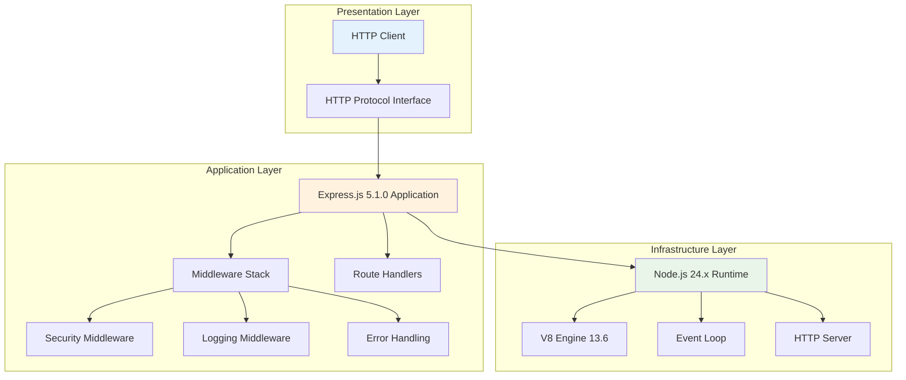
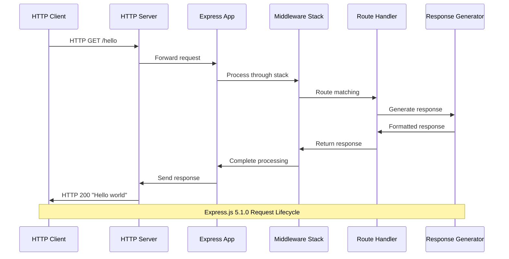
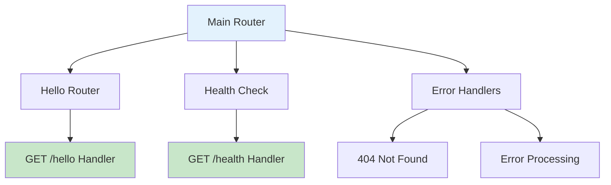
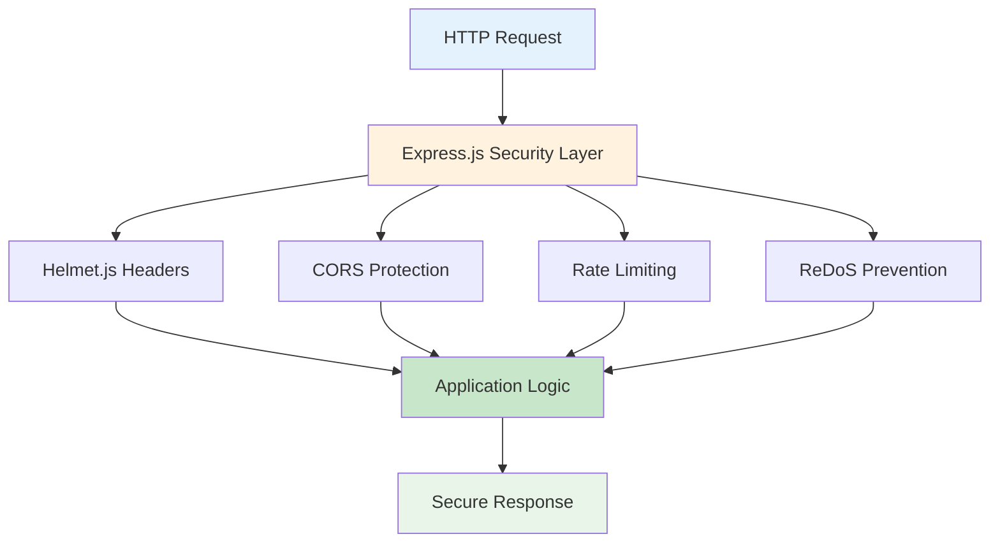
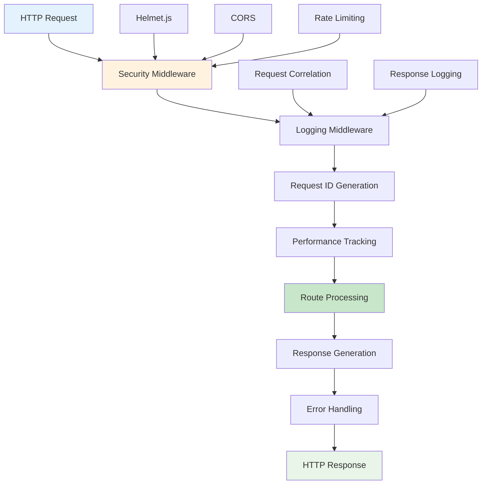
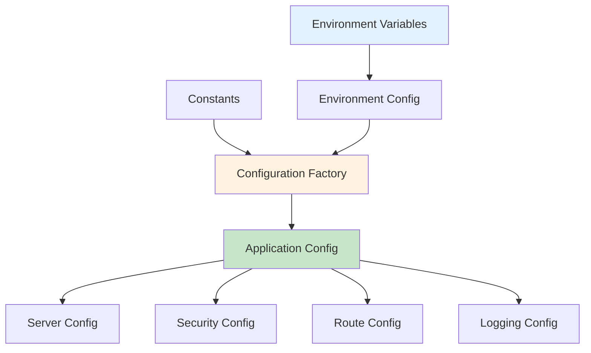
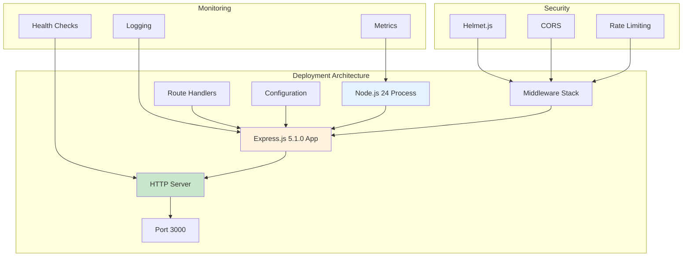
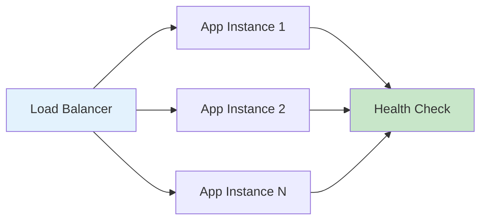
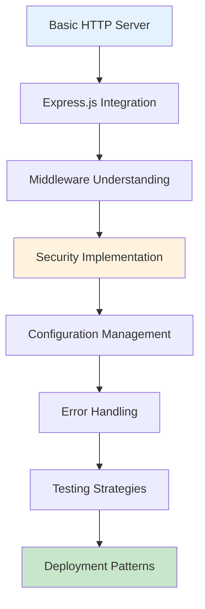

# Node.js Tutorial Application Architecture Documentation

## Table of Contents

1. [System Overview](#system-overview)
2. [Component Architecture](#component-architecture)
3. [Security Architecture](#security-architecture)
4. [Middleware Architecture](#middleware-architecture)
5. [Configuration Architecture](#configuration-architecture)
6. [Deployment Architecture](#deployment-architecture)
7. [Educational Patterns](#educational-patterns)

---

## System Overview

### Architecture Style and Rationale

The Node.js tutorial application employs a **minimalist three-tier architecture** that demonstrates fundamental web server patterns through a simplified yet production-ready implementation. The system follows Express.js best practices while maintaining educational clarity, making it ideal for demonstrating core Node.js and Express.js concepts.



### Key Architectural Principles

- **Single Responsibility**: Each component has a clearly defined purpose within the HTTP request-response cycle
- **Separation of Concerns**: Clear separation between HTTP handling, routing logic, and response generation
- **Simplicity First**: Educational clarity over production complexity
- **Event-Driven Design**: Leverages Node.js asynchronous, non-blocking I/O model
- **Middleware Pattern**: Output of one unit/function is the input for the next

### Technology Stack

| Component | Technology | Version | Purpose |
|-----------|------------|---------|---------|
| **Runtime** | Node.js | 24.x LTS | JavaScript execution environment |
| **Web Framework** | Express.js | 5.1.0 | HTTP server and routing |
| **JavaScript Engine** | V8 | 13.6 | Code execution and optimization |
| **Package Manager** | npm | 11.x | Dependency management |
| **Security** | Helmet.js | Latest | HTTP security headers |

### Express.js 5.1.0 Enhanced Features

The application leverages Express.js 5.1.0's enhanced capabilities:

- **Automatic Promise Rejection Handling**: Rejected promises in middleware are automatically forwarded to error-handling middleware
- **ReDoS Attack Prevention**: Updated path-to-regexp@8.x removes vulnerable regex patterns
- **Enhanced Security**: Built-in protections against CVE-2024-45590 and other vulnerabilities
- **Improved Middleware Composition**: Better support for async/await patterns

---

## Component Architecture

### High-Level Component Interaction



### HTTP Server Component

**Purpose**: Foundational layer enabling network communication between clients and the application.

**Key Features**:
- Node.js 24.x HTTP module integration
- Express.js 5.1.0 application binding
- Connection management with keep-alive support
- Graceful shutdown handling
- Error recovery and monitoring

**Implementation Highlights**:
```typescript
// Server creation with Express.js integration
export function createServer(expressApp: typeof app, config: ServerConfig): http.Server {
  const server = http.createServer(expressApp);
  
  // Configure timeouts and connection settings
  server.setTimeout(config.timeout);
  server.keepAliveTimeout = 61000;
  server.headersTimeout = 62000;
  
  // Set up graceful shutdown handlers
  setupGracefulShutdown(server);
  
  return server;
}
```

### Express.js Application Component

**Purpose**: Central application orchestration with middleware management and route integration.

**Factory Pattern Implementation**:
```typescript
export function createExpressApp(options: AppOptions = {}): Application {
  const app: Application = express();
  
  // Configure Express.js settings
  configureExpressSettings(app);
  
  // Apply middleware stack in optimal order
  setupSecurityMiddleware(app);
  setupLoggingMiddleware(app);
  mountApplicationRoutes(app);
  setupHealthCheck(app);
  setupErrorHandling(app);
  
  return app;
}
```

**Configuration Highlights**:
- Trust proxy settings based on environment
- JSON and URL-encoded body parsing with security limits
- Security header configuration (X-Powered-By removal)
- Environment-specific optimizations

### Route Handler Component

**Purpose**: Processes specific endpoint requests and generates appropriate responses.

**Route Organization Pattern**:


**Implementation Pattern**:
```typescript
// Modular route organization with factory pattern
export function createMainRouter(): Router {
  const router = Router();
  
  // Mount individual route modules
  router.use(ROUTES.HELLO, helloRouter);
  
  // Set up route error handling
  setupRouteErrorHandling(router);
  
  return router;
}
```

### Response Generator Component

**Purpose**: Formats HTTP responses with appropriate headers, status codes, and content.

**Response Pattern**:
- **Content-Type**: `text/plain; charset=utf-8`
- **Status Code**: `200 OK` for successful requests
- **Response Body**: Static "Hello world" content
- **Security Headers**: Applied via Helmet.js middleware

---

## Security Architecture

### Comprehensive Security Stack

The application implements multiple layers of security protection:



### Helmet.js Security Headers

**Implementation**:
```typescript
export class SecurityMiddleware {
  helmet(): RequestHandler {
    return helmet({
      contentSecurityPolicy: {
        directives: {
          defaultSrc: ["'self'"],
          styleSrc: ["'self'", "'unsafe-inline'"],
          scriptSrc: ["'self'"]
        }
      },
      hsts: environment.isProduction ? {
        maxAge: 31536000,
        includeSubDomains: true,
        preload: true
      } : false
    });
  }
}
```

### CORS Protection

**Configuration**:
- **Development**: Multiple localhost origins allowed
- **Production**: Restricted to configured domains
- **Methods**: GET, POST, PUT, DELETE, OPTIONS
- **Headers**: Standard and custom headers controlled

### Rate Limiting

**DoS Protection**:
```typescript
const rateLimitConfig = {
  windowMs: 15 * 60 * 1000, // 15 minutes
  max: environment.isProduction ? 100 : 200, // Requests per window
  message: 'Too many requests from this IP',
  standardHeaders: true,
  legacyHeaders: false
};
```

### Express.js 5.1.0 Security Enhancements

- **ReDoS Protection**: Built-in protection with path-to-regexp@8.x
- **CVE-2024-45590 Mitigation**: Configurable urlencoded body depth
- **Enhanced Error Handling**: Prevents information disclosure
- **Automatic Promise Handling**: Secure async error processing

---

## Middleware Architecture

### Middleware Stack Composition

Express.js 5.1.0 middleware architecture with optimal execution order:



### Security Middleware Layer

**Factory Pattern Implementation**:
```typescript
export function createSecurityStack(options: SecurityStackOptions = {}): MiddlewareStack {
  const securityStack: MiddlewareStack = [];
  
  // Apply security middleware in optimal order
  securityStack.push(helmetMiddleware);
  securityStack.push(corsMiddleware);
  securityStack.push(rateLimitMiddleware);
  securityStack.push(customSecurityHeaders);
  
  return securityStack;
}
```

### Logging Middleware Layer

**Request Correlation and Performance Tracking**:
```typescript
export function createLoggingStack(options: LoggingStackOptions = {}): MiddlewareStack {
  const loggingStack: MiddlewareStack = [];
  
  // Request ID generation for correlation
  loggingStack.push(generateRequestId);
  
  // HTTP request/response logging
  loggingStack.push(createLoggingMiddleware(options));
  
  // Performance monitoring
  loggingStack.push(performanceTrackingMiddleware);
  
  return loggingStack;
}
```

### Error Handling Middleware

**Express.js 5.1.0 Enhanced Error Processing**:
```typescript
export function createErrorHandlingStack(options: ErrorHandlingStackOptions = {}): ErrorMiddlewareStack {
  const errorStack: ErrorMiddlewareStack = [];
  
  // Main error handler with promise support
  errorStack.push(errorHandler);
  
  // Environment-specific error filtering
  errorStack.push(environmentErrorFilter);
  
  return errorStack;
}
```

### Middleware Execution Order

| Order | Middleware Type | Purpose | Implementation |
|-------|----------------|---------|----------------|
| 1 | **Security** | Request validation and protection | Helmet.js, CORS, Rate Limiting |
| 2 | **Logging** | Request correlation and tracking | Request ID, HTTP logging |
| 3 | **Custom** | Application-specific middleware | Custom headers, validation |
| 4 | **Routes** | Endpoint processing | Route handlers, business logic |
| 5 | **Error Handling** | Error processing and response | Error middleware, 404 handlers |

---

## Configuration Architecture

### Centralized Configuration Management

The application uses a comprehensive configuration architecture with environment awareness:



### Configuration Composition

**Factory Pattern Implementation**:
```typescript
export function initializeConfiguration(): AppConfig {
  const appConfiguration: AppConfig = {
    server: createServerConfiguration(),
    security: createSecurityConfiguration(),
    routes: createRouteConfiguration(),
    logging: createLoggingConfiguration(),
    environment: config
  };
  
  // Comprehensive validation
  const validationResult = validateConfiguration(appConfiguration);
  
  return appConfiguration;
}
```

### Environment-Specific Configuration

| Environment | Configuration Focus | Key Settings |
|-------------|-------------------|--------------|
| **Development** | Debug and ease of use | Debug logging, relaxed CORS, colored output |
| **Production** | Security and performance | Info logging, strict CORS, HSTS enabled |
| **Test** | Minimal output | Error-level logging, disabled colors |

### Type-Safe Configuration

**Interface Definitions**:
```typescript
export interface AppConfig {
  readonly server: ServerConfiguration;
  readonly security: SecurityConfiguration;
  readonly routes: RouteConfiguration;
  readonly logging: LoggingConfiguration;
  readonly environment: EnvironmentConfig;
}
```

### Configuration Validation

**Comprehensive Validation Strategy**:
- Port range validation (1-65535)
- Environment consistency checks
- Security configuration verification
- Logging level validation
- Deployment readiness assessment

---

## Deployment Architecture

### Single-Process Design

The tutorial application demonstrates a single-process deployment pattern suitable for educational purposes:



### Containerization Strategy

**Docker Implementation**:
```dockerfile
FROM node:24-alpine
WORKDIR /app
COPY package*.json ./
RUN npm ci --only=production
COPY . .
EXPOSE 3000
HEALTHCHECK --interval=30s --timeout=3s --start-period=5s --retries=3 \
  CMD curl -f http://localhost:3000/health || exit 1
CMD ["npm", "start"]
```

### Health Check Implementation

**Comprehensive Health Monitoring**:
```typescript
app.get('/health', (req: Request, res: Response) => {
  const healthInfo: SystemHealth = {
    status: 'healthy',
    uptime: Math.floor(process.uptime() * 1000),
    memory: process.memoryUsage(),
    version: serverConfig.version,
    environment: environment.env,
    timestamp: new Date().toISOString(),
    components: {
      server: 'healthy',
      routes: 'healthy',
      middleware: 'healthy'
    }
  };
  
  res.status(200).json(healthInfo);
});
```

### Scalability Considerations

**Horizontal Scaling Pattern**:


---

## Educational Patterns

### Design Patterns Demonstrated

#### 1. Factory Pattern
**Application Factory**:
```typescript
// Express application factory with configuration
export function createExpressApp(options: AppOptions = {}): Application {
  const app: Application = express();
  // Configuration and middleware setup
  return app;
}
```

#### 2. Middleware Pattern
**Chain of Responsibility**:
```typescript
// Middleware composition pattern
app.use(securityMiddleware);
app.use(loggingMiddleware);
app.use(routeMiddleware);
app.use(errorHandlingMiddleware);
```

#### 3. Barrel Export Pattern
**Centralized Module Access**:
```typescript
// config/index.ts - Central configuration export
export { appConfig, serverConfig, securityConfig };
export type { AppConfig, ServerConfiguration };
```

#### 4. Composition Pattern
**Middleware Stack Composition**:
```typescript
export function createMiddlewareStack(options: MiddlewareStackOptions): MiddlewareStack {
  const stack: MiddlewareStack = [];
  
  if (options.enableSecurity) stack.push(...createSecurityStack());
  if (options.enableLogging) stack.push(...createLoggingStack());
  
  return stack;
}
```

### Learning Objectives

1. **Modern Node.js Development**: Express.js 5.1.0 with latest Node.js 24.x features
2. **Security Best Practices**: Comprehensive security middleware implementation
3. **Architecture Patterns**: Three-tier architecture with clear separation of concerns
4. **TypeScript Integration**: Type-safe development with comprehensive interfaces
5. **Production Readiness**: Monitoring, health checks, and deployment patterns
6. **Error Handling**: Modern async error handling with Express.js 5.1.0
7. **Configuration Management**: Environment-aware centralized configuration
8. **Testing Architecture**: Comprehensive testing strategies and patterns

### Progressive Learning Path



### Advanced Concepts Demonstrated

- **Async/Await Patterns**: Modern JavaScript asynchronous programming
- **Promise Rejection Handling**: Express.js 5.1.0 automatic error forwarding
- **Event-Driven Architecture**: Node.js event loop and non-blocking I/O
- **Middleware Orchestration**: Complex middleware stack management
- **Type Safety**: Comprehensive TypeScript integration
- **Security Headers**: HTTP security best practices implementation
- **Request Correlation**: Distributed tracing preparation
- **Graceful Shutdown**: Production-ready process management

---

## Conclusion

This Node.js tutorial application demonstrates a comprehensive, production-ready architecture while maintaining educational clarity. The three-tier design with Express.js 5.1.0 showcases modern web development patterns, security best practices, and scalable architecture principles.

Key architectural achievements:
- **Modularity**: Clear separation of concerns with reusable components
- **Security**: Multi-layered protection with industry-standard practices
- **Maintainability**: Type-safe, well-documented, and testable codebase
- **Scalability**: Architecture patterns that support growth and extension
- **Educational Value**: Progressive complexity with clear learning objectives

The architecture serves as both a functional tutorial application and a reference implementation for modern Node.js development practices, providing a solid foundation for understanding enterprise-grade web application development.